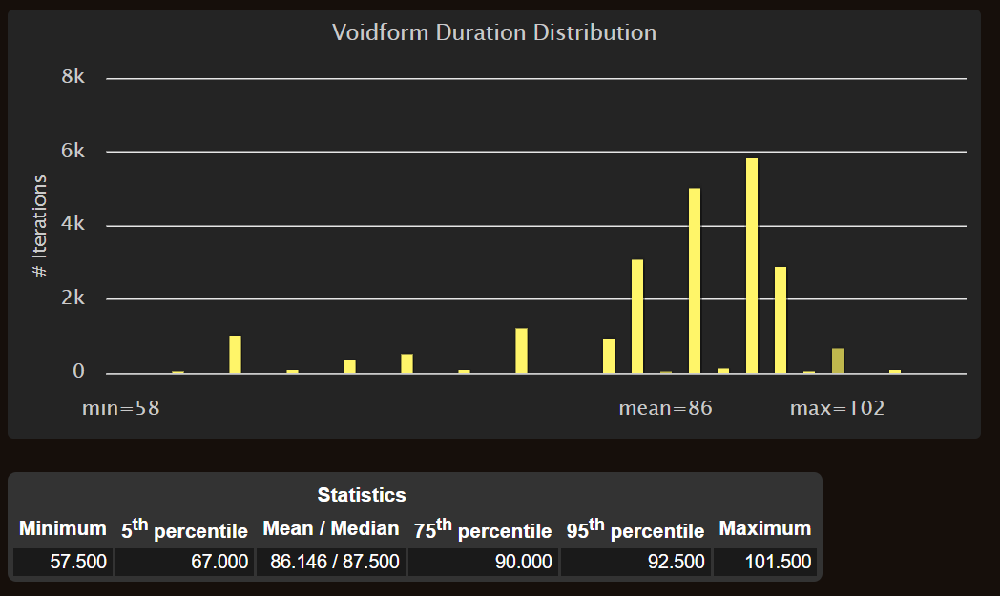
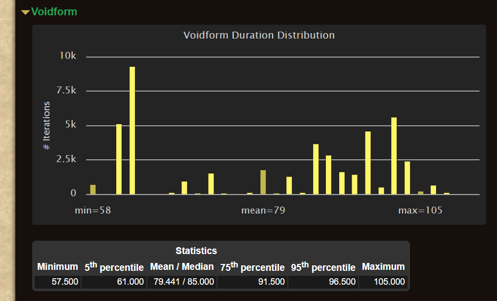

# How Long Should Your Voidform Last in Season 3?

One of the most common questions Shadow Priests have in Season 3 is: *“How long should my [Voidform](https://www.wowhead.com/ptr-2/spell=228264/voidform) last?”* With the new Archon set bonus shaping our gameplay, Voidform durations are both more stable and more rewarding than ever. Let’s break down what realistic expectations look like, and how your rotation and gear tie into sustaining long Voidforms.

<!-- truncate -->

## The Role of the Season 3 Set Bonus
**2-piece:** [Halos](https://www.wowhead.com/ptr-2/spell=120517/halo) generate an additional 10 Insanity over 5 sec and Resonant Energy additionally increases the damage of your [Devouring Plague](https://www.wowhead.com/ptr-2/spell=335467/devouring-plague) by 5%.  
**4-piece:** While [Power Surge](https://www.wowhead.com/ptr-2/spell=1236396/power-surge) is active, every 2 casts of Devouring Plague adds another Halo to the effect at 100% effectiveness, up to 2 times.

### What this really means for Voidform uptime
Your Insanity comes from Halos now (a lot). Power Surge causes your cast Halo to echo at fixed intervals; with the 2-pc, each Halo instance injects an additional 10 Insanity over 5s. During Power Surge, that’s multiple “mini-batteries” of Insanity that smooth your resource gain and make long Voidforms realistic. 

With the 4-pc, landing 4 Devouring Plagues during Surge adds up to two extra Halos, juicing Insanity even more. I have made a Weak Aura to help you track this that is also included in my Shadow Priest pack.
- [Shadow Priest Pack](https://wago.io/HkQsadDaf)
- [Standalone Tracker](https://wago.io/GSmlcVuus)

## Rotation Goals Inside Voidform
Sustaining Voidform isn’t just about the new tier set, it’s about execution. Here are some practical tips:
- **During Power Surge windows**: plan to fire four DPs relatively quickly so you earn the two extra Halos from the 4-pc. Don’t greed other spells if you’re about to miss that fourth DP.
- **Halo timing**: use Halo ASAP whenever possible; its echoes (plus any bonus Halos you trigger via 4-pc) are your Insanity engine for sustaining VF. (Power Surge’s echo behavior is defined in the Archon kit; the set just adds more echoes when you spend correctly.)
- **Baseline priorities stay the same**: the core loop doesn’t change, the set just rewards cleaner Insanity flow so your Voidforms last longer on average.

:::info

If you are trying to practice the rotation, most Target Dummy setups will give you inaccurate results. This is because as soon as you damage a PvP dummy or heal a player that has hit a PvP dummy you will be flagged in PvP combat (particularly when pressing Halo). This will cause the set bonus to be nerfed significantly due to the PvP modifier attached to the spell.

:::

## Simulation Data on Voidform Durations
To ground expectations, here are Voidform duration statistics from a single target sim with Bloodlust on the opener:

| Bloodlust on Opener | Duration | Percentage |
| --- | --- | --- |
| Yes | 65s or less | 5% |
| Yes | 70-80s | 8% |
| Yes | 80-90s | 42% |
| Yes | 90s+ | 45% |

Here is that same setup without Bloodlust:

| Bloodlust on Opener | Duration | Percentage |
| --- | --- | --- |
| No | 65s or less | 35% |
| No | 70-80s | 10% |
| No | 80-90s | 25% |
| No | 90s+ | 30% |

### What This Means in Practice
- **Sub-60s Voidforms are rare** → usually mechanics, downtime, or missed Devouring Plagues.  
- **80–90s Voidforms are the goal** → this is your realistic target.  
- **90s+ Voidforms happen** → but only with ideal uptime, procs, and movement-free fights.

Voidforms should always last at least 60 seconds. With low haste or without Bloodlust you will have more cases of falling out right around that 60-65s range depending on mechanics, but these should be on the rarer side.

| Duration Range | Goal | Notes |
|----------------|------|-------|
| **80–90s** | **Target Range** | Shows clean Halo + Devouring Plague execution inside Voidform. |
| **90s+** | **Excellent** | Ideal conditions: minimal movement, perfect Power Surge uptime, consistent Halo/DP cycles. |
| **Under 60s** | **Troubleshoot** | Check if you're: Missing DPs during Power Surge, Capping Insanity instead of spending, or Losing casts due to downtime or movement. |

## Gear & Stat Targets for Sustained Voidforms
To consistently land the 80–90s (or higher) Voidform windows, having the right balance of stats and item-level gear is just as important as rotation execution.

Based on the [Stat Priority](https://www.icy-veins.com/wow/shadow-priest-pve-dps-stat-priority) Archon wants anywhere between 24% and 31% haste to execute things correctly. If you fall below this range in Haste you will likely struggle to consistently get longer Voidforms.

## Video Examples

### Bloodlust Opener Example
<iframe width="560" height="315" src="https://www.youtube.com/embed/20U6J79jPyk?si=1Ti0EBO8QbSlhvic" title="YouTube video player" frameborder="0" allow="accelerometer; autoplay; clipboard-write; encrypted-media; gyroscope; picture-in-picture; web-share" referrerpolicy="strict-origin-when-cross-origin" allowfullscreen></iframe>