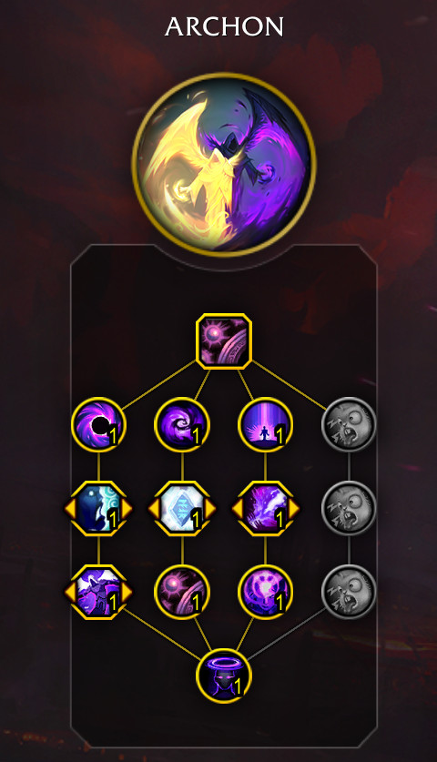

# Midnight Changes for Shadow Priests

> The following changes are focused on simplifying some of the cooldown launch sequence as well as the frequent number of high priority procs in the rotation for Shadow. We are also updating the fantasy and visuals of their core spells to create a consistent theme of using the power of the Old Gods to haunt your enemies.

Feedback Thread on the Forums
- [US](https://us.forums.blizzard.com/en/wow/t/feedback-priests/2175615)
- [EU](https://eu.forums.blizzard.com/en/wow/t/feedback-priests/590298)

## Changelog
- [10/15]: Season 1 Tier set added and a change to Void Empowerment
- [10/9]: Updated from [this week's Alpha build](https://www.wowhead.com/news/class-changes-and-ui-improvements-midnight-alpha-test-development-notes-378812)
- [10/1]: Initial [Alpha Build](https://www.wowhead.com/news/midnight-alpha-development-notes-378688)

## Baseline Spells
- [Vampiric Embrace](https://www.wowhead.com/beta/spell=15286/vampiric-embrace)
- [Silence](https://www.wowhead.com/beta/spell=15487/silence)
- [Dispersion](https://www.wowhead.com/beta/spell=47585/dispersion)

In addition to these spells being added baseline there have been changes to the balancing of several spells in our kit. For brevity I have not included these simple balancing tweaks in this post.

## Removed Spells
### Class Spells
- [Void Shift](https://www.wowhead.com/spell=108968/void-shift)
- [Psychic Horror](https://www.wowhead.com/spell=64044/psychic-horror)
- [Apathy](https://www.wowhead.com/spell=390668/apathy)
- [Cauterizing Shadows](https://www.wowhead.com/spell=459990/cauterizing-shadows)
- [Divine Star](https://www.wowhead.com/spell=122121/divine-star)
- [Essence Devourer](https://www.wowhead.com/spell=415479/essence-devourer)
- [From Darkness Comes Light](https://www.wowhead.com/spell=390615/from-darkness-comes-light)
- [Halo](https://www.wowhead.com/spell=120644/halo) (now Archon tree only)
- [Manipulation](https://www.wowhead.com/spell=459985/manipulation)
- [Power Word: Life](https://www.wowhead.com/spell=373481/power-word-life)
- [Prayer of Mending](https://www.wowhead.com/spell=33076/prayer-of-mending) (Holy only)
- [Renew](https://www.wowhead.com/spell=139/renew)
- [Rhapsody](https://www.wowhead.com/spell=390622/rhapsody)
- [San'layn](https://www.wowhead.com/spell=199855/sanlayn)
- [Throes of Pain](https://www.wowhead.com/spell=377422/throes-of-pain)
- [Void Shield](https://www.wowhead.com/spell=280749/void-shield)
- [Word of the Pious](https://www.wowhead.com/spell=377438/words-of-the-pious)
  
### Shadow Spells
- [Dark Ascension](https://www.wowhead.com/spell=391109/dark-ascension)
- [Void Bolt](https://www.wowhead.com/spell=205448/void-bolt) (now a passive in the Apex Spec tree, sort of)
- [Last Word](https://www.wowhead.com/spell=263716/last-word) (baseline)

## Talent Tree
You can see an updated version of the [Talent Calculator](https://www.wowhead.com/beta/talent-calc/priest/shadow/archon) on Wowhead.

### Class Tree
- [Shadowfiend](https://www.wowhead.com/beta/spell=34433/shadowfiend) is a Shadow only spell
- [Psychic Scream](https://www.wowhead.com/beta/spell=8122/psychic-scream) and [Mind Blast](https://www.wowhead.com/beta/spell=8092/mind-blast) are now class talents and given baseline.
- [Shadow Word: Death](https://www.wowhead.com/beta/spell=32379/shadow-word-death) is no longer given for free as Shadow

### Hero Trees

#### Archon
- [Halo](https://www.wowhead.com/beta/spell=120644/halo) is now baseline for Archon specifically.
- [Concentrated Infusion](https://www.wowhead.com/spell=453844/concentrated-infusion) has been removed.
- [Spiritwell](https://www.wowhead.com/beta/spell=1247178/spiritwell) - new talent
- [Empowered Surges](https://www.wowhead.com/beta/spell=453799/empowered-surges) increases [Mind Flay: Insanity](https://www.wowhead.com/beta/spell=391403/mind-flay-insanity) damage by 30% (was 60%).
- [Perfected Form](https://www.wowhead.com/beta/spell=453917/perfected-form) now increases damage during [Voidform](https://www.wowhead.com/beta/spell=228260/voidform) by 5% (was 20%).
- Icons have been updated to be more Shadow Priest themed

#### Voidweaver
- [Void Torrent](https://www.wowhead.com/beta/spell=263165/void-torrent) is now baseline for Voidweaver specifically.
- [Quickened Pulse](https://www.wowhead.com/beta/spell=1266845/quickened-pulse) - new talent
- [Touch of the Void](https://www.wowhead.com/beta/spell=1266856/touch-of-the-void) - new talent
- [Overwhelming Shadows](https://www.wowhead.com/beta/spell=1266883/overwhelming-shadows) - new talent
- [Voidheart](https://www.wowhead.com/beta/spell=449880/voidheart) has changed positions in the hero talent tree.
- [Void Empowerment](https://www.wowhead.com/beta/spell=450138/void-empowerment) now causes you to gain [Shadowy Insight](https://www.wowhead.com/beta/spell=375888/shadowy-insight) (was [Mind Devourer](https://www.wowhead.com/beta/spell=373202/mind-devourer)).

### Spec Tree
We will soon be getting several new talents into the spec, these have not yet shown up in Alpha but were [announced](https://www.wowhead.com/news/class-changes-and-ui-improvements-midnight-alpha-test-development-notes-378812?utm_source=discord-webhook):
- [Shadow Power](https://www.wowhead.com/beta/spell=1266544/shadow-power) – Increases your non-periodic spell damage by 6%. 
- [Mind Melt](https://www.wowhead.com/beta/spell=1266566/mind-melt) – Mind Flay has a 20% increased critical strike chance and deals 50% increased critical strike damage.

The following talents have been adjusted/reworked:
- Talenting into Misery now replaces Shadow Word: Pain.
- Shadowy Insight now grants a temporary charge of Mind Blast that ignores its cooldown instead of granting a charge when triggered.
- [Devouring Plague](https://www.wowhead.com/spell=335467/devouring-plague) renamed to [Shadow Word: Madness](https://www.wowhead.com/beta/spell=335467/shadow-word-madness) and the healing component has been removed.
- [Shadow Crash](https://www.wowhead.com/spell=205385/shadow-crash) reworked into [Tentacle Slam](https://www.wowhead.com/beta/spell=1227280/tentacle-slam) (targeted only)
- [Void Eruption](https://www.wowhead.com/pell=228260/void-eruption) renamed to [Voidform](https://www.wowhead.com/beta/spell=194249/voidform) for clarity
- [Voidform](https://www.wowhead.com/beta/spell=194249/voidform) can now be an extendable buff ([Ancient Madness](https://www.wowhead.com/beta/spell=341240/ancient-madness)) or a non-extendable version
- [Surge of Insanity](https://www.wowhead.com/beta/spell=391399/surge-of-insanity) is now fully passive, no more procs. Mind Flay: Insanity is still granted via Archon.
- [Shadowy Apparitions](https://www.wowhead.com/beta/spell=341491/shadowy-apparitions) now only proc from [Shadow Word: Madness](https://www.wowhead.com/beta/spell=335467/shadow-word-madness) baseline
- [Void Volley](https://www.wowhead.com/beta/spell=1240401/void-volley) takes [Void Bolt](https://www.wowhead.com/spell=205448/void-bolt)'s place as the active spell to press during [Voidform](https://www.wowhead.com/beta/spell=194249/voidform) with a 15-second cooldown.
- [Death and Madness](https://www.wowhead.com/beta/spell=321291/death-and-madness) is now a choice node with [Deathspeaker](https://www.wowhead.com/beta/spell=392507/deathspeaker)
- [Phantasmal Pathogen](https://www.wowhead.com/spell=407469/phantasmal-pathogen) renamed to [Spectral Horrors](https://www.wowhead.com/beta/spell=407469/spectral-horrors) and is now 1-point
- [Maddening Touch](https://www.wowhead.com/spell=391228/maddening-touch) is now a 1-point talent
- [Insidious Ire](https://www.wowhead.com/spell=373212/insidious-ire) now also affects [Mind Flay](https://www.wowhead.com/beta/spell=15407/mind-flay)
- [Void Torrent](https://www.wowhead.com/beta/spell=263165/void-torrent) now baseline for Voidweaver only

#### [Tentacle Slam](https://www.wowhead.com/beta/spell=1227280/tentacle-slam) Animation
[Shadow Crash](https://www.wowhead.com/spell=205385/shadow-crash) renamed to [Tentacle Slam](https://www.wowhead.com/beta/spell=1227280/tentacle-slam) and has been redesigned – [Tentacle Slam](https://www.wowhead.com/beta/spell=1227280/tentacle-slam) summons a massive shadowy appendage to slam the ground, dealing damage and applying [Vampiric Touch](https://www.wowhead.com/spell=34914/vampiric-touch) to up to 6 targets to all enemies between you and the target, as well as 8 yards around your target. Max 2 charges, 15 seconds recharge.

#### Shadow Word: Madness Animation

#### Apex Talents: Void Apparitions
1. [Void Apparitions](https://www.wowhead.com/beta/spell=1264096/void-apparitions) - When an effect from an Idol is activated, conjure [Shadowy Apparitions](https://www.wowhead.com/beta/spell=341263/shadowy-apparition)
2. [Void Apparitions](https://www.wowhead.com/beta/spell=1264104/void-apparitions) - [Shadowy Apparitions](https://www.wowhead.com/beta/spell=341263/shadowy-apparition) have a chance to become empowered and deal more damage and send out a [Void Bolt](https://www.wowhead.com/beta/spell=205448/void-bolt) at their target. This [Void Bolt](https://www.wowhead.com/spell=205448/void-bolt) does NOT refresh DoTs
3. [Void Apparitions](https://www.wowhead.com/beta/spell=1264107/void-apparitions) - [Tentacle Slam](https://www.wowhead.com/beta/spell=1227280/tentacle-slam) has a 100% chance to activate an effect from one of your idols (does not require it to be talented).

## FAQ

### How will Mass AoE Work?
With the changes that remove [Void Bolt](https://www.wowhead.com/spell=205448/void-bolt) and its ability to refresh DoT effects this is a massive gap we have right now in our kit.

## UI and Addons
[Combat Addons will be disabled](https://www.wowhead.com/news/combat-addons-disabled-in-end-game-content-in-midnight-378679?utm_source=discord-webhook).

This means that many things you rely on for tracking will have to change. Basically anything that accesses Combat Log events will likely stop working and you will need to rely on the default UI to track these things.

While we do not know all specifics it is likely that things like Plater nameplate mods or Weak Auras that track buffs/debuffs will no longer function. Hopefully we get more details soon.

The biggest thing here is to give feedback on what we rely on addons for that is no longer working. The biggest things that come to mind are:
- Tracking if every mob in a pack has DoTs active
- Duration of DoTs on your current target to know optimal refresh times (Only works for [Shadow Word: Madness](https://www.wowhead.com/beta/spell=335467/shadow-word-madness) currently)

# Gearing Updates in Midnight

## Season 1 Tier Set Bonuses
- 2-set bonus: [Shadow Word: Madness](https://www.wowhead.com/beta/spell=335467/shadow-word-madness) damage increased by 10% and Insanity cost reduced by 5.
- 4-set bonus: [Shadowy Apparitions](https://www.wowhead.com/beta/spell=341491/shadowy-apparitions) and [Void Apparitions](https://www.wowhead.com/beta/spell=1264104/void-apparitions) damage increased by 40%.