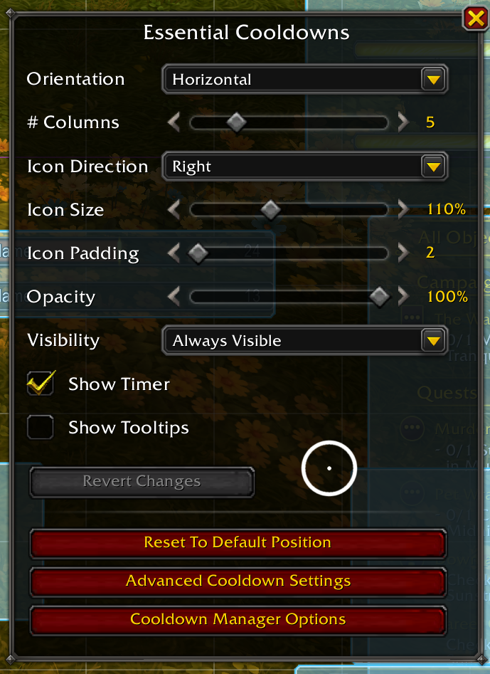
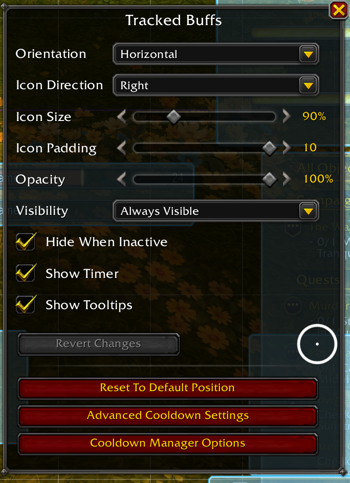
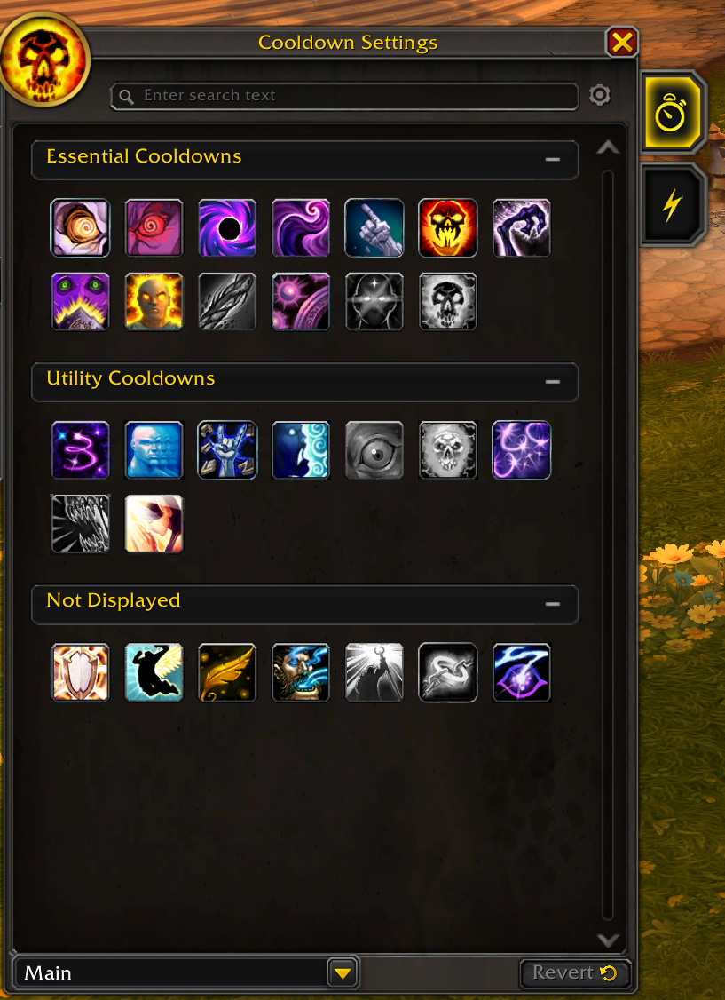
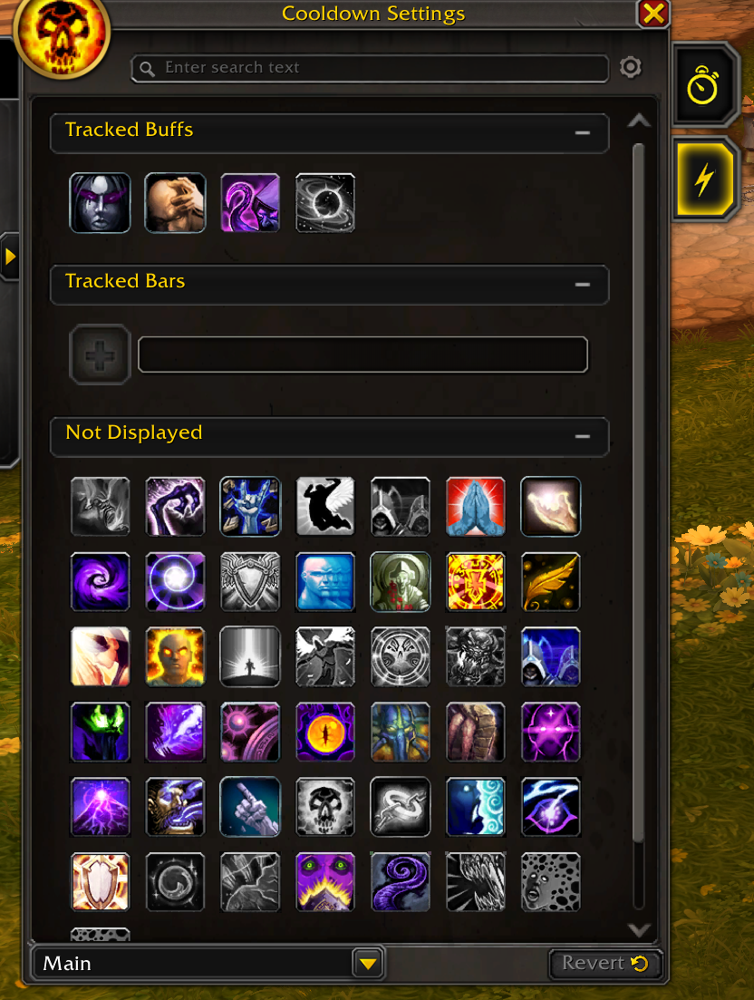

# Shadow Priest UI: Midnight
If you are looking for starting point imports for your Shadow Priest use the following import codes.

## Main HUD: Edit Mode


```
2 50 0 0 1 7 7 UIParent 0.0 45.0 -1 ##$$%/&('%)#+#,$ 0 1 1 7 7 UIParent 0.0 45.0 -1 ##$$%/&('%(#,$ 0 2 1 7 7 UIParent 0.0 45.0 -1 ##$$%/&('%(#,$ 0 3 1 5 5 UIParent -5.0 -77.0 -1 #$$$%/&('%(#,$ 0 4 1 5 5 UIParent -5.0 -77.0 -1 #$$$%/&('%(#,$ 0 5 0 4 4 UIParent -78.7 -110.6 -1 ##$$%)&''%(#,# 0 6 1 1 4 UIParent 0.0 -50.0 -1 ##$$%/&('%(#,$ 0 7 1 1 4 UIParent 0.0 -100.0 -1 ##$$%/&('%(#,$ 0 10 1 7 7 UIParent 0.0 45.0 -1 ##$$&('% 0 11 0 7 1 MultiBarBottomRight -3.3 4.0 -1 ##$$&('%,# 0 12 0 0 2 StanceBar 4.0 0.0 -1 ##$$&('% 1 -1 0 4 4 UIParent 0.0 -300.3 -1 #$$#%# 2 -1 1 2 2 UIParent 0.0 0.0 -1 ##$#%( 3 0 0 4 4 UIParent -220.3 -163.6 -1 $#3$ 3 1 0 4 4 UIParent 222.0 -163.2 -1 %#3$ 3 2 0 1 4 UIParent -526.5 10.5 -1 %#&$3# 3 3 1 0 2 CompactRaidFrameManager 0.0 -7.0 -1 '$(#)#-a.G/#1#3#5#6-6$7-7$ 3 4 0 0 0 UIParent 0.0 -160.0 -1 ,#-3.//#0#1#2(5#6-6$7-7$ 3 5 1 5 5 UIParent 0.0 0.0 -1 &$*$3' 3 6 1 5 5 UIParent 0.0 0.0 -1 -#.#/#4$5#6-6$7-7$ 3 7 1 4 4 UIParent 0.0 0.0 -1 3# 4 -1 0 4 4 UIParent 0.0 -389.9 -1 # 5 -1 0 7 7 UIParent 410.7 210.8 -1 # 6 0 1 2 2 UIParent -255.0 -10.0 -1 ##$#%#&.(()( 6 1 1 2 2 UIParent -270.0 -155.0 -1 ##$#%#'+(()( 6 2 1 1 1 UIParent 0.0 -25.0 -1 ##$#%$&.(()(+#,-,$ 7 -1 0 1 1 UIParent 0.0 -2.0 -1 # 8 -1 0 6 6 UIParent 35.0 50.0 -1 #'$A%$&i 9 -1 0 8 2 MultiBarBottomRight 0.0 4.0 -1 # 10 -1 1 0 0 UIParent 16.0 -116.0 -1 # 11 -1 0 8 8 UIParent -57.8 259.6 -1 # 12 -1 1 2 2 UIParent -110.0 -275.0 -1 #K$#%# 13 -1 0 7 7 UIParent -432.2 0.6 -1 ##$#%#&- 14 -1 0 8 8 UIParent -54.3 209.0 -1 ##$#%( 15 0 1 7 7 StatusTrackingBarManager 0.0 0.0 -1 # 15 1 1 7 7 StatusTrackingBarManager 0.0 17.0 -1 # 16 -1 1 5 5 UIParent 0.0 0.0 -1 #( 17 -1 1 1 1 UIParent 0.0 -100.0 -1 ## 18 -1 1 5 5 UIParent 0.0 0.0 -1 #- 19 -1 1 7 7 UIParent 0.0 0.0 -1 ## 20 0 0 4 4 UIParent 0.0 -202.2 -1 ##$(%$&)'%(-($)#+$,$-# 20 1 0 4 4 UIParent 0.0 -274.3 -1 ##$0%$&)'%(-($)#+$,$-$ 20 2 0 4 4 UIParent 0.0 -104.1 -1 ##$$%#&''-(-($)#+$,$-# 20 3 0 4 4 UIParent -276.6 -112.5 -1 #$$$%#&('((-($)#*#+$,$-#.` 21 -1 0 5 5 UIParent -968.7 -83.8 -1 ##$$ 22 0 0 3 3 UIParent 190.4 80.6 -1 #$$$%#&('((#)-)$*%+#,# 22 1 1 1 1 UIParent 0.0 -215.0 -1 &('()-)$*#+$ 22 2 1 1 1 UIParent 0.0 -270.0 -1 &('()-)$*#+$ 22 3 1 1 1 UIParent 0.0 -315.0 -1 &('()-)$*#+$ 23 -1 0 8 8 UIParent -299.2 3.9 -1 ##$#%#&n'Y(#)U*#+$,$-,.(
```

<!-- I also use [Masque](https://www.curseforge.com/wow/addons/masque) and [Masque: Shadow 4](https://www.curseforge.com/wow/addons/masque-shadow) with [Masque Blizzard Bars](https://www.curseforge.com/wow/addons/masque-blizz-bars-revived) to get that shadow border effect. -->

## Cooldown Manager
:::note
The Import feature for the cooldown manager is not currently working, use the images below to recreate what I have setup.
:::

```
1|TdC7TkJBEAZgDhIvqCR2/CYbx6iJBXZeIGph44WLoKC2kHAStTFREigw8RxRbKwosNAIBRw7CgotfAAfwtIH8A10/sbYfLvZnezMv7XAVTu85LgPSYgfkRxkbNJnPV2SKmQUEoAMY+oHrRjMKsSCDOplfU7xajDLkBFUALMIs46ZIMwaTBQSglmBibE0h3wDMoT5I9gbiHygeK/H3QkUXnU9tVmzSbbINtkhcZIgSZIiu6RJ0iRD9sg+yZIDcqiExrl7U54flU6QeOST/dmy2yNfzALC5z2+7N2QW1Ind+SdfCsvs0qP4foW4Xz9VMfn6F/5r/9FnHY0pLhMn28MuH9zN5105vzEvijJgmSPC8Wz8i8=
```






## [Twintop's Resource Bar](https://www.curseforge.com/wow/addons/twintops-insanity-bar)

:::info
Be sure to download the _Alpha_ version to support the Midnight Beta.
:::

```
!TRB!eyJwcmllc3QiOnsic2hhZG93Ijp7InRleHR1cmVzIjp7InJlc291cmNlQmFyTmFtZSI6IkJsaXp6YXJkIiwiY2FzdGluZ0JhciI6IkludGVyZmFjZVxcVGFyZ2V0aW5nRnJhbWVcXFVJLVN0YXR1c0JhciIsImJvcmRlck5hbWUiOiIxIFBpeGVsIiwiYm9yZGVyIjoiSW50ZXJmYWNlXFxCdXR0b25zXFxXSElURThYOCIsInRleHR1cmVMb2NrIjp0cnVlLCJjYXN0aW5nQmFyTmFtZSI6IkJsaXp6YXJkIiwicGFzc2l2ZUJhck5hbWUiOiJCbGl6emFyZCIsInBhc3NpdmVCYXIiOiJJbnRlcmZhY2VcXFRhcmdldGluZ0ZyYW1lXFxVSS1TdGF0dXNCYXIiLCJiYWNrZ3JvdW5kIjoiSW50ZXJmYWNlXFxUb29sdGlwc1xcVUktVG9vbHRpcC1CYWNrZ3JvdW5kIiwiYmFja2dyb3VuZE5hbWUiOiJCbGl6emFyZCBUb29sdGlwIiwicmVzb3VyY2VCYXIiOiJJbnRlcmZhY2VcXFRhcmdldGluZ0ZyYW1lXFxVSS1TdGF0dXNCYXIifSwiZW5kT2ZWb2lkZm9ybSI6eyJlbmFibGVkIjp0cnVlLCJtb2RlIjoiZ2NkIiwidGltZU1heCI6MywiZ2Nkc01heCI6Mn0sImF1ZGlvIjp7Im92ZXJjYXAiOnsiZW5hYmxlZCI6ZmFsc2UsInNvdW5kTmFtZSI6IlRSQjogQWlyIEhvcm4iLCJuYW1lIjoiT3ZlcmNhcCIsInNvdW5kIjoiSW50ZXJmYWNlXFxBZGRvbnNcXFR3aW50b3BJbnNhbml0eUJhclxcU291bmRzXFxBaXJIb3JuLm9nZyJ9LCJtZFByb2MiOnsiZW5hYmxlZCI6ZmFsc2UsInNvdW5kTmFtZSI6IlRSQjogQm94aW5nIEFyZW5hIEdvbmciLCJuYW1lIjoiTWluZCBEZXZvdXJlciBQcm9jIiwic291bmQiOiJJbnRlcmZhY2VcXEFkZG9uc1xcVHdpbnRvcEluc2FuaXR5QmFyXFxTb3VuZHNcXEJveGluZ0FyZW5hU291bmQub2dnIn0sInBvd2VySW5mdXNpb24iOnsiZW5hYmxlZCI6ZmFsc2UsInNvdW5kTmFtZSI6IlRSQjogQm94aW5nIEFyZW5hIEdvbmciLCJuYW1lIjoiUG93ZXIgSW5mdXNpb24gZ2FpbmVkIiwic291bmQiOiJJbnRlcmZhY2VcXEFkZG9uc1xcVHdpbnRvcEluc2FuaXR5QmFyXFxTb3VuZHNcXEJveGluZ0FyZW5hU291bmQub2dnIn0sImRwUmVhZHkiOnsiZW5hYmxlZCI6ZmFsc2UsInNvdW5kTmFtZSI6IlRSQjogQm94aW5nIEFyZW5hIEdvbmciLCJuYW1lIjoiRGV2b3VyaW5nIFBsYWd1ZSBSZWFkeSIsInNvdW5kIjoiSW50ZXJmYWNlXFxBZGRvbnNcXFR3aW50b3BJbnNhbml0eUJhclxcU291bmRzXFxCb3hpbmdBcmVuYVNvdW5kLm9nZyJ9fSwibWluZGJlbmRlciI6eyJlbmFibGVkIjp0cnVlLCJ0aW1lTWF4IjozLCJtb2RlIjoiZ2NkIiwic3dpbmdzTWF4Ijo0LCJnY2RzTWF4IjoyfSwidGhyZXNob2xkcyI6eyJ0aHJlc2hvbGREaWN0aW9uYXJ5Ijp7InNoYWRvd1dvcmRNYWRuZXNzMiI6eyJlbmFibGVkIjpmYWxzZX0sImRldm91cmluZ1BsYWd1ZSI6eyJlbmFibGVkIjp0cnVlfSwiZGV2b3VyaW5nUGxhZ3VlMyI6eyJlbmFibGVkIjp0cnVlfSwic2hhZG93V29yZE1hZG5lc3MzIjp7ImVuYWJsZWQiOmZhbHNlfSwiZGV2b3VyaW5nUGxhZ3VlMiI6eyJlbmFibGVkIjp0cnVlfSwic2hhZG93V29yZE1hZG5lc3MiOnsiZW5hYmxlZCI6ZmFsc2V9fSwicHJvcGVydGllcyI6eyJvdmVybGFwQm9yZGVyIjp0cnVlLCJ3aWR0aCI6Mn0sImljb25zIjp7ImVuYWJsZWQiOmZhbHNlLCJyZWxhdGl2ZVRvIjoiVE9QIiwieFBvcyI6MCwiYm9yZGVyIjoyLCJ3aWR0aCI6MjQsInJlbGF0aXZlVG9OYW1lIjoiQWJvdmUiLCJoZWlnaHQiOjI0LCJ5UG9zIjotMTIsImRlc2F0dXJhdGVkIjp0cnVlfSwic3BlY1Byb3BlcnRpZXMiOnsiZGV2b3VyaW5nUGxhZ3VlVGhyZXNob2xkT25seU92ZXJTaG93IjpmYWxzZSwic2hhZG93V29yZE1hZG5lc3NUaHJlc2hvbGRPbmx5T3ZlclNob3ciOnRydWV9fSwiZGlzcGxheVRleHQiOnsiZGVmYXVsdCI6eyJmb250RmFjZSI6IkZvbnRzXFxGUklaUVRfXy5UVEYiLCJjb2xvciI6IkZGRkZGRkZGIiwiZm9udEp1c3RpZnlIb3Jpem9udGFsIjoiTEVGVCIsImZvbnRTaXplIjoxOCwiZm9udEp1c3RpZnlIb3Jpem9udGFsTmFtZSI6IkxlZnQiLCJmb250RmFjZU5hbWUiOiJGcml6IFF1YWRyYXRhIFRUIn0sImJhclRleHQiOlt7InVzZURlZmF1bHRGb250Q29sb3IiOmZhbHNlLCJmb250RmFjZSI6IkZvbnRzXFxGUklaUVRfXy5UVEYiLCJ1c2VEZWZhdWx0Rm9udEZhY2UiOmZhbHNlLCJndWlkIjoiNmNmNGQ4NjktY2MzNy00MTUxLTgxZDQtMWNiNzQyMzdlNmE2IiwiZm9udEp1c3RpZnlIb3Jpem9udGFsTmFtZSI6IkNlbnRlciIsInRleHQiOiIkaW5zYW5pdHkiLCJlbmFibGVkIjp0cnVlLCJmb250RmFjZU5hbWUiOiJGcml6IFF1YWRyYXRhIFRUIiwibmFtZSI6IkNlbnRlciIsInBvc2l0aW9uIjp7InJlbGF0aXZlVG9OYW1lIjoiQ2VudGVyIiwicmVsYXRpdmVUbyI6IkNFTlRFUiIsInhQb3MiOjAsInJlbGF0aXZlVG9GcmFtZU5hbWUiOiJNYWluIFJlc291cmNlIEJhciIsInlQb3MiOjcsInJlbGF0aXZlVG9GcmFtZSI6IlJlc291cmNlIn0sImZvbnRKdXN0aWZ5SG9yaXpvbnRhbCI6IkNFTlRFUiIsInVzZURlZmF1bHRGb250U2l6ZSI6ZmFsc2UsImNvbG9yIjoiRkZGRkZGRkYiLCJmb250U2l6ZSI6MTh9XX0sImRpc3BsYXlCYXIiOnsiYWx3YXlzU2hvdyI6dHJ1ZSwibm90WmVyb1Nob3ciOmZhbHNlLCJkcmFnb25yaWRpbmciOnRydWUsIm5ldmVyU2hvdyI6ZmFsc2V9LCJ2b2lkVGVuZHJpbFRyYWNrZXIiOnRydWUsImF1c3BpY2lvdXNTcGlyaXRzVHJhY2tlciI6dHJ1ZSwiY29sb3JzIjp7InRocmVzaG9sZCI6eyJvdXRPZlJhbmdlIjp7ImNvbG9yIjoiRkY0NDAwMDAiLCJzaG93Ijp0cnVlLCJlbmFibGVkIjp0cnVlfSwibWluZGJlbmRlciI6eyJjb2xvciI6IkZGRkYxMUZGIn0sIm92ZXIiOnsiY29sb3IiOiJGRjAwRkYwMCJ9LCJ1bmRlciI6eyJjb2xvciI6IkZGRkZGRkZGIn19LCJ0ZXh0Ijp7ImN1cnJlbnQiOnsiY29sb3IiOiJGRkMyQTNFMCJ9LCJoYXN0ZUJlbG93IjoiRkZGRkZGRkYiLCJoYXN0ZUFib3ZlIjoiRkYwMEZGMDAiLCJwYXNzaXZlIjp7ImNvbG9yIjoiRkZERjAwRkYifSwib3ZlclRocmVzaG9sZCI6eyJjb2xvciI6IkZGMDBGRjAwIiwiZW5hYmxlZCI6dHJ1ZX0sIm92ZXJjYXAiOnsiY29sb3IiOiJGRkZGMDAwMCIsImVuYWJsZWQiOnRydWV9LCJjYXN0aW5nIjp7ImNvbG9yIjoiRkZGRkZGRkYifSwiZG90cyI6eyJwYW5kZW1pYyI6eyJjb2xvciI6IkZGRkZGRjAwIn0sImRvd24iOnsiY29sb3IiOiJGRkZGMDAwMCJ9LCJvcHRpb25zIjp7ImVuYWJsZWQiOnRydWV9LCJ1cCI6eyJjb2xvciI6IkZGRkZGRkZGIn19LCJoYXN0ZUFwcHJvYWNoaW5nIjoiRkZGRkZGMDAifSwiYmFyIjp7ImZsYXNoUGVyaW9kIjowLjUsImJvcmRlck92ZXJjYXAiOiJGRkZGMDAwMCIsImZsYXNoRW5hYmxlZCI6dHJ1ZSwiYm9yZGVyIjoiZmYwMDAwMDAiLCJkZXZvdXJpbmdQbGFndWVVc2FibGUiOiJGRjVDMkY4OSIsImluc3RhbnRNaW5kQmxhc3QiOnsiY29sb3IiOiJGRkMyQTNFMCIsImVuYWJsZWQiOnRydWV9LCJpblZvaWRmb3JtIjoiRkY0MzE4NjMiLCJjcml0TWluZEJsYXN0Ijp7ImNvbG9yIjoiRkZDMkEzRTAiLCJlbmFibGVkIjp0cnVlfSwic2hhZG93V29yZE1hZG5lc3NVc2FibGVDYXN0aW5nIjoiRkZGRkZGRkYiLCJiYWNrZ3JvdW5kIjoiNjYwMDAwMDAiLCJib3JkZXJNaW5kRmxheUluc2FuaXR5IjoiRkYwMEZGMDAiLCJiYXNlIjoiRkY3NjNCQUYiLCJ2b2lkVm9sbGV5Ijp7ImNvbG9yIjoiRkY4QTAwNEMiLCJlbmFibGVkIjp0cnVlfSwic2hvd1Bhc3NpdmUiOnRydWUsIm1pbmREZXZvdXJlciI6eyJjb2xvciI6IkZGMDBDM0ZGIiwiZW5hYmxlZCI6ZmFsc2V9LCJzaG93Q2FzdGluZyI6dHJ1ZSwiZW50cm9waWNSaWZ0Ijp7ImNvbG9yIjoiRkY4QTAwNEMiLCJlbmFibGVkIjp0cnVlfSwic2hhZG93V29yZE1hZG5lc3NVc2FibGUiOiJGRjVDMkY4OSIsIm1pbmRGbGF5SW5zYW5pdHlCb3JkZXJDaGFuZ2UiOmZhbHNlLCJvdmVyY2FwRW5hYmxlZCI6dHJ1ZSwiZmxhc2hBbHBoYSI6MC43LCJwYXNzaXZlIjoiRkZERjAwRkYiLCJjYXN0aW5nIjoiRkZGRkZGRkYiLCJpblZvaWRmb3JtMUdDRCI6IkZGRkYwMDAwIiwiZGV2b3VyaW5nUGxhZ3VlVXNhYmxlQ2FzdGluZyI6IkZGRkZGRkZGIn19LCJoYXN0ZVRocmVzaG9sZCI6MTQwLCJvdmVyY2FwIjp7Im1vZGUiOiJyZWxhdGl2ZSIsImZpeGVkIjoxMDAsInJlbGF0aXZlIjowfSwicHJlY2lzaW9uIjp7InJlc291cmNlIjowLCJzZWNvbmRhcnkiOjJ9LCJoYXN0ZUFwcHJvYWNoaW5nVGhyZXNob2xkIjoxMzUsImJhciI6eyJwaW5Ub1BlcnNvbmFsUmVzb3VyY2VEaXNwbGF5IjpmYWxzZSwieFBvcyI6MCwiZHJhZ0FuZERyb3AiOnRydWUsImhlaWdodCI6OSwieVBvcyI6LTE0MywiYm9yZGVyIjoxLCJ3aWR0aCI6Mjc0fX19fQ==
```

## [Platynator](https://www.curseforge.com/wow/addons/platynator)


### Publik: Name Only
This is the profile I use for friendly style.

```
{"highlights":[{"color":{"r":0.1098039299249649,"g":0.8862745761871338,"b":0.9294118285179138},"scale":0.64,"kind":"target","asset":"wide/glow","anchor":["TOPLEFT",-67,13]}],"specialBars":[],"addon":"Platynator","auras":[{"direction":"RIGHT","scale":1,"height":1,"kind":"debuffs","showCountdown":true,"anchor":["BOTTOMLEFT",-60,-2]},{"direction":"LEFT","scale":1,"height":1,"kind":"buffs","showCountdown":true,"anchor":["TOPLEFT",-93,-7]},{"direction":"RIGHT","scale":1,"height":1,"kind":"crowdControl","showCountdown":true,"anchor":["TOPRIGHT",85,-8]}],"font":{"outline":true,"shadow":true,"asset":"RobotoCondensed-Bold"},"version":1,"bars":[],"kind":"style","markers":[{"color":{"b":1,"g":1,"r":1},"anchor":["TOPLEFT",-72,-6],"kind":"quest","asset":"normal/quest-boss-blizzard","scale":0.9},{"color":{"b":1,"g":1,"r":1},"anchor":["BOTTOM",0,-5],"kind":"raid","asset":"normal/blizzard-raid","scale":1.45}],"texts":[{"widthLimit":130,"truncate":false,"color":{"r":0.9686275124549866,"g":0.9686275124549866,"b":0.9686275124549866},"colors":{"npc":{"tapped":{"b":0.4313725490196079,"g":0.4313725490196079,"r":0.4313725490196079},"hostile":{"b":0,"g":0,"r":1},"neutral":{"b":0,"g":1,"r":1},"friendly":{"b":0,"g":1,"r":0},"unfriendly":{"r":1,"g":0.5058823529411765,"b":0}}},"align":"CENTER","anchor":["TOP",0,-8],"kind":"creatureName","scale":1.27,"applyClassColors":true},{"color":{"r":1,"g":1,"b":1},"widthLimit":124,"truncate":false,"anchor":["TOP",0,-20],"kind":"guild","align":"CENTER","scale":1}]}
```

### Publik
This is the profile I use for enemy style.

```
{"highlights":[{"anchor":[],"color":{"b":0.9294117647058824,"g":0.8862745098039215,"r":0.1098039215686274},"kind":"target","asset":"wide/soft-glow","scale":1}],"specialBars":[{"filled":"normal/gradient-full","scale":0.6,"kind":"power","blank":"normal/gradient-faded","anchor":[0,-7]}],"addon":"Platynator","auras":[{"direction":"RIGHT","scale":1,"height":1,"kind":"debuffs","showCountdown":true,"anchor":["BOTTOMLEFT",-62,24]},{"direction":"LEFT","scale":1,"height":1,"kind":"buffs","showCountdown":true,"anchor":["LEFT",-96,0]},{"direction":"RIGHT","scale":1,"height":1,"kind":"crowdControl","showCountdown":true,"anchor":["LEFT",68,0]}],"font":{"outline":true,"shadow":true,"asset":"RobotoCondensed-Bold"},"version":1,"kind":"style","bars":[{"absorb":{"asset":"wide/blizzard-absorb","color":{"r":1,"g":1,"b":1}},"scale":1,"border":{"color":{"b":0,"g":0,"r":0},"asset":"wide/slight"},"relativeTo":0,"foreground":{"asset":"wide/bevelled"},"colors":{"npc":{"tapped":{"b":0.4313725490196079,"g":0.4313725490196079,"r":0.4313725490196079},"hostile":{"b":0,"g":0,"r":1},"neutral":{"b":0,"g":1,"r":1},"friendly":{"b":0,"g":1,"r":0},"unfriendly":{"b":0,"g":0.5058823529411765,"r":1}},"threat":{"warning":{"b":0,"g":0,"r":0.8},"transition":{"b":0,"g":0.6274509803921569,"r":1},"offtank":{"b":0.7843137254901961,"g":0.6666666666666666,"r":0.05882352941176471},"safe":{"b":0.9019607843137256,"g":0.5882352941176471,"r":0.05882352941176471}}},"kind":"health","anchor":[],"background":{"applyColor":true,"asset":"wide/bevelled-grey","alpha":1},"marker":{"asset":"wide/glow"},"aggroColoursOnHostiles":true},{"marker":{"asset":"wide/glow"},"anchor":["TOP",0,-9],"colors":{"normal":{"b":0,"g":0.5490196078431373,"r":0.9882352941176472},"uninterruptable":{"b":0.7647058823529411,"g":0.7529411764705882,"r":0.5137254901960784},"interrupted":{"b":0.8784313725490196,"g":0.211764705882353,"r":0.9882352941176472}},"kind":"cast","foreground":{"asset":"wide/bevelled"},"background":{"applyColor":true,"asset":"wide/bevelled-grey","alpha":1},"border":{"color":{"b":0,"g":0,"r":0},"asset":"wide/slight"},"scale":1}],"markers":[{"scale":0.9,"color":{"b":1,"g":1,"r":1},"kind":"quest","asset":"normal/quest-blizzard","anchor":["RIGHT",-64,0]},{"scale":0.5,"color":{"b":0.4980392156862745,"g":0.4823529411764706,"r":0.3921568627450981},"kind":"cannotInterrupt","asset":"normal/shield-gradient","anchor":["TOPRIGHT",-50,-12]},{"scale":0.8,"color":{"b":1,"g":1,"r":1},"kind":"elite","asset":"special/blizzard-elite","anchor":["LEFT",-61,0]},{"scale":1,"color":{"b":1,"g":1,"r":1},"kind":"raid","asset":"normal/blizzard-raid","anchor":["BOTTOM",0,20]}],"texts":[{"color":{"b":1,"g":1,"r":1},"scale":1,"widthLimit":0,"truncate":false,"align":"CENTER","kind":"health","anchor":["RIGHT",61,0],"displayTypes":["percentage"]},{"widthLimit":124,"truncate":false,"scale":1.1,"colors":{"npc":{"tapped":{"r":0.4313725490196079,"g":0.4313725490196079,"b":0.4313725490196079},"hostile":{"r":1,"g":0,"b":0},"neutral":{"r":1,"g":1,"b":0},"friendly":{"r":0,"g":1,"b":0},"unfriendly":{"b":0,"g":0.5058823529411765,"r":1}}},"color":{"b":1,"g":1,"r":1},"anchor":["BOTTOM",0,9],"kind":"creatureName","align":"CENTER","applyClassColors":false},{"align":"CENTER","truncate":false,"scale":1,"kind":"castSpellName","anchor":["TOP",0,-12],"color":{"b":1,"g":1,"r":1}},{"scale":0.77,"color":{"b":1,"g":1,"r":1},"truncate":false,"anchor":["TOPRIGHT",62,-24],"kind":"castTarget","align":"CENTER","applyClassColors":true}]}
```

## [Unhalted Unit Frames](https://github.com/DaleHuntGB/UnhaltedUnitFrames)

```
!UUFTZvBVjooq4FrTkVt4(wPT0wPTaxtQ6U60MRgWarxAmYjCDB1Q(B)SZlL8MHqsaspS2DZwIThp2E8Z8mJX1s0Y0YyUdAmWH(tp6bVj4dJWOz2oqRXwgPFHXvWzGvo(w(wglJExneHpaph6h(K26RDbJDGtT6zzCN7u7jaFe2JwW9OvEq0)cX3ApFHd5FzR(Lih0km5Lded(RuWt5GNk0N(b)XWempqGK)38ve9N6JC9nSFhsQKKLXWzZ8G(F3AWzYwgx4ozbcBIiI)6bMx)qqZSmIR1pSgiexP(y0lRRwP0gQWg6cJ0glJ)Yf8c8NmvOc1NWoQ3BKzs)vE0j7gt1mxGHWnmbjSVNFiQrFmzkHQd)yeYZ23g5swyK0pxmzF3BOP5W7F4UBULuXVVUIz6BZHJIQZt2t9xqhnKHt)BsQl97iR0rqrxxqwxRJOMK1SZu1O6hRsKzws04ishgbWqxYNE8X()TzO9UXTWad5bsKHtV9UECPdWZlQtiByEacMqNN(8nKQmc9ke3dGtU3ACU5ifvjrjnbDbj5oD70nOF6eOBmkrMzjeDt4C9aTl0qgm5FMJrRCN27nZ3wcPkA8SeX(3e(l)S6wkJZ1gfrl1jnaIEvb7WJxC6)Wf3FDAR34nyXAtPSCZ1Q9(QBwa5LoG3G4wnKA0Yri03Kv4flxcjp(dW4X4FYgcjQzLs5Qdc73UUV5UGVMS(LqTAVORDutdVgl1eiRNPiLOsP78iWvjfLTbUkZ0SxMPzVCgqTyWbfPTTjRj6TkcH27WaHMaOKnA6byskd23xfqBQQd88ZV2LC3rbep2cNJnUJOO1uzM2bYz051eiuoelSXlKM2HOgjnV3ba)gby3yj0XzaOSksbi7naoEKvZnqxiom6N174OtwRWKODmqo2tPkggMPKEo2V)oap9JNFaytEsT8cga9DO48dF08B3nGyzFHJd61hVZycWX2DoD)t4hOdYWgqHYTF)JN)ZvGPyGp4JNnJ9SSamf9AG75Kd4KUzsnufcgQcbdvHqWLOTgR88rVew3aXfd(f2WOwtaIkW4vKAiPueiwujut46lc5nlI1BHylcL0Ii8)3udulEJCS6wgrOvFr0P(IqV2Ii25xsdcXuMtjwMJk4C1WIoxsn5kyYnCbntOaZt6EWbIRx0vs2xbEeJhuKpkh3FsrL3nO16zuhTe9POy6onsxftSM9zr6sjuPoF2RD6gvUKwC32ng14wiWXFHbCjatPKBz87FtF9m0KvEzb1kGNw2GGjEAcrUy7mk0DvyTkFiWnHNJ8Hapkm(KDie4Mqpkb)T2vms7dI)1jOOtJ0o5hNyYml2TlBdE8ZhzZKQh)mp8zE4Zvn85Cb5WdFMh(8UIR3McFMFgGv0d7PbzSJ(za2e79Zha0UFgGnHEurpWhOZa8lIh42BcSjcBzoq0Dy)Z2YGWNjz4yV7HN(aUhRwRhlIImg5LnjETllJdBYdkJTriWsktQgGJzlXKOqqyHTMNavvH2xEcmwcMqphksj5Hap8OW3GrV6V4kBmm84OmUA4tdSyqKHNkbRVeez4PsGNkHDbMFn9x(37nR6Xr7unV9IAQBXB8zsQQ11zCd8v9ChsAFt0BLiONJykdy7EL)1gUeRU)V2tBdm)W90wSN223xtLMyXo9U6QLNPMqpkbKB7IsZ(WpDD4WCYKNPVaNAgNU7r2mPQ0D5SDlpB3duELQeB3CmeQjB3rdFIAfWz7Yz7EQW2TTDOQnXAnNSBfj0Sp8sxhgmNmKD5hQAkdLYyBCcEOQBMvB)oQDfev010011KL0viOrkYTbEU5pk1Kh06rLfCB8iwRevyEIF5uHl38dNkmdQW77l7m9vKPh0yKp6JNVe5of66bPna5mn9nFUoxj5GLBfMqnL5kjxgru5RK8AruYRK86gW4kjhRULremUsY7IiyCLK3frW4kjVdIWV(xjz2384TEnFpox)yM3H6nEvPd5trXtAQFHbu09Bo)Vkdc7zR)7d
```

## [Clean Cooldown Manager](https://www.curseforge.com/wow/addons/clean-cooldown-manager)
This adds a clean border and centers the buff bar. Make sure your buffs are set to left aligned to keep the order intact. I have all settings enabled (`/ccm`).

<!-- ## [Cooldown Manager Tweaks](https://www.curseforge.com/wow/addons/cooldown-manager-tweaks)
I use this to move the second bar down to fit the Insanity Bar.


```
CMT1:{"trackers":{"buffs":{"cooldownTextScale":1,"zoom":1,"borderAlpha":1,"hSpacing":10,"compactMode":false,"vSpacing":2,"barIconSide":"LEFT","compactOffset":-4,"reverseOrder":false,"aspectRatio":"1:1","alignment":"CENTER","layoutDirection":"ROWS","iconSize":40,"barSpacing":2,"rowPattern":[12],"barIconGap":0},"essential":{"cooldownTextScale":1,"zoom":1.1000000238419,"borderAlpha":1,"hSpacing":-2,"compactMode":false,"vSpacing":23,"barIconSide":"LEFT","compactOffset":-4,"reverseOrder":false,"aspectRatio":"1:1","alignment":"CENTER","layoutDirection":"ROWS","iconSize":45,"barSpacing":2,"rowPattern":[5,6,7],"barIconGap":0},"utility":{"cooldownTextScale":1,"zoom":1.1000000238419,"borderAlpha":1,"hSpacing":0,"compactMode":false,"vSpacing":2,"barIconSide":"LEFT","compactOffset":-4,"reverseOrder":false,"aspectRatio":"1:1","alignment":"CENTER","layoutDirection":"ROWS","iconSize":29,"barSpacing":2,"rowPattern":[13],"barIconGap":0}},"version":"3.0.6","profileName":"Publik"}
``` -->