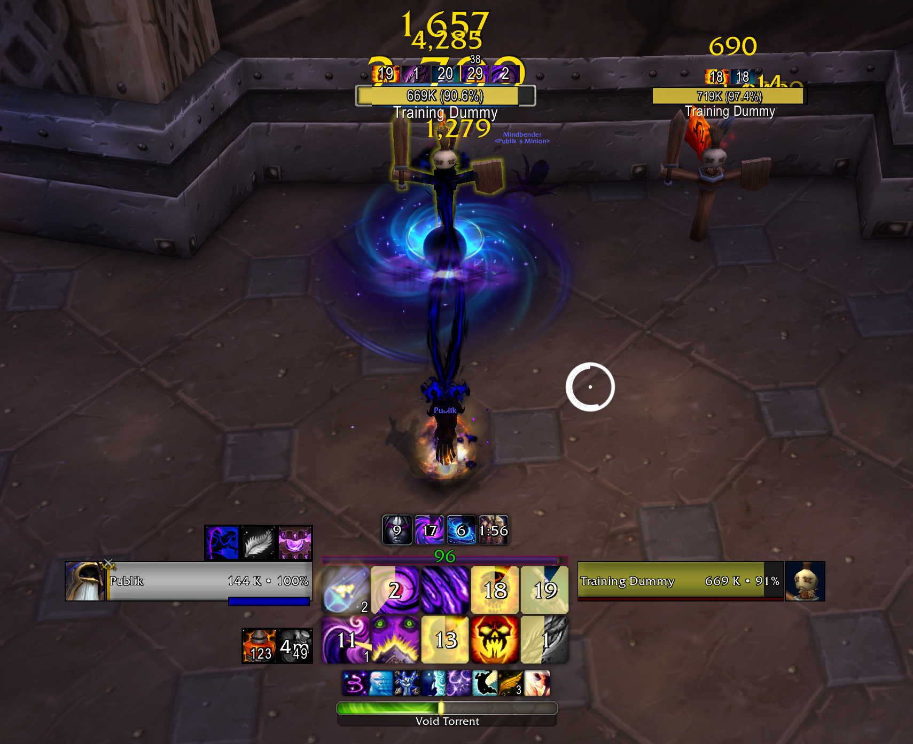
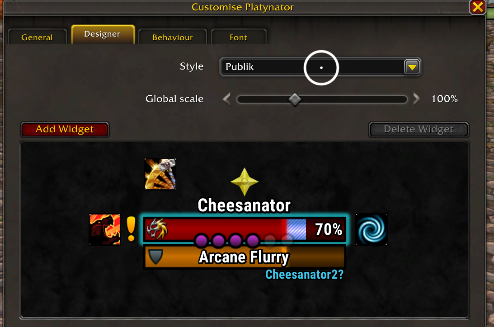

import Changelog from "@site/src/components/Changelog";

# Publik UI: Midnight
If you are looking for starting point imports for your UI use the following import codes. This UI is designed mainly for Shadow Priest, although I also support the following:
- All Priest specs
- All Rogue specs
- Havoc Demon Hunter

In the future I might add support for others.

<Changelog
  docName="ui.md"
  docPath="docs/guides/ui/ui.md"
/>

## Main HUD: Edit Mode



Import the DPS profile into `/editmode` -> `Layout` -> `Import`. This is what I use for all my non-Healing specs that do not use my Healbot config below.

### DPS Profile
```
2 50 0 0 0 7 7 UIParent 0.0 42.0 -1 ##$$%/&('%)#+#,$ 0 1 0 7 7 UIParent 783.7 202.0 -1 ##$$%/&('%(#,$ 0 2 0 0 0 UIParent 785.7 -1064.0 -1 ##$$%/&('%(#,$ 0 3 0 0 0 UIParent 785.7 -1015.0 -1 ##$$%/&('%(#,$ 0 4 0 0 0 UIParent 2086.4 -387.0 -1 #$$$%/&('%(#,$ 0 5 1 1 4 UIParent 0.0 0.0 -1 ##$$%/&('%(#,$ 0 6 1 1 4 UIParent 0.0 -50.0 -1 ##$$%/&('%(#,$ 0 7 1 1 4 UIParent 0.0 -100.0 -1 ##$$%/&('%(#,$ 0 10 0 0 0 UIParent 785.7 -981.0 -1 ##$$&('% 0 11 0 0 0 UIParent 912.7 -981.0 -1 ##$$&('%,# 0 12 0 0 0 UIParent 1285.7 -981.0 -1 ##$$&('% 1 -1 0 7 7 UIParent 2.4 296.8 -1 #$$#%# 2 -1 1 2 2 UIParent 0.0 0.0 -1 ##$#%( 3 0 0 7 7 UIParent -267.6 385.0 -1 $#3# 3 1 0 7 7 UIParent 273.2 384.0 -1 %#3# 3 2 0 7 7 UIParent -290.8 281.1 -1 %#&#3# 3 3 1 0 2 CompactRaidFrameManager 0.0 -7.0 -1 '$(#)#-[.E/#1$3#5$6(7-7$ 3 4 1 0 2 CompactRaidFrameManager 0.0 -5.0 -1 ,#-#.#/#0#1#2(5#6(7-7$ 3 5 1 5 5 UIParent 0.0 0.0 -1 &#*$3# 3 6 1 5 5 UIParent 0.0 0.0 -1 -#.#/#4&5#6(7-7$ 3 7 1 4 4 UIParent 0.0 0.0 -1 3# 4 -1 0 4 4 UIParent 0.0 -393.3 -1 # 5 -1 0 0 0 UIParent 1351.7 -1017.7 -1 # 6 0 1 2 2 UIParent -255.0 -10.0 -1 ##$#%#&.(()( 6 1 1 2 2 UIParent -270.0 -155.0 -1 ##$#%#'+(()(-$ 6 2 1 1 1 UIParent 0.0 -25.0 -1 ##$#%$&.(()(+#,-,$ 7 -1 0 1 1 UIParent 0.0 -2.0 -1 # 8 -1 0 6 6 UIParent 34.0 41.1 -1 #'$@%%&P 9 -1 0 0 0 UIParent 1315.7 -979.0 -1 # 10 -1 1 0 0 UIParent 16.0 -116.0 -1 # 11 -1 0 8 2 BagsBar 0.0 4.0 -1 # 12 -1 0 5 3 MultiBarLeft -4.0 120.0 -1 #+$#%# 13 -1 0 0 0 UIParent 491.4 -1153.4 -1 ##$#%#&- 14 -1 0 0 0 UIParent 1123.3 -992.4 -1 ##$#%( 15 0 1 7 7 StatusTrackingBarManager 0.0 0.0 -1 # 15 1 1 7 7 StatusTrackingBarManager 0.0 17.0 -1 # 16 -1 1 5 5 UIParent 0.0 0.0 -1 #( 17 -1 1 1 1 UIParent 0.0 -100.0 -1 ## 18 -1 1 5 5 UIParent 0.0 0.0 -1 #- 19 -1 1 7 7 UIParent 0.0 0.0 -1 ## 20 0 0 4 4 UIParent 0.0 -200.0 -1 ##$(%$&(''(-($)#+$,$-# 20 1 0 4 4 UIParent 1.1 -271.2 -1 ##$7%$&(''(-($)#+$,$-$ 20 2 0 4 4 UIParent 0.6 -111.7 -1 ##$$%$&''-(-($)#+$,$-$ 20 3 0 4 4 UIParent -264.6 -58.3 -1 #$$$%#&('((-($)#*#+$,$-$.c 21 -1 1 7 7 UIParent -410.0 380.0 -1 ##$# 22 0 0 1 1 UIParent -570.5 -102.0 -1 #$$$%#&('((#)U*$+$,$-#.#/U0% 22 1 1 1 1 UIParent 0.0 -40.0 -1 &('()U*#+$ 22 2 1 1 1 UIParent 0.0 -90.0 -1 &('()U*#+$ 22 3 1 1 1 UIParent 0.0 -130.0 -1 &('()U*#+$ 23 -1 0 4 4 UIParent 637.5 -500.0 -1 ##$#%$&#'j(%)U+$,$-$.(/U
```

### Healing Profile

This profile is imported directly into `/editmode` and moves the central bars around to get more room for my Healbot frames below. If you are not interested in my Healing UI you do not need to import this.

```
2 50 0 0 0 7 7 UIParent 0.0 2.0 -1 ##$$%/&('%)#+#,$ 0 1 0 7 7 UIParent 783.7 202.0 -1 ##$$%/&('%(#,$ 0 2 0 8 2 MainActionBar 0.0 4.0 -1 ##$$%/&('%(#,$ 0 3 0 8 2 MultiBarBottomLeft 0.0 4.0 -1 ##$$%/&('%(#,$ 0 4 0 8 2 MultiBarRight 0.0 4.0 -1 #$$$%/&('%(#,$ 0 5 1 1 4 UIParent 0.0 0.0 -1 ##$$%/&('%(#,$ 0 6 1 1 4 UIParent 0.0 -50.0 -1 ##$$%/&('%(#,$ 0 7 1 1 4 UIParent 0.0 -100.0 -1 ##$$%/&('%(#,$ 0 10 0 6 0 MultiBarBottomRight 0.0 4.0 -1 ##$$&('% 0 11 0 7 7 UIParent -0.0 102.0 -1 ##$$&('%,# 0 12 0 2 0 MainMenuBarVehicleLeaveButton -4.0 0.0 -1 ##$$&('% 1 -1 0 7 7 UIParent 2.4 296.8 -1 #$$#%# 2 -1 1 2 2 UIParent 0.0 0.0 -1 ##$#%( 3 0 0 7 7 UIParent -267.6 385.0 -1 $#3# 3 1 0 7 7 UIParent 273.2 384.0 -1 %#3# 3 2 0 7 7 UIParent -290.8 281.1 -1 %#&#3# 3 3 1 0 2 CompactRaidFrameManager 0.0 -7.0 -1 '#(#)#-#.#/#1$3#5#6(7-7$ 3 4 1 0 2 CompactRaidFrameManager 0.0 -5.0 -1 ,#-#.#/#0#1#2(5#6(7-7$ 3 5 1 5 5 UIParent 0.0 0.0 -1 &#*$3# 3 6 1 5 5 UIParent 0.0 0.0 -1 -#.#/#4&5#6(7-7$ 3 7 1 4 4 UIParent 0.0 0.0 -1 3# 4 -1 0 4 4 UIParent 0.0 -393.3 -1 # 5 -1 0 7 7 UIParent 409.4 2.0 -1 # 6 0 1 2 2 UIParent -255.0 -10.0 -1 ##$#%#&.(()( 6 1 1 2 2 UIParent -270.0 -155.0 -1 ##$#%#'+(()(-$ 6 2 1 1 1 UIParent 0.0 -25.0 -1 ##$#%$&.(()(+#,-,$ 7 -1 0 4 4 UIParent 0.0 350.5 -1 # 8 -1 0 6 6 UIParent 34.0 41.1 -1 #'$@%%&P 9 -1 0 8 2 MultiBarBottomRight 0.0 4.0 -1 # 10 -1 1 0 0 UIParent 16.0 -116.0 -1 # 11 -1 0 8 2 BagsBar 0.0 4.0 -1 # 12 -1 0 8 2 GameTooltipDefaultContainer 0.0 4.0 -1 #'$#%# 13 -1 0 5 3 MainActionBar -4.0 -40.4 -1 ##$#%#&- 14 -1 0 8 6 MultiBarLeft -4.0 0.0 -1 ##$#%( 15 0 0 0 0 UIParent 776.1 -1181.0 -1 # 15 1 0 8 2 MainStatusTrackingBarContainer 0.0 4.0 -1 # 16 -1 1 5 5 UIParent 0.0 0.0 -1 #( 17 -1 1 1 1 UIParent 0.0 -100.0 -1 ## 18 -1 1 5 5 UIParent 0.0 0.0 -1 #- 19 -1 1 7 7 UIParent 0.0 0.0 -1 ## 20 0 0 4 4 UIParent 0.0 -200.0 -1 ##$(%$&)'%(-($)#+$,$-# 20 1 0 4 4 UIParent 1.1 -271.2 -1 ##$7%$&('%(-($)#+$,$-$ 20 2 0 4 4 UIParent 0.6 -111.7 -1 ##$$%$&''-(-($)#+$,$-$ 20 3 0 4 4 UIParent -264.6 -58.3 -1 #$$$%#&('((-($)#*#+$,$-$.c 21 -1 1 7 7 UIParent -410.0 380.0 -1 ##$# 22 0 0 1 1 UIParent -570.5 -102.0 -1 #$$$%#&('((#)U*$+$,$ 22 1 1 1 1 UIParent 0.0 -40.0 -1 &('()U*#+$ 22 2 1 1 1 UIParent 0.0 -90.0 -1 &('()U*#+$ 22 3 1 1 1 UIParent 0.0 -130.0 -1 &('()U*#+$ 23 -1 0 4 4 UIParent 637.5 -500.0 -1 ##$#%$&#'j(%)U+$,$-$.(/U
```

### Other Addons
These addons are smaller parts that make up the total UI that I use.

- [CursorRing](https://www.curseforge.com/wow/addons/cursorring)
- [Astral Keys](https://www.curseforge.com/wow/addons/astral-keys)
- [MPlusTimer](https://www.curseforge.com/wow/addons/mplustimer)
- [Plumber](https://www.curseforge.com/wow/addons/plumber)
- [TargetedSpells](https://www.curseforge.com/wow/addons/targetedspells)
- [Skyriding/Dragonriding Glider](https://www.curseforge.com/wow/addons/glider)
- [BasicMiniMap](https://www.curseforge.com/wow/addons/basic-minimap)
- [Missing Class Buff](https://www.curseforge.com/wow/addons/missing-class-buff) (works for [Power Word: Fortitude](https://www.wowhead.com/spell=21562/power-word-fortitude) and [Shadowform](https://www.wowhead.com/spell=232698/shadowform))

## Cooldown Manager

Make sure you enable the Cooldown Manager itself in `Options` -> `Gameplay Enhancements` -> `Enable Cooldown Manager`. Then you can import my profiles by clicking `Advanced Cooldown Settings` -> `Import`.

I currently only support some specs/classes and I might add configurations for others in the future.

The below settings are just a starting point. I strongly encourage you to open up the Cooldown Manager (`/cdm`) and arrange spells in your desired order/place. The UI should automatically update as you move stuff around so feel free to experiment.

<details>
<summary>Demon Hunter</summary>
<details>
    <summary>Havoc</summary>

```
1|a2FpWChR2dg0Q09ynZDkvHOS8/ZJrguXnJ8pOe+s5PzlkvO7JOdnSc79JzlvvuTcP5LzqyXn6UnOY5Gc+19yHoPkPCbJecxSDIy//EDEQsn5OZLz9krO3ym54AZQILESRFRJzt8huVAUyExPABGJQOJHCkimGUj8A2n/qQMk3mQBifeaQOJLOIg4DCS+eYKIHhBxHqRuBYj4LbngJkh7yRLFJjAN5DO1wG2B2qrQBHZKDkMzyD9AD6wTagxxSc3Nz1PwKM0rSS1S0FXwSCzLTwYA
```
</details>

<details>
    <summary>Vengeance</summary>

Coming Soon
</details>

<details>
    <summary>Devourer</summary>

Coming Soon
</details>
</details>

<details>
<summary>Priest</summary>
<details>
    <summary>Discipline</summary>

```
1|VdA7L0RBGMbx41BM1knmWM0+Wx0K1z1YJChIJESikvgIssVJxG4sjYrZi8u6F2gVvoDbsj6Ayjc4WlZ0im3X+5CVaH6TzMw7yX/yLZuXsRFTMxezUA9QZTgbUE9QFbQ9Qz1C3SNch7qNW/bUGNSdrPNVRLsQLcKZg36DfofTDl2F/oD+jFtNflJIbCGs47UTrWWEFe4OI5JGOMqzPNkhBVIiRbJNdskeOSCH5IgckxNySs7IOZ/uJj2kl/SRfpIgPhkgg2RISHMsE5OY8Re+sg9Xxu3Ja3JDGDxtCxOu4H3BjVxZpvELtmlMdeT+3fEK0vxby/C6tDfn/kJ/kkumtriwGqSya57vzQTZpSCzHKykvgE=
```
</details>

<details>
    <summary>Holy</summary>

```
1|a2FpWChhspC5aYaNJAePJAe3JAebJAerJAevJAeXJAeHJAenJJeWJJe2FAPjyvlSDEx2m0CsBUCWt4okl4akwV5Jg32SvGaSvJaSvFaSvLaSvHaSfEskec0l+ZZK8lpLFjtJCp2XFDklKc4A1KkeAiRUjEDEMSChqgUi+oCEmjqI+ABS0gYidgAJDVkQIQciAkBEIIgAySbfBhLtLCDiNcg5C0HEIhCxGEQsARKrS4HEGlMQcRhIrDsIMj4SZO8PkJVfJcXtQdYoLWZuAfPBHJi0WiRTE9DhYPcqtID8CPQp0I8G+xYy+wYUZaYWlyjoKnjk51QCAA==
```
</details>

<details>
    <summary>Shadow</summary>
```
1|TdA9L0NhGAbgc47GRysSm7vJG0+CxNDRVxMnYqkqR4tiLdHBR9pJYiBx5Ggtpg4MBAmOrUMHBj/AjzD6ARYzz30kWK68n8/73k8QO7rtG/WPL/IQB6kipDtp2VeH5ACSgHRCbEgM0o7+L12uDylhAOmCSWMfMCMwkzAupAdmAmYMZpzniig1cJOGdGAgjuE1lKeResXmmW7ex5OWk/1U3Aqp6tpDhrfOle0yR9F0hmTJLMmRObJA5kmeLBKPFMgSWSYrZJU8K9eXfDwkb3yylzTJO1OBsHKoRZ0pi6MTUiN1ckpeyIfyOKg000rLJvxQy8P6k17PJe4sX/vn1KKEmj3K/K8BbkUC9uanSaVGW/AbyvtL5mcKexu7Wzvf
```
</details>
</details>

<details>
<summary>Rogue</summary>
    <details>
    <summary>Assassination</summary>

```
1|XdHLSwJRFAZwS/sPCvpso+7ShDY9IKis1i0CaZtChj10MRVnIqgxRQyCQBDLIPNRQrve0qLWvf+Q3OWuoPPZrs1v7j1n7rnDN0nH9kl3r5XIByGbkHWIAUlBtpy2tlwD5gDMYUgOEoUk0Bxk2U4cpAOZWUgBsgfZhzkCySLrhuzC7Gf/Uwl9o/mFtIf7MEwfzGldRl6wEUEmj0wdlVEtLPmVoy62npRCmNyz1qmcl0iZVEiVnJIzpejjgEnl0AtzipsJZfGSXCkHP+SVvJF38qGUHpS5ZciKPstOpcZDNR6qXXPQEFc35JbckTpPNvipz9wmSYpcsPHIUT3KMW8tekkfRwXIGBmv2pKMVLPVhCXXbmkq9p1/L7nSGriG9xdi2sM/YPpaObqtVmRWcCa+sDbv8rsChhEyjGgstBqNx34B
```
    </details>
    <details>
    <summary>Outlaw</summary>

```
1|PdA9S8NQFAbgah30D6ivUx1chNzF0c+OgloobSeFBlGHCjo01nZQSQXnXDoIOtgmrU07iaigIoi/wEHw20lwca2Di+dNweU5h5tD7j3vbtdOuX/Ybtn7MahZqARUCnUXKgl/GlUD/iGcb+g+OB8DoY6zCTIG5w7OL3QP9AL0EPQI9Al0FJ4LHYNzL1PnZRgP0C7bI3hf0BnoPNSMHGRKUGmpy/Nwe1F5QsXk6TZqP1Bsb5tohtEY5W2TZEpYX2QXFS6zHN8gQWeRTag4a47kSUG4eBb8F/JK3sg7fzSOwqnU6yRHt3ipR2rkmFRJXUh/onkg9aqb8wmS4jefNISbx2qoKAm1o+osyh7tfZQZLv6/MnivFdljDEE0jCTIIwho0Jadg93t1lx8bcVaihiRmJVdNXN/
```
    </details>
    <details>
    <summary>Subtlety</summary>

```
1|Pc+/SwJxGAbwywvHwvx1z2lyTQ7i3JD/QLhILY0RSCBBkDrUu1gKesN5X5q07Ya7qb21gn6oNUU03NBWg0u0NAW9b4jLZ3p53ufpLLY8o+DpZ4MNOJuwv+Bk0avA+cTLD05eQUmQAYqBEqa2sPsBWkX3F5SFP0VQMrXI0hH8C7h52ClQHMSmQcD5G8gEZfgk+Q3KwQ2halAKgY3LdfR30C+AVji2di3cCLfCnXAvjIQH4VEYCxPhSXjm7OUoEx8KmrwqMqkrJl0W3hmjDhX6Woc3zPdETrmD3p4n//8YWT3ZEpRmE3mrm59NnK61pa8KubinV7YO95tVq2htN/caB9XG8R8=
```
    </details>
</details>

### [Cooldown Manager Centered](https://www.curseforge.com/wow/addons/cooldown-manager-centered)
This addon both center aligns icons in the Cooldown Manager and provides a skin for the icons by default. Import this in `Options` -> `Addons` -> `Cooldown Manager Centered` -> `Profiles` -> `Import`.

This addon also lets you do `/cdm` to open up the Cooldown Manager settings.

```
CMC1:DI1xSXrXzCVzVlzTJDPjghpPUMyJX2j1neCCbkKyfIp)xi2N585KysG72725UBK3B3HDNZxSrvczEO5HkEmTPuPkGkAvROs1Y0csGuueLhALAxXdrQIhALkkYHivHavOj9H2zV7B378U3)IFWs)UX)Mz(MVVV5B(9Tcx(cRJviSz1vWp26md5KlJng(kjm5qMCIzNy8zwC2iuDIglsKzMA6OrmtkRIN(u3mvQxUPMAkISknJS4(xD6Rz8jF537dsEX9FPPV2pDZ)WMT9VwzDssDTfiRHXBOBqWAmzgrx7lMM)J105)sTNZGtX2WM18YkkeT0bDmHJFflrRawbT2T1EC3mlPcBuMU0iR9rVBHn6339NW3iRMXwTyTxRwDN)iTq)Uj11vv0ZRnRSMCASrmtg)FDATKz0nglxQuZW3wZyyn5eQyLm0J4J(lMt2axG1ZPRNnM7CM(uV3vVQT9q7Z7CsMZKPN90jzKvWH0v1nILqGoOpwWVNK7eSDprHZ8CZCg)KnZONFAs6mQ8)yXMW0K7hjYQzOpKxMA6gzLv5R3ImIkHTQ9sx7Z1y6gk8ra(I0VtnCzaPy6PszIzNxOHi74D)ciS4mqC6H8o7LXRMGOPy7tMtolM(nNKNL0ZZMtwXotSNOrRFeY15CpfHslq7VgRCP4EC)wG3iPlxR2PJuFhVRbhl8kydvzAMAM1wIUBw7X8sNNaKwZ2mgt2WmwAd98tAONDCIboP9LVeJfoA0WZs7Lzq0wgZIiNKVEqcyX9kCHa8sI(pTLfISpSLm)UPduP02NPiFZYZApSxIRqmjj2w2smJCQyZwOpy1TrhtOB)3x8AKqQyh0H9f842eUmNQpN1XJgE(kCYk3aCN9r9FFSyQwOXxipHc5AY8AzV5REn7mZEQvUK9naRUAWsyU3iRzASRLgVHU5wCrxsGgYlz8LOydsw7Y5ojIr4(lzT05uLnkUz5GvHZ02lpV4J8WFF6e7KvkH7XCBRL)YKEQfaNJsvcASlwWXUvb6O7eRfxkr3xEdKyw8615DmWt20oZV4UtB3Vm09qrhrAxEzNihJXFm2GV6v4QAfstkOmyJIfvkOpOHUgyi4VWL3sPEFcXaEc5S07pprvjPSHYcQ6SfWmgx4G5aRdvlgEGiC7KHTAlsHZROZ)44dynMvBwHcs3NjfRQoddN1z2x(XrcpzsBc7Yk09jDRmaCvK4n)5aErKqB)oa)8Oamhoxaj8nobGBtIAbWhff4JUiGNfj25FhWDGeV9MaoTu7VghMidrrbRzfQpP5DMYHKEGNcG5LUPZEjJ2)FAeB8KwHockO5laJ)ssBDfa(4sB9ta4jqc3DuaVpPT(za80OaTgeWhfT))5paWM8d4FbWXK26QaCuKWT(FWEois8oTcJhu6p(oaCViHP(kGYrLMplm8qODV0Db8usY3aG7bj83C2)qOaF4faCxsZBaWL5MYld4brbF9NgWzrbg(4awej8gtb4LKOpjaBwk17bWULELxhG9IeVXuGf2pk4n6hWdHe)ro07ef8xEDapbA3)Qlb4dY53hW)ysh8pdWHL26hdmEc0UEHMbC7sB9Aa8usZpbaZXtKEla3pkqY)bGNr6vCgUVRtkpJSBK4Odc)lDK4MlaBRismWpeWbrIVFkGZZIe)Tob(KiXtDlaFmKqh)gGpp3B0ddJ)IiX3Tdy82qI)NFbGVp(CVnWze0UEQ)lmE7iX35RbCxCoFgWzy((6KzDo(6FeaJ528Ia)oL(w7gG8J17NgOSasu156Yr4J7Cbmms4xF)a)dk1XLHHFgK4N)CWWnJc0Yga(qClWjzLGeF77aJ3lAx3(nb8ErI)7Eb8EO7Z2tFwcop24mYRQNJz2Y1TfSSOwot7QnzOpsv1vvS8RFHvHMyUOteXFbyvswcRmf5r1ltnKp5PL)InmP4nujvEFg(f44PKAf66zh9kN7BYzODhZrzFkIQT2T8ewMyk4uY5uzCfZ(lZxq0LtXDFUrRHOpufL9LOqX8OzijxwJ)6KOFXoW7RfFFYX5ToxcxX3LQMqrGVBqXAr)(7TjMfw5kO92R)o62B6PcHB)DJWFA8aChC6y5Ln04fcIPqmPQYRIvoSWJ2)FToYkwQmzfnWMXLJ(P9vuo6d6LTJeofs2WuEOGTQTcJrQP4Xs6OkOlGhmVxuDXvW2t1L8xCowN0VSKINRYUl42KPFbXBRzA3iPpxvz6GIXWxILZaV(y8wRxJR6WVb4rzN75IheQBV)GnW7xSkN9sfeI7VNHYA2zsv50MhWi8IrpZmZnrJv0G3679slg8Ub6UIgP9xWXw1Dj12NyNuxjNt8WxLSQ(nlk14CTYllDqkMxEsA3vKDzTE1BTcCf91wK41Vp6Z)TBQr(saLSq3dudiL3DwI(Rlu293ZLbRnNolSwOXRGFQcnGVsHNgntrpGZoecMuXhnJVrOzd58vRIt7acgvN0WXPD6ETWdnAhWNRW7419RTuQMD715s5sB7szhoCxGTQk2rX1b(4cTf48ZwQ)7Pv47X8avnVYnN5))d
```

## Resource Tracking
For resource tracking I use two addons depending on the class I am playing. Twintop's has a lot of great features I love to have when playing Priest, and will likely add more for other specs in the future. For the time being other classes I just use Sensei.

- Priest: [Twintop's Resource Bar](https://www.curseforge.com/wow/addons/twintops-insanity-bar)
- Others: [SenseiClassResourceBar](https://www.curseforge.com/wow/addons/senseiclassresourcebar)


<details>
<summary>[Twintop's Resource Bar](https://www.curseforge.com/wow/addons/twintops-insanity-bar)</summary>


To import type: `/trb` -> `Import/Export` -> `Import existing settings configuration string`.

```
!TRBv2!7V17b+M4kv8qRrB7uAPChh7Uq4H7I3GS6b7tTLKJe/uw04MBJVK20LLkk+SkM0G++xVFvS2/HXdHowABZImvYhWryB+ryOcTykgy+RZ440ly8v63309PZsQn1AvEj3hCpiR7nobBN/EUheM5O3n/fBLOE5888qeEfU/mEYv5sx1GlEW/kimkOZEHt9535p+cZq/h1ccgYZFLHPb16/k8ScIg/vr1y4ePo0vzf01IN2HETybnxPk2jsJ5QLOCzn3vzz9JRAejMPQTb1am3K7cJY0rqqsXlFUGJX3+iLIfqGxbLefyhkLHhPPIYeckr3l0d/5+cD8Nw2QCbS+JbtBxRmlKxujRC5Jw9jGISeAlT5Du69f7hCTzGB7he5yV9C4ZEyjNCad2eBtCnnh5lRnLPoUOsDWJ5qyZ7yBNaXJz2+6tNqmddbVGH6KaDRi60KrNxXoZOyoycoCOf6mJ1DOU7pPEe2CjkBN0MxrdXEOd329DGLFSOTaV05NHjyaTk/eqJJ1WcuVdwfzwcYAGQ8bbByXEM+J4wTgtZMKEFlHg+Skv2Z37/hdRpJAxEjiTMG2TTaJ/sCcodRZ5UxI9QXEkSYgzSTuWd9HNLW/kjevGLElLm5LEmbQUl+coKHsqMr1AV1AvnvnkaQQSn1UsHn97PpnH7IK5ZO4nV2GQDEOft80lfgxlu/DmCngABfOP0MdXdx///c/RH3+8G42uoJZ6ZpE0yzuee1wIqeMYpu1ISCGSgrDsMESog+HJtmVFkil2lBNR0//M48Rznz6Ekfcn/CR+1uefmJtkwxV+/U2w9ZaBqATJ3+EDC4jtM5p3SN7oLPcVlDb455zQiCRkMBpBhqBW7iyMvcQLg7qU1OuuSc+ny6tRITtK9eNVBLmynB/SZg64+FWkoZG2SMeTvSzphrLKenffe3+W3e0Ixj3nDydX2V9erEgt45fTV+e5oxmWayo2siVTR1ghOrIVx0GywVRDt7HtYryG53fpSGoyfQ9m5wWu5HaeqMbuu4+/fCj5jY7D8LzSN8Jx12K65To6ki3FQVi3LESIRZBiEsJUQhTNXsfxQqPmLM/twR5Mv/Yo9dk6rhc119g+vPx1dHlXtRHtbL8mXjC4y9q6nvt5ylXML6o+APf1F5ivUlEIT76W2es7d42S2kCVV6VzJSkV25XZcWjHOAwij6ZGV8hDbj7h84MXe7bnw/SA6yGYpBBen5gZiOTFxGDj5DFzwoBuVEHKHN7olJRYEFXMlPjPGQuAE9DehDVJtixJ4txjYNCBujuW0sWnctV0ujkcXqZchlbFXpyA9H4OXM+HAVIf1zH0ef2NTeKFWq+uRK3VBUCZQtel9C9Nkc2R6vkvVPHV9QIuBfWPIutLPqjh4zyKWJAsa0T4wKLRBEb+JPQbdEtSmqiiDERni0wOmbXW3dAdvNcIiCaXnfahMyNxDAO2/vlCE7xpTiphLrik1qQkQuLkP824+AOz+OSZ2HEY2WIp6QUgINAebhXEm/WMmICZWtI51XrfGUuYJkmmKUqaMurNp63caJSlvqQyEpXr27vEPie0mdeEv1JYIM0vYdjOybUSJb7ebMXdDaR41RhIa7xPCv1QbXQmy5CMzKkXpsv/2SyMknmQaoPnhmTCAKysodLVzpkXDUAnBqWFuilLGNxGoXOS5dpiBcSTwzcomxf9LhyPU0GtjIppSHlduTGqWDqxQoF1JFSoaFxSZxFzQMXlpjIzVjxZRQ0qL6dNvVazndm6ZdXiqmVtdWZDm4+2tirXgFssrwRh9bVVNiiqy8aC8pkXjEJYqsQhKMfc9F8Ig1aISU4a75QWAmInYixYaH85P1nS/qz0OgFFroIGpEic70/Z7Faq84ub27OAXkThrGLd4rmd+EwIfQ989cBXD3z1wFcPfDWWxKbObJtaSGImhiUxsZGt6QpSmKSpCpaxI5Ee+OoW8EWppGsYS4hJFkHYMVVkqxgj12SuqaiY6q7VA19dAr5MZsqqqzNkMKIgbBAVEVsxkUENSzVsEAdCe+CrB7564OuAwFcLsLUrNJXu8NPwcQR1B97/zVlcT4dV2dTVDfGxFcjCaqyuB8i6CJDdp5LlRMRNlgrV4QGw9RDWfjhwBQDjzNgeZpJ6mKmHmTaCmUDTcGUTkHwG02NNPdbUY0091tRjTfVVqO7aqmzoGtIxJghjQ0OEYhs5RKKKadsSMXqsqWNYk4ptGROTIMXWGcJM1pEtSy4yHdOxdaK7jrYOeeixpjeFNVHHJRZ1CCKqKyGsYANZNrORpGINBjh1TbzOlbLHmnqsqceaeierHkN6IxjSW4WGoP2+F9DYo2xHz6jzPP+P9otSe8CqB6w2Aaz4UCdjJhSME0ZC8qmXXIdiFABx4VyIxe0cxse3jB5hs0r72hwtJfFL1qFtC9qU5A9ZF2YFrekSl0+fROcGYcAWOAp2kuzUvsWCd2hdG5HV9r2kHIgTPofibcn1SBWA8dkD47Oo87PhP365u/n86wXXa4UOThnhcZNfI1NI/NbghoKXYRt8DE/Cx2EIdYaPQV5DMZZxLncyFzUWk2QOVFVU+QzkjkWJJ6BQrtJ8MssxIlFY3gjeKREjDp+ZjzzeBumdDB3sBSBvqRqcpEo6N/TBfGqz6My2I/bgZcirKFHMv0C5/ov4c/Z5RqFJcQuo98PU3tG13IKmfTmtYdTZNOhQKOeekLeYES00pkfHM2x0PQj8mvj58SD56my4THUf+h5tB+wLwWkk3QPO3pnV+yL9DeLXi2w5hjcVm58QpS9m5c6EBAHzK/bxGugTdOSf8lfccrDvYGfAagj0gU9sQOuTO+Zyi3mXrq+1ykrjuX6cwvPJPAC7+lRgSlEYJ/kP208jQzK1Sdk0DCbzVNWnxTxAD5TWbEIeYBGQ/XhgwZiBamYlepAd08CN9oR/mabrX5Gc+SwnILfkcRJGFdv2kh/uAGsCWOw/MvJQVg2G8HEqeqQwrQF9JP63/M1Ly4kQmcksHOWzkVTf0czrTmeNz7DgiFhrVxFYsQQltTRKAUHIwKKSKpv4ZZ9w0BBGn0eCVUQ/kijysplbNC1sOcwuEuZUTb87j56qufxUOzwLrsE6cFxS6Lq+V8sL8xd4cGoVg1lmcSog1IsdbwZrvaLhwiGnYHwhPnxNXsiHzYAjQk6LqsHQf4tBDOIJqJuCAdGD95B30kvldI/nFjKrshqxJPLsea3ZIJTfCvmEymvTIzIfp2JWfQerxphFD9Vef6tg29gPbYE9LRni1e35bMpeTKyHGVJXrOwKO9p800hZ21Orv6tm5zU3chZ1fxTz+ex1ZR1fgLyVmWuB4VVcs7Kh2Fn6MkXcUfpW2ZaOklyYy87SV5kBdJTGQuNepnOrIknbPKWjXVCfenWWyOpssqNEtk2QO0rqsuDYTpG4wjGzQ3QurMw6Smf3Z7j5+rmjBLat5DtKah2c6CyRAm/pKHktCFZHKa2Acp2lsMQZO0tiDTrtKJXLcd2OElyHqjtLZA197yiVyzeAOkpwbU+rszT+RdRu+17Ym6O3xQ2oSm65UUvDLqM/b3QvbBPurdiAfXP0bsrO+p5yZ8kst8k7SuLynf+OEvxmNdHms4OKf0ZHqVzuctJRgpteNJ0ls+4Y1FEyW4LitwmSzAKMlkdfromPzIIfzY2jJVdFZIqAliyg/3fuJ88e45YoAR/GqHCN557DyjvpnfxO1lAECzYeWVWLWqzEfqX7ojfuHQnGjfArjLNwLh4xULg0NkK75kFLrFjeVfEM+NYWNnh11RIlFj4sRrLlAWDzYB4Lb4RdIhCHypl62RaYtlNAIlAV0IUYQy392zIisb1FmwfWtYcztnfwztGNeTxjmXY45KnP+YmSWSQbmfFOYbSljduEM9bDJasVmpJtmdJGFdajMXcLfN0xhrLZxz/sWJKjn0LSFpCyMuAxi3GUqwSLgpYHPIowMLn0OpVrHqVpKK43ZXlYW1bMh1QApUrBn7joy5UXFR2glQGEi6F2G8YPfl/BhuMED+ZCYRVxhDI2SoGTyygtTaoh8NzRPp/5pU73VQ/G9JLCtaBRH33URx/10Ud99NFPEH3UG+MydKe+HJp6Y7HBIWxl+MiiL9AB52Klcc8Yrd1tc7QDxVSHWozaLqKuZSFsShoiri4hlUoWZaqLNbLuPrf+QLE3dqCYpBMi6aqFmO4QhC3FRaYk64g5GpOorWCVsTU87w8Ue1MHiplYUjRKYFhrssyPkCPI1HUVKTY1MFNNyzHcNRxfOFCMLw6yUb4H34ti9z9TbCnnl58ppv0MZ4qZRxAAyzIx1mwCAmDaCNs6QUS2NKQa/HpeLMkuNrZS889/mz3eEe4O5jB+2MR/VH4PJyQas/i/pZffGql+30NSbr8M8qIG8kEEZukhdLfcPA+4fX5f1vmfcpwMBGn/tVqD3ObW/Y888x9yd6yHJcs6sWwNaboLukSxVGRaho1k14D5guY6ti0fXJTkVxMl5UeIkhLQnUVJOZYo/b7dSYcHAvHxYUD8vYKvif9InuKNg68D9iAWJq950GEuCLkcNHv64kJRWsDZXeFYSbKs9lPi8m+rNwFc13BNw3WXHgJoSqYkZGPlEYI9iv76KHoBwG63dRLPQX/duJ/y4wEqWYaXmnnZliV1ChuGD/BhYdMIn2mXxxPh/DzU4sCUJjlrTzI8D79DZw3OQPTJ4JcQ+q0wMPe8rEHoDj5lK5YdjzQUVaQ1pK/E2YZc4oJ0T5nt29CPRUEHbuO++wp7nTKmd+iUse7sjajS0kMWSwDwZYnr6PJNjhGfRvEv6ZwpRWQLiHL5ZgYXQUiwO8Db74ZsshuSmf5tmVZmaxRd5dyR7j5p4vItTdmQD2XLD9KyLXZQFjelllGxdC/qQBshjYZtvU2yMG7XDpLtdz9WCme/y7Fil+OIGxe642Jq6hZyHNVAWNZkZMoUI9mxDayoBtOJvi2k6WUjb4MF5gL4cHg8c4c7Ev4yeKZrKYomyzbSJSYjTIiLLMsxkSwpjPBFkKmuuxOlsW1VgbP/voBIrCT9KNtV19C89XsX10I77ocQbSn6x9i+UF1N11QXyRgGPMYSQybVDWQ5qi0zW2GGte0NOOkSZBc2v/5G1cFYvcEm1ba8/jGY4IEcexcwQYHz3VfcbYMw+TeLQvGq5na9KeqXvq7lPwTymB/I/lq4Y4GCVHwIW3GF7fGB6rUMG90Hkd91wcmm6ZUQe4Ic115ABxfZWYB7XjKxDJFJ8dmPgTvPAY99Giw2DfLSBmOw9ylmeOA209kdI7T1IoJtWit6ln+99cl4zgai1MMDSiygN24q1KFH3TCatnjlZ0Dr2El9zLwpuybfYc59yt/E6XN6Tv6ExzNWvFBlLNX89Tfwbs9LEef815DS9H2KN9WR41Xu49t6x+cT8FAAZPMFF/ZczYp7B9qvxA5nhUvSoqt7QNnUc1ox5Mb1Kht4zq+5J0j02GwWhbBsSdNVAets0bcExD0tbtbIteTuiPHZ2UkFDm8FjPvtiGNtR7g+ibkjmRemn7TdLkNKS7msa4nF1rpuSQvNFZrQZ5+zSBgedDJUrkwrxS3ihAQJtyznPBCoVUOsiB+pho04kbd1QQIi5fuB14QGLI5FI4dbbeBsylXeuCuYNeXaekPVxLX0v0LfZ08L+uW0kt88kyQ8PMkycLV+2bykrVRYINf0onKqb7UZQ7VOZR4/BAo8Cmeec+c1r2fPqt64e+u5C2FY7NfmhpOhq+dnIkQLZoa3uRTkx6CHjwXjMk8GLrNn/mxC0kFdUZ9VflbNYCWMTNw532Iq2sR6uFjwS4s+rppKVds51KSpqP+ql8fsszumvPFNIRkbOwTMLMa492EvP9NGTx/20oe97LKf04e9dHpDqB72wpX4TxH14koW0XXHRrYumQhrEkUmJTIiju4YTNJ0RTa32z7oo15+dr9lRzUkbBo6Ihq2ELY1Cdhtmkh1bUMzLZeLwpabCH3Uy0/Ncazbmo0dDenMlRBWHAmZmuwgydKZJkvMtYx1nup91Mtb3iXGmoVNy7SRpqoOwjpTQOFTglyHOJKrUSqvDXRrhipMHu9ZxPisQIQqlL+rUS/1VPuEKnz4MsiLeu2olw9gnbNIhaLKzYNePmS2/Y88b5diXlxZxUQHY6FjXYb5gsmnCoqCqGwybDjEkLV18XPbC5L8aoL0yjEvrYK0ccjLoiAdLeLl9QWJUMWwTddBCqMKwpQQRCwLpMmQLabazDatHTQSTNV50kKQst8NjVRJta8gZUUdUyPlVe6ikbK8XdJIYNlkVdV1pJkaQ2DlMMxtwMhZhmoqKugmdeuAzvWCJL+aIB1RIxWCtINGygWpQxpJs2UmKypfChswR1I1jAgsgpFJqKTKpkpkvJ0nHRekId8/8OI0UDOVmeqLPWUmL+poElOpcBMhyZMfT9v0gZrHD9QsfFHIjEOBIIhtZ0Ru6I2yNOozJk7E6B1vNluI+bSkqysdNweTiJ2a+SxhwzD0F70/JOlca92vzdG5Qt4bIsIjNldky5VjM9uSwNQiWzbLazbyAv5asvXxrL0DycYOJDtEqG4XArta1nxeb3l1a73rW8urK5NKA84uzrS25pYZVjhNrB6hmsb/t9YHZ2f8/6TF32LdyF7iLrKBiCwN5BV7OjymmFccN1vafj5r1e21waq17pCLXqufKiUcxFf2TYT5tnT8Dn13l5UxEIUcqvveTkR3Hy3dR0vz4JYljjH6UseYl/KmlvT0WHHbIn+s3BO67BIMnqycegrfrPTE89xNC1YVLOBTnR2k6kDOWg0W/wAxaznb3q6cDw9//w8=
```

To import type: `/trb` -> Make sure `Shadow Priest` section is selected -> `Import`.

```
!TRBv2!vVhtb+M2Ev4rgnD3zV5Ill/zzXbibu42teuo3aK3h4KWKIuoLAoilcQb+L/fkKJeKMmJvd29AAFkaTgznOfhzHBezSQlmHHz5tVkIfLps3ji+IVnKWbi2UOMk3i/QKl5Y97HHKcB8vCXLy5K91h8WaXoAL9/ve8/csQzJiR75o6mPk5/hk+wzDY25AVH8PqAYgQCC+T9tU9pFvsNpZRGnCRMqlM/+jXhnpkgxsgTvtYdtGM03bVWLTLOaQzmPn+8d++mv09BNMQo4mFlVO1hEZGvX1HqG8qtSlLu9GK93XHZfXNAKnwajpYgvO9agcqV4qVJd7u4MR4PlPIQp5qArmzu+1KX+0xiTpP7mKGY8CPIfflSogXfmVL1ge+RFpzzWABbaZZ6uDMOBaTfxx11Oj5R7y/zhqcZrtFL2X6kEdHZ2nZKC3qLEE0WXksLEnv0ALz4CHouon1jQWMjrXP77qk4S44aUlcc4ZOG4itoiRCH0LpUeLF23fUD6H7ZUEhaVsX8Qc98Jj4PzRvHsnq1VYX/OKLPRt9YYuEHaGAJ8sAFqSTEZB9CahzA87HQjGIvpNKFHUr/jY+gBFLoAaVHkWY4R164ocAnsfP1Rvi0DgKGuVx8QNwLP+cOKeZIdcWKciPHchFsPMiiqLYI3vAQohjSyJcpuvx1SzxOaCx8KfP5Z4jEA/JjzNhAvMUx2kUY+BSgiAldPn4CPGDPmwjtM6zJKHMNEadLpmXNucTa4CJVHZpALElpglNO8jpFn3AaoaTIYXl0FfYDkCYeML6tqKczSUF2nkaDYQeL5juwLsgT0uclHATwPi5cKEk0LEjUtwciDgyonSJe33eCvY22qUa03ALodRwd17Dhx1AUbLWRVtjOiEtrAgrCkggdXUhnis75439ezYzhWxygLOIrGvMljQTjlZkA3qzgwMK+xUfIIqvt/R+/uH/++cF1VxAFfXEuqtbuMyIy2dgLhv50POt7njPpD+2R3Z/a/rBve7vJcOBM8BiNzdzSvzIob8HxI03JV/iJIhXy8sBy6bP5D6Kyt1l5qERXsNT4JUM+RBsZrgsSGuN6ZtzQmVBGxEHSE03Tskac5d3P7t22zp3qs8xnavUDIrGxVSnQyJuTnBaj1hIQLyRF/usMR920HvhH8rUKvJdD+Fo8mCv1VyjOpe3pqffD0Q9mg8HItnf9sYXt/hChoD+bedO+bQ0wmk4ta+r476D/CQe8hr2oThsMYYr5P01tP8N3th5r+t7EXcloqH+6W7kl5oPzmMdIg7rNDiWlKt05pJW5N3C+kvr/B7SnTjAaj5ygbw/hwA+HFu5P/fGkP/OcnY13AzyZvYf2VmZQHe5vgrlQ9CbOhZAG9Pb+p48V0v0fD3Vh8Dti/V9RdaQqse93oX03ZbzB0HpGuegkv7eXWr1SDSCKntGRVRUNQKb8D5xSrSbmPaOQfyKM7EgkKsSNGeOnvNuTbWlZgOVrbT04sKdxSnzZE+Z2inavqTT3qK1V0vVCDxiGNsXv0g7d+Q7x2oqyD0KZT2jRAnko6WpyWPsO8ebtR4jDtzlJAbH4A93vTaWk3tXDZ0N8N8sTtlYuiG370Mt4Z52p61nQF4ivMU9B0viJxvtK4QOJfeNWtkE4NaTGb95NbkZaka/ktkQjSZ9xeh8HGVM54e84vBHKjEKbsYd6j/3v77OfbDHyj3/X29uiwTTyDtPItX5nd08iFfnrQJKaEj+g6aHV+ANjqC982nsiXpwc8AN6gYtbT7xh8nkgVIWI8aoVFtnfUtlKvw3JI5HxdbBF8R7rmQzqEPyplr2w37yHwHXY34HjuJUGbTtPg+LE6d8sS/yLb1nXwjx/Ni+zUT52qwsq92qbETfBfM5Ql10uhfRiZpbhQ0kifPbbtd4MobR1uqsb+jA56fMA3eDU2s2m1kUG+TEREoBX0hhyVQrHY0v+iZgV9y3dRdETyoyCfZId2iFtb8ARIYYLjSREkX+/1bxlzedmrq/9ScJ5KnoT+JqlQH6uCy4Hc+dOWpDclUOHOiHU+/waqcGiBki6uttVbjfnn1vneweyrcs85TIsWXKuuOfX1w4+CouJaJxY6/SKNIqABQfidQJ0Ut6q+tRB9aY6Ndg852QesSRJKfJCKVdng5pXncGrxDKIEAvh5kCopM2ooMD6Kk+lljs9l7WpFAQV0Rr3+l+ZWCuNjJaD1XQm53GMo5iL+rcA/d2MavtSEqbiCYQyJVcrak0TcieXb6DSVnLpkRPOraC3K2rKhVQWteQ3GkX42OJjr7Z+Ores4dJUC0TxuYv9cwQXSb/oN5puLB19l8VQCw58ShPibUnQCK8yfXF49dUlGdpxZQ3RydhZzOXBEBVtU7AgD4WcSxXA5a8kZ+dREiKZ8GvHrY5nvVjXiqdjT8dOV2rpovWyrfjUcX7rBd0ZaclC1ZniHiWuC+RFmLXrM928QjaT/nXTPadrRizT8o+aEVej6yvGxPk+3pwRy/ko9ggrr7lqkJTrF8Gxq+uRrd08BlWCFPefORwIoHfZXyYkdikkTUZjFBUDqtv8clYKvbwRC+alGMetUFQjtDOhUKr1WJSrynD07eHkVCEzq+auw0kFul2NdEcWlPDT/wA=
```

To import type: `/trb` -> Make sure `Holy Priest` section is selected -> `Import`.

```
!TRBv2!zVdtb+I4EP4rUXT3jVSBkhD6DVrYcmq3XcippztOK5M4YG2wUeKUUsR/v5nECTEt7fblToeECPbMMy/P2DPZmquE0VSaZ1tzIeIN/kr6ILOEpvg8E0lIk69kSc0zs2ncsgcamw21DEsjLmkSkYBOp/1MSsHT6fTucuQPvD88kFtQEstFnwQ/5onIeKiA+jF7fCRJaPhCxJKt9pJvwz3iXGVOB1LGAOn3kaX+WHvfNM3jjkJiRJYEtE9Ky/64f2ZMlkLIBfi+D/ogjl4Y5mH4a8alWI14SjiTG5CbTieSyCyFR9hPFdKJnBNAC8RyJm4F6KTHTSrKrkTwwzyTSUYP9T7dledTf8j3WwnQnP5UkOOEPonq58v6GB21GvmExO+0ktoCekwku6e+wIBufP/mGmw+3Ao4sfb+bLYa5pqFcmGendp2o6ZVpoLGYm1YxjlF/wAhXZGA8XkOsqBsvoBboQXPmxI5yuL4roDEGgO/QpauYrLxofzQs5BGJIvzx0hwOYSYwdAQHiGm4Xj05zf/+/cT3x/maY8FZmeoPrCEOr9lqWTR5lIk7BH+khhErgZDX21P2CNANttHhFVoVzSSSgF9UKtDkDK+ZSRMiCSG72NiZyQpnP9ra2YpvSgCQI/PC/8iEqe08Xo4unIhqnTnGcMajuwucd1gZs1c27Pajh1aXkiaFgncoENtx201vWNJ0OOSucfmL0VV3FKoNC5/hQ3KySymYXkFvBZ/w+Qa7kqkTDLB9SLTbWvFp4gpSq9V3xwmoKU0L3M3DazeWjEdyFZyKLZ7tRb0dBdVodJ9pLDKytk1/nWmg9OO3fY6rkWcdtdqzxwbSPY86zSadRyvG2EBvML0OD9+h1R/gOIS8EWOSyGN5PHoy+WeZeu/obk0+r/mue3OnFk7cCyXRrbVbgW25TnNwLK7LnWaNo26neYrPFeXb0n0knCiTvQH2K5gX6S7ktL4Ph989Qfj14/1NWHcGKtOp9HuPEd7KfkS65Xpd9Pu7f7etyXVLyE9c8ETFubNrcgkTL1LksC4a5J4TTZp1dRhhdP7oh/SQPCwkMIhgUj0Pbefz8ZyAX0ehuYQ/4hM3kRjwucU/+2dbLdt+CDaQqxL6xqtgCnQoKZm2/hFexnPUpTW93EX93dl5cBmliRYNTW5KOpEXieKEGdF0hQI0WE82wNDeVgE6MD8bJ9meFc0yvId4Q4GjAkFWzC5DPQCrd4LCv+6XQg8xktlTQnEWMxX54siTUqlPue5rm2rfM1ISiugnObSNuiDrymtbKvKSLNkTm+iq2JyQffPB443AE2ywmkKjkJarPcues5Ad63KumZqQniAVXoQJs53nHCJIulzQe0NDvK4KsJ0L+uqzVL3MMX1enjqWb7rOPh9JkX5bq+HX/PAbbWV5xYJJlnIBFKsJWW7r9Uyy7VpOp97eywx4BTz2jhRQ1AKbxiDURz2ABZRT8R8jvXJOKfJPZH0p3zqiwcoZqMHGSTGFwF1XTk3qoDe7VqBnoPnS6WPB/l9V+7GCsMoQD4rffrZ+FgGJ4hliMi4UuPCp6YRr6qEBiytupbqGzhN1K5ke4f3aHgT9WqHe3vYMZciRJfnAb4YSrak1+QBXogauJLmz6395bZi3BfQfJGBuOxXF0UvqTJVvWdhW+nx8CIRq2qzfG3qlq3Qarbd/bXYrF7JWo69g88/
```

To import type: `/trb` -> Make sure `Discipline Priest` section is selected -> `Import`.

```
!TRBv2!zVfbbuM2EP0VQWjfrIV8jZy32LE3LrKbrKNii9bFYixSMrEKKYhUEifwv3coUrLlrOOmSYvqxZTmdmbODEk/uVnOqFTu6ZNLmIxYljJO9ZuiD6rIqdTrpcgJzT/DLUrctnPNHmjqtuxn/DTjiuYxRHSxGBVKCS4Xi68Xs3AS/Bag3opCqlYjiL4nuSg4sY5GKXt8hJw4oRCpYtlW83V+D4CrwzUd2WDo6deZZ1+8LbaG5WGgWBhR5BEdQRU5nI9OnZtbIdQKsW+T3svjjJAyjfCecSWyGZfAmVqj3mJxo0AVEpcol9bTB5UAeovE7VJcC7SRh0Nayi5F9N09VXlB9+3eHcqPS7/P92sJaIB+VyeHCX2W1d9v60N07PTIOxR+03KhIEzoeZRFntCr+JIlq3JyKYdlSrFEMaQSWZc7uZaoRuKB8cQ5y1HT+Sh4gvC4kd9oX46IHePNGr8CsFZHmQlRRig/fRBJokEzzml+B4q+FeisdvTOGDeNYX1C3lJQ7I6GQrfKVRhefcKQD9cC90J/u+t1Wu49I2rlnnZ9v7VjVTUZTcW94zljqkFq0BlEGL50sqKGuw6u15XnuEjTr8alnl7EleU0YpIJbnCZfip1JY0EJ5Cv8W2j2zcVuaz2bf0bFTnmaZZaiIji+CQOTuJY05KBlIh2VzydBn7gT6daHIFUJdZdsXnKgi1NqZYgaSny8UFRq9GaZpDGK+AJbVc7UrN3tdfxpB9MtOkKiLgfizukhxvZuHfWn3T2d/PBwC+f3SPIQBgOn/nZBWHrivjxrMtSWIe2WITGUKTlMhZcTSEq08Ilds10Pvv9S/jt24cwnLqt5/VolTa/FFixeH0hcvaIr5CiyuVkGlrxDXtEl+3eAWXbM5c0VtZAY7Bfp6jlfCmA5KDACUPXEGDA//HkFpKemwQ04rHBZyfsaDpNY6NqbZOC6XJ3IzKkZBl7JB4OvV7g9z2IB77XJf6Q0G7c60PvUBGaeZnedH8y43ZNsZm5+hkF9b5geuRY/vWeYP1mQjJVT8neHFqdxlRbYsxMd3aF0xytrOVFCdPR28LOlO7p1npabXO0F5rlNl1hy32gsarO2bT+dab9AYA/6A49OojA6w07sRf47YFHoz71ybLT61J6hOm5PUWaVL+B4srhixxXSg2S57OPF1uWvf+G5iro/5rnoOd3+gRwhPvtttejbfCCwaDrdZbkpEe7wTA6iY/wXJ9qFdG3wMFO9BvYrt2+SHet1eB7PPkcTubHx/oTMO7M7WHaoL3/I9orzZdYr0P/Y9qDzZ/bY8leRLA8ieA5I+VJbCqJf9duy1PfhfQe1rK+h+IXTu/MRWN7NyjvtaDc7ZGdMR4KJEoKDmmV27mJW2OtLzsawhkn57nIamF1d+nWdxev4x+6GG3w+Qs=
```
</details>

<details>
<summary>[SenseiClassResourceBar](https://www.curseforge.com/wow/addons/senseiclassresourcebar)</summary>

```
SenseiClassResourceBar:1:9r5ZVnXruCCzzOqtPnjlK0sOGDHs6pOyAmQ9UxNysuJXUR3asvvIDwVpVZOmEMrZmMGZXOEONZFcO(xqu)lGZ9Wt(pHCUN4VGoZgJWob1lR0m7BFV33pFFVT06HHnI69ZQv7b9LImIECeyKJ09HqIEZW)CDvLbAs(qqyHSUYdaT7(y4v2UAOpZWKIWnQx7XVoLOFM7ykhoTb)aYyt1PhpzGuy7mYYzc4nXBVtZFPZEX7UZt36ukldAteKoIijhw4TPK(7NRLJeznLCPUvaPCGUCqE5G0YV26kzlPEiXQBosRDTJkyiXSFdrwOuNb6E2XCimMYebJZcc9vvf0Y9087TI253(14x8IAXXToYqLh47)KukWYP2kh7A9EwnXssBV1M7Sx7JlcH1FFtYr(00JDiujsjzcBAyN44oTNmGySGEpvgXcMKJpGLzPTLzqQtpJi8JgYep3FxPtndLslTRwMRbJluRlVVxEPLcYlfOlPQ4HriND4HeD2fSI9yu1A(UQ1h0kOt0aNyzVe66Bs8luxheeh778sqZjJJL55CizYagNVjZ5BwNTnzxyGTQvwnYtHj2zT07Ur9J9xCrFygtQa4Qv61mkSApyi7HogkmkI3BE7aPgMnSLlcR1tQ2IKbv9LoQaA)X1ojTW(MPufmjTKAnptEoLXH2Ue50Ch9ZakR)ioqJm9jCO8epoDEE)9fo6wwT0id8oO1WYjgAHoAWz5I0MB904TIcEvj1T(WJ0xuUNqbc3spBv4Eyz8s4Lt3MLLbc8k6PdY4cZ9n43HFp(P4Nfm(FUkUiUeUCcgubVoEdC1BIFowhVzcUgEl8llH3obFifRsXVYD9DtW7HFnEFh9X1NpLFcEn1TNDePRZw9qtyjU9kTBabFWFVi(n43I1k7L4s(O3UO7NUFH)WC4f3aRpXHRMokzkuEc(45QQ6gD1SHx4pc33Jb1Y(Xr)2BdtxW9oHLIxg)i8k4vXpEHZJex)Fgs(33JKvkqYkj4QvEhvQ19sBuR(pnLm3zUvKPG6)bsEX)G)AXc(FoT6X9psXhv2RAhEoNstFYUDcBS76V5mGvqdZcNumBm9W)b
```
</details>

## [Platynator](https://www.curseforge.com/wow/addons/platynator)



I swapped over to Platynator instead of Plater since it only shows SW:P, VT, and SW:M debuffs on enemy plates.

To import type: `/platynator` -> `General` -> `Import`

In Style Select Tab:
- Friendly: `Name Only (Default)`
- Enemy: `sola`
- Simplified: `Custom`

```
{"stack_region_scale_y":1,"obscured_alpha":0.4,"not_target_behaviour":"fade","simplified_nameplates":{"minor":false,"minion":false,"instancesNormal":false},"stacking_nameplates":{"friend":false,"enemy":true},"show_friendly_in_instances":true,"blizzard_widget_scale":1.2,"show_friendly_in_instances_1":"name_only","stack_applies_to":{"normal":true,"minion":false,"minor":false},"not_target_alpha":1,"show_nameplates_only_needed":false,"click_region_scale_x":1,"kind":"profile","cast_alpha":1,"stack_region_scale_x":1,"click_region_scale":1,"mouseover_alpha":1,"closer_to_screen_edges":true,"cast_scale":1,"closer_nameplates":false,"designs_assigned":{"friend":"_name-only","enemySimplified":"_custom","enemy":"sola"},"version":1,"global_scale":1.35,"addon":"Platynator","apply_cvars":true,"current_skin":"blizzard","simplified_scale":0.38,"designs":{"_custom":{"highlights":[{"scale":0.56,"layer":0,"asset":"Platy: Glow","width":1,"sliced":false,"anchor":["BOTTOM",0,-12],"kind":"target","height":1,"color":{"a":1,"r":0.1098039299249649,"g":0.8862745761871338,"b":0.9294118285179138}}],"specialBars":[],"scale":1,"auras":[{"direction":"RIGHT","scale":1,"showCountdown":true,"sorting":{"reversed":false,"kind":"duration"},"showPandemic":true,"kind":"debuffs","height":1,"anchor":["BOTTOMLEFT",-63,37],"showDispel":[],"textScale":1,"filters":{"fromYou":true,"important":true}},{"direction":"LEFT","scale":1,"showCountdown":true,"sorting":{"reversed":false,"kind":"duration"},"height":1,"kind":"buffs","anchor":["BOTTOMLEFT",-90,2],"showDispel":{"enrage":true},"textScale":1,"filters":{"dispelable":false,"important":true,"defensive":false}},{"direction":"RIGHT","scale":1,"showCountdown":true,"sorting":{"reversed":false,"kind":"duration"},"height":1,"kind":"crowdControl","anchor":["BOTTOMRIGHT",90,2],"showDispel":[],"textScale":1,"filters":{"fromYou":false}}],"font":{"outline":true,"shadow":true,"asset":"RobotoCondensed-Bold","slug":true},"version":1,"bars":[],"markers":[{"color":{"b":1,"g":1,"r":1},"scale":0.9,"anchor":["BOTTOMLEFT",-82,0],"layer":3,"asset":"normal/quest-boss-blizzard","kind":"quest"},{"color":{"b":1,"g":1,"r":1},"scale":1.45,"anchor":["BOTTOM",0,32],"layer":3,"asset":"normal/blizzard-raid","kind":"raid"}],"texts":[{"showWhenWowDoes":true,"truncate":false,"color":{"r":0.9686275124549866,"g":0.9686275124549866,"b":0.9686275124549866},"layer":2,"maxWidth":1.04,"autoColors":[{"colors":[],"kind":"classColors"},{"colors":{"tapped":{"r":0.4313725490196079,"g":0.4313725490196079,"b":0.4313725490196079}},"kind":"tapped"},{"colors":{"neutral":{"b":0,"g":1,"r":1},"unfriendly":{"r":1,"g":0.5058823529411765,"b":0},"hostile":{"b":0,"g":0,"r":1},"friendly":{"b":0,"g":1,"r":0}},"kind":"reaction"}],"anchor":["BOTTOM",0,7],"kind":"creatureName","align":"CENTER","scale":1.27},{"showWhenWowDoes":true,"playerGuild":true,"scale":0.91,"layer":2,"maxWidth":0.99,"npcRole":true,"truncate":false,"anchor":["BOTTOM",0,-4],"kind":"guild","color":{"b":1,"g":1,"r":1},"align":"CENTER"}]},"krepp":{"texts":[{"showWhenWowDoes":false,"truncate":true,"color":{"b":1,"g":1,"r":1},"layer":2,"maxWidth":0.57,"autoColors":[],"anchor":["LEFT",-61,0],"kind":"creatureName","scale":0.71,"align":"LEFT"},{"align":"LEFT","color":{"b":1,"g":1,"r":1},"layer":2,"truncate":false,"anchor":["TOPLEFT",-61,-11],"kind":"castSpellName","scale":0.71,"maxWidth":0.68},{"displayTypes":["absolute","percentage"],"align":"RIGHT","layer":2,"maxWidth":0.46,"significantFigures":0,"truncate":true,"anchor":["RIGHT",61,0],"kind":"health","color":{"b":1,"g":1,"r":1},"scale":0.71},{"truncate":false,"color":{"r":1,"g":1,"b":1},"layer":2,"maxWidth":0.41,"align":"RIGHT","anchor":["TOPRIGHT",60,-11],"kind":"castTarget","scale":0.71,"applyClassColors":true}],"highlights":[{"color":{"a":1,"b":1,"g":1,"r":1},"layer":0,"asset":"Platy: Soft Glow","width":1.066,"sliced":true,"height":1.544,"kind":"target","scale":1.02,"anchor":[]}],"specialBars":[],"font":{"outline":true,"shadow":false,"asset":"FritzQuadrata","slug":true},"scale":1,"bars":[{"absorb":{"color":{"a":1,"r":1,"g":1,"b":1},"asset":"Platy: Absorb Wide"},"animate":false,"marker":{"asset":"none"},"layer":1,"border":{"color":{"a":1,"b":0,"g":0,"r":0},"height":1,"asset":"Platy: 2px","width":1},"autoColors":[{"colors":[],"kind":"classColors"},{"colors":{"tapped":{"b":0.4313725490196079,"g":0.4313725490196079,"r":0.4313725490196079}},"kind":"tapped"},{"combatOnly":false,"colors":{"transition":{"b":0,"g":0.6274509803921569,"r":1},"warning":{"b":0,"g":0,"r":0.8},"safe":{"r":0.5764706134796143,"g":0.6431372761726379,"b":0.9019608497619628},"offtank":{"r":0.4784314036369324,"g":0.3019607961177826,"b":0.7843137979507446}},"kind":"threat","instancesOnly":false,"useSafeColor":true},{"colors":{"unfriendly":{"r":1,"g":0.5058823529411765,"b":0},"neutral":{"b":0,"g":1,"r":1},"hostile":{"b":0,"g":0,"r":1},"friendly":{"b":0,"g":1,"r":0}},"kind":"reaction"}],"scale":1.01,"kind":"health","foreground":{"asset":"Platy: Solid White"},"background":{"color":{"a":0.93,"r":1,"g":1,"b":1},"applyColor":false,"asset":"Platy: Solid Black"},"anchor":[],"relativeTo":0},{"marker":{"asset":"none"},"layer":1,"border":{"color":{"a":1,"b":0,"g":0,"r":0},"height":0.75,"asset":"Platy: 2px","width":1},"autoColors":[{"colors":{"cast":{"r":1,"g":0.09411764705882352,"b":0.1529411764705883},"channel":{"r":0.0392156862745098,"g":0.2627450980392157,"b":1}},"kind":"importantCast"},{"colors":{"uninterruptable":{"r":0.9058824181556702,"g":0.8901961445808411,"b":0.9058824181556702}},"kind":"uninterruptableCast"},{"colors":{"cast":{"r":0.988235354423523,"g":0.760784387588501,"b":0},"interrupted":{"r":0.988235354423523,"g":0.2117647230625153,"b":0.8784314393997192},"channel":{"r":0.2431372549019608,"g":0.7764705882352941,"b":0.2156862745098039}},"kind":"cast"}],"scale":1.01,"background":{"color":{"a":1,"r":1,"g":1,"b":1},"applyColor":false,"asset":"Platy: Solid Black"},"anchor":["TOP",0,-9],"kind":"cast","foreground":{"asset":"Platy: Solid White"},"interruptMarker":{"color":{"r":1,"g":1,"b":1},"asset":"none"}}],"markers":[{"color":{"b":1,"g":1,"r":1},"anchor":["RIGHT",81,0],"scale":1.33,"kind":"raid","asset":"normal/blizzard-raid","layer":3},{"square":false,"scale":1.93,"kind":"castIcon","color":{"r":1,"g":1,"b":1},"layer":3,"asset":"normal/cast-icon","anchor":["TOPLEFT",-93,8]}],"auras":[{"direction":"LEFT","scale":1.02,"showCountdown":true,"filters":{"important":true,"fromYou":true},"textScale":1,"kind":"debuffs","height":1,"anchor":["BOTTOMRIGHT",63,10],"showDispel":[],"showPandemic":true,"sorting":{"reversed":false,"kind":"duration"}},{"direction":"LEFT","scale":0.81,"showCountdown":true,"filters":{"dispelable":true,"important":true,"defensive":false},"textScale":1,"kind":"buffs","height":1,"showDispel":{"enrage":true},"anchor":["BOTTOMLEFT",-62,10],"sorting":{"reversed":false,"kind":"duration"}},{"direction":"RIGHT","scale":0.82,"showCountdown":true,"filters":{"fromYou":false},"textScale":1,"kind":"crowdControl","height":1,"showDispel":[],"anchor":["RIGHT",83,0],"sorting":{"reversed":false,"kind":"duration"}}]},"sola":{"highlights":[{"color":{"a":1,"b":0.917647123336792,"g":0.8941177129745483,"r":0.9294118285179138},"layer":2,"asset":"Platy: 4px","width":1.05,"sliced":true,"height":1.07,"kind":"target","anchor":[],"scale":0.96},{"scale":0.99,"layer":0,"asset":"Platy: Glow","width":0.86,"sliced":false,"anchor":[],"kind":"target","color":{"a":1,"b":1,"g":0.9333333969116212,"r":0.9372549653053284},"height":0.5}],"specialBars":[{"filled":"normal/gradient-full","anchor":["TOP",0,-23],"scale":0.6,"blank":"normal/gradient-faded","kind":"power","layer":3}],"scale":1,"auras":[{"direction":"LEFT","scale":1.2,"showCountdown":true,"filters":{"important":true,"fromYou":true},"textScale":1,"kind":"debuffs","height":1,"anchor":["BOTTOMRIGHT",63,12],"showDispel":[],"showPandemic":true,"sorting":{"reversed":false,"kind":"duration"}},{"direction":"LEFT","scale":1.72,"showCountdown":true,"filters":{"dispelable":true,"important":true,"defensive":false},"textScale":1,"kind":"buffs","height":1,"showDispel":{"enrage":true},"anchor":["TOPLEFT",-102,8.5],"sorting":{"reversed":false,"kind":"duration"}},{"direction":"RIGHT","scale":1,"showCountdown":true,"filters":{"fromYou":false},"textScale":1,"kind":"crowdControl","height":1,"showDispel":[],"anchor":["LEFT",68,0],"sorting":{"reversed":false,"kind":"duration"}}],"font":{"outline":true,"shadow":false,"asset":"Lato-Regular","slug":true},"version":1,"bars":[{"relativeTo":0,"animate":false,"marker":{"asset":"wide/glow"},"layer":1,"border":{"color":{"a":1,"r":0,"g":0,"b":0},"height":1,"asset":"Platy: 4px","width":1},"autoColors":[{"colors":{"execute":{"r":1,"g":0.8862745761871338,"b":0.1607843190431595}},"kind":"execute"},{"colors":{"focus":{"b":0.196078431372549,"g":0.6784313725490196,"r":0.2745098039215687}},"kind":"focus"},{"kind":"eliteType","colors":{"boss":{"b":0,"g":0.1098039215686275,"r":0.7372549019607844},"melee":{"r":0.6980392336845398,"g":0.5568627715110779,"b":0.3333333432674408},"caster":{"b":0.7372549019607844,"g":0.4549019607843137,"r":0},"trivial":{"r":0.6274510025978088,"g":0.6274510025978088,"b":0.6274510025978088},"miniboss":{"b":0.7372549019607844,"g":0,"r":0.5647058823529412}},"instancesOnly":true},{"colors":[],"kind":"classColors"},{"colors":{"tapped":{"b":0.4313725490196079,"g":0.4313725490196079,"r":0.4313725490196079}},"kind":"tapped"},{"combatOnly":false,"colors":{"transition":{"r":1,"g":0.6274509803921569,"b":0},"warning":{"r":0.8,"g":0,"b":0},"safe":{"r":0.05882352941176471,"g":0.5882352941176471,"b":0.9019607843137256},"offtank":{"r":0.05882352941176471,"g":0.6666666666666666,"b":0.7843137254901961}},"kind":"threat","instancesOnly":false,"useSafeColor":true},{"colors":{"unfriendly":{"b":0,"g":0.5058823529411765,"r":1},"neutral":{"r":1,"g":1,"b":0},"hostile":{"r":1,"g":0,"b":0},"friendly":{"r":0,"g":1,"b":0}},"kind":"reaction"}],"scale":1,"kind":"health","foreground":{"asset":"Platy: Bevelled"},"background":{"color":{"a":1,"r":1,"g":1,"b":1},"applyColor":true,"asset":"Platy: Bevelled Grey"},"anchor":[],"absorb":{"color":{"a":1,"b":1,"g":1,"r":1},"asset":"Platy: Absorb Wide"}},{"marker":{"asset":"wide/glow"},"layer":1,"border":{"color":{"a":1,"r":0,"g":0,"b":0},"height":1,"asset":"Platy: 4px","width":1},"autoColors":[{"colors":{"uninterruptable":{"r":0.6980392336845398,"g":0.7647059559822083,"b":0.7450980544090271}},"kind":"uninterruptableCast"},{"colors":{"cast":{"r":1,"g":0.09411764705882352,"b":0.1529411764705883},"channel":{"r":0.0392156862745098,"g":0.2627450980392157,"b":1}},"kind":"importantCast"},{"colors":{"cast":{"r":0.9882352941176472,"g":0.5490196078431373,"b":0},"interrupted":{"r":0.9882352941176472,"g":0.211764705882353,"b":0.8784313725490196},"channel":{"r":0.2431372549019608,"g":0.7764705882352941,"b":0.2156862745098039}},"kind":"cast"}],"scale":1,"background":{"color":{"a":1,"r":1,"g":1,"b":1},"applyColor":false,"asset":"Platy: Fade Left"},"anchor":["TOP",0,-9],"kind":"cast","foreground":{"asset":"Platy: Fade Left"},"interruptMarker":{"color":{"r":1,"g":1,"b":1},"asset":"none"}}],"markers":[{"anchor":["BOTTOMLEFT",-61.5,9.5],"scale":0.9,"color":{"r":1,"g":1,"b":1},"kind":"quest","asset":"normal/quest-boss-blizzard","layer":3},{"anchor":["TOPLEFT",-68.5,-11.5],"scale":0.59,"color":{"r":0.3921568627450981,"g":0.4823529411764706,"b":0.4980392156862745},"kind":"cannotInterrupt","asset":"normal/shield-gradient","layer":4},{"anchor":["BOTTOM",0,9],"scale":1.73,"color":{"r":1,"g":1,"b":1},"kind":"raid","asset":"normal/blizzard-raid","layer":3},{"square":true,"anchor":["TOPLEFT",-77,-9.5],"layer":3,"color":{"r":1,"g":1,"b":1},"kind":"castIcon","asset":"normal/cast-icon","scale":1}],"texts":[{"truncate":false,"scale":0.98,"layer":2,"maxWidth":0,"significantFigures":0,"align":"CENTER","anchor":[],"kind":"health","color":{"r":1,"g":1,"b":1},"displayTypes":["percentage"]},{"showWhenWowDoes":false,"truncate":false,"color":{"r":1,"g":1,"b":1},"layer":0,"maxWidth":0.99,"autoColors":[],"anchor":["TOP",0,-10],"kind":"creatureName","scale":1,"align":"CENTER"},{"align":"CENTER","color":{"r":1,"g":1,"b":1},"layer":2,"truncate":false,"anchor":["TOP",0,-12],"kind":"castSpellName","scale":1,"maxWidth":0},{"color":{"r":1,"g":1,"b":1},"scale":1,"kind":"castTimeLeft","truncate":false,"anchor":["TOPRIGHT",60.5,-12],"layer":2,"align":"CENTER","maxWidth":0}]},"Name Only Publik":{"highlights":[{"color":{"a":1,"r":1,"g":1,"b":1},"layer":0,"asset":"Platy: Arrow Double","width":1.36,"sliced":true,"anchor":[],"kind":"target","height":1.36,"scale":0.96},{"color":{"a":1,"b":0.6666666666666666,"g":0.6666666666666666,"r":0.6666666666666666},"layer":0,"asset":"Platy: Soft Glow","width":1.066,"scale":1,"sliced":true,"anchor":[],"kind":"mouseover","height":1.544,"includeTarget":true},{"color":{"a":1,"r":1,"g":1,"b":1},"layer":2,"asset":"Platy: 4px","width":1,"sliced":true,"anchor":[],"kind":"target","height":1,"scale":1},{"color":{"a":1,"b":0.960784375667572,"g":1,"r":0},"layer":0,"asset":"Platy: 7px","width":1.02,"sliced":true,"anchor":[],"kind":"focus","height":1.16,"scale":1}],"specialBars":[{"filled":"normal/soft-full","kind":"power","scale":0.01,"blank":"normal/soft-faded","anchor":[0,-7],"layer":3}],"scale":1,"auras":[{"direction":"RIGHT","scale":0.8,"showCountdown":true,"sorting":{"reversed":false,"kind":"duration"},"showPandemic":true,"kind":"debuffs","anchor":["BOTTOMLEFT",-64,10],"height":0.8,"showDispel":[],"textScale":0.9,"filters":{"important":true,"fromYou":true}},{"direction":"LEFT","scale":1,"showCountdown":true,"sorting":{"reversed":false,"kind":"duration"},"anchor":["LEFT",-88,0],"kind":"buffs","height":1,"showDispel":{"enrage":true},"textScale":0.9,"filters":{"dispelable":true,"important":true,"defensive":false}},{"direction":"RIGHT","scale":1,"showCountdown":true,"sorting":{"reversed":false,"kind":"duration"},"anchor":["LEFT",68,0],"kind":"crowdControl","height":1,"showDispel":[],"textScale":0.9,"filters":{"fromYou":false}}],"font":{"outline":true,"shadow":true,"asset":"Expressway","slug":true},"version":1,"bars":[{"absorb":{"color":{"a":1,"r":1,"g":1,"b":1},"asset":"Platy: Absorb Wide"},"animate":false,"scale":1,"layer":1,"border":{"color":{"a":1,"b":0,"g":0,"r":0},"height":1,"asset":"Platy: 2px","width":1},"autoColors":[{"combatOnly":false,"colors":{"transition":{"b":0.2274509966373444,"g":0.9137255549430848,"r":1},"warning":{"b":0,"g":0.4352941513061523,"r":0.8666667342185974},"safe":{"b":0.1137254983186722,"g":0.1882353127002716,"r":0.7450980544090271},"offtank":{"b":1,"g":0.501960813999176,"r":0.501960813999176}},"kind":"threat","useSafeColor":false,"instancesOnly":false},{"kind":"eliteType","colors":{"boss":{"b":0.1137254983186722,"g":0.1882353127002716,"r":0.7450980544090271},"melee":{"b":0.1137254983186722,"g":0.1882353127002716,"r":0.7450980544090271},"caster":{"b":1,"g":0.7490196228027344,"r":0},"trivial":{"b":0.1137254983186722,"g":0.1882353127002716,"r":0.7450980544090271},"miniboss":{"b":0.8588235974311829,"g":0.4392157196998596,"r":0.5764706134796143}},"instancesOnly":false},{"colors":{"tapped":{"b":0.4313725490196079,"g":0.4313725490196079,"r":0.4313725490196079}},"kind":"tapped"},{"colors":{"neutral":{"b":0,"g":0.4941176772117615,"r":1},"hostile":{"b":0,"g":0.4941176772117615,"r":1},"friendly":{"b":0,"g":0.4941176772117615,"r":1}},"kind":"quest"},{"colors":[],"kind":"classColors"},{"colors":{"neutral":{"r":0.8980392813682556,"g":0.8588235974311829,"b":0},"unfriendly":{"b":0,"g":0.5058823529411765,"r":1},"hostile":{"b":0.1137254983186722,"g":0.1882353127002716,"r":0.7450980544090271},"friendly":{"r":0,"g":0.8901961445808411,"b":0}},"kind":"reaction"}],"marker":{"asset":"wide/glow"},"kind":"health","anchor":[],"background":{"color":{"a":0.5,"r":1,"g":1,"b":1},"applyColor":true,"asset":"Platy: Solid Black"},"foreground":{"asset":"Platy: Solid White"},"relativeTo":0},{"scale":1,"layer":1,"border":{"color":{"a":1,"b":0,"g":0,"r":0},"height":0.51,"asset":"Platy: 2px","width":1},"autoColors":[{"colors":{"ready":{"b":0,"g":1,"r":1}},"kind":"interruptReady"},{"colors":{"cast":{"b":0.1372549086809158,"g":0.4941176772117615,"r":1},"channel":{"b":0.1372549086809158,"g":0.4941176772117615,"r":1}},"kind":"importantCast"},{"colors":{"uninterruptable":{"r":0.8000000715255737,"g":0.3019607961177826,"b":0.3019607961177826}},"kind":"uninterruptableCast"},{"colors":{"cast":{"b":0.1372549086809158,"g":0.4941176772117615,"r":1},"interrupted":{"r":0.8000000715255737,"g":0.3019607961177826,"b":0.3019607961177826},"channel":{"b":0.1372549086809158,"g":0.4941176772117615,"r":1}},"kind":"cast"}],"marker":{"asset":"none"},"kind":"cast","anchor":["TOP",0,-8],"background":{"color":{"a":0.5,"r":1,"g":1,"b":1},"applyColor":true,"asset":"Platy: Solid Black"},"foreground":{"asset":"Platy: Solid White"},"interruptMarker":{"color":{"r":1,"g":1,"b":1},"asset":"none"}}],"markers":[{"scale":1,"color":{"b":1,"g":1,"r":1},"anchor":["LEFT",-103,0],"layer":3,"asset":"normal/quest-blizzard","kind":"quest"},{"scale":1,"color":{"b":1,"g":1,"r":1},"anchor":["BOTTOMRIGHT",10,-2],"layer":3,"asset":"normal/blizzard-raid","kind":"raid"}],"texts":[{"truncate":true,"scale":0.85,"layer":2,"maxWidth":0.41,"significantFigures":0,"align":"RIGHT","anchor":["RIGHT",61,0],"kind":"health","color":{"r":1,"g":1,"b":1},"displayTypes":["absolute","percentage"]},{"showWhenWowDoes":false,"truncate":true,"scale":0.85,"layer":2,"maxWidth":0.56,"autoColors":[],"anchor":["LEFT",-60,0],"kind":"creatureName","align":"LEFT","color":{"r":1,"g":1,"b":1}},{"scale":0.8,"color":{"b":1,"g":1,"r":1},"layer":2,"truncate":true,"anchor":["TOPLEFT",-62,-17],"kind":"castSpellName","align":"LEFT","maxWidth":0.48},{"truncate":true,"align":"LEFT","layer":2,"maxWidth":0.44,"scale":0.8,"anchor":["TOPRIGHT",54,-17],"kind":"castTarget","color":{"b":1,"g":1,"r":1},"applyClassColors":true},{"align":"RIGHT","scale":0.8,"layer":2,"truncate":false,"anchor":["TOPRIGHT",64,-17],"kind":"castTimeLeft","color":{"r":1,"g":1,"b":1},"maxWidth":0},{"truncate":true,"color":{"r":1,"g":1,"b":1},"layer":2,"maxWidth":0.44,"align":"LEFT","anchor":["TOPRIGHT",54,-17],"kind":"castInterrupter","scale":0.8,"applyClassColors":true}]}},"target_behaviour":"none","design_all":[],"click_region_scale_y":1,"target_scale":1,"clickable_nameplates":{"friend":false,"enemy":true},"style":"sola","show_nameplates":{"friendlyMinion":false,"enemyMinor":true,"friendlyPlayer":true,"friendlyNPC":false,"enemyMinion":true,"enemy":true}}
```

## [Unhalted Unit Frames](https://github.com/DaleHuntGB/UnhaltedUnitFrames)

:::note
I have Unhalted Unit Frames anchored to the Cooldown Manager itself. This means you need to have the Cooldown Manager enabled (`Options` -> `Gameplay Enhancements` -> `Enable Cooldown Manager`) in order for the frames to show up. Enable this before you import the UUF profile. If you only want to see the CDM in combat you might need to un-anchor this to the CDM.
:::

Type in `/uuf` -> `Profiles` -> Paste in below string -> `Import Profile`

```
!UUF_T316snUos4NM9NqfFlxM)racdvbbwCyND3PoEp2bdX1jyNYrH5WuNAEX2)TpzRUAlFx2XoxavZfmw2QLu3Qv)1DBjlfRzwMRcdE2BPBQlVY13n0Ej6YzU)jytO7A01tccDFjmyJ)twMJDba3WF97Jx69ZFAhIUJ98)OWsbWAY(Lhx9KnW9AFyzVbR(P9ov1WY88GLbBcXu4bx75aVaF41tvi)h8HgAnv1AIUHQIA)Ed7PQny0GrkwpFIHU1uTIkbGERTUk0kVkurpOw5vHEYQG8ZYEbdYluuZvKQO)2xfd2(Qy4wxfq5M7d(HBiVaHc5nrVh8)5yZ0co1Gues4IJdskvj(16X4lC1NcQaLyMUopTGT14of8xhyWiOk9bgHF9HPAp95iQYG4xFeTC1(SxFehVJ1UoDOkxttjvHgrLHhSEW2)f8u472aU7zYVHFkZl9TDw6(K1ylZR9PfGEnZhx7E(M1GGxpZXj09npB0eW1wowMMURSdTbbHwM)1FbNahmJ7o)V)lsHGpGQzWhwttc9(5V(9)(g7NGpJ9V(9zWsmxy)uWpqpdRbaR4)19bRTMEIIL5)eFLctjqoCKEOjq0oiMotwA)cS)94SBUE6L4oW1MZTjkU4Ob5ESx8rFpslD1s73XIt8diF11EjyXyB89jTKVTW1FM9QvKh4m)5lccNfCEqWsy3X)F45IekD41jE3k75EG3jYjCAdJUFuVC87NV0E9AcR4n3W1UOAIvwKoWXj0PsNjnSN2qTr97PAOoe(x08edIIP8lrROsaj0NN78uSYTbfQ2BqEZCPLaI6pr9awV2HUyaMDa)5SfHUU0RTm)(k0095W3n83((8nHRw9Be2UP3prStvlZBSFpydG0KnF46R(6mut0C8DZMD3T0Fhk4CIgwYrnUTKJIaQ4bK035h3ikLINF50zx(aMKSlJet7jiXM9JG4EmSxUy1xSHZ(eTRMPtkkDNqEGDuVCI3B7OXuazo89HUp5XmGW8mN1bHoRtnxhQUZee6bNytnTbDtOwip8RzEZLtMLl5ORuLuFeIOIsghEYq4GjOtrMwuMDlO2Mo3GWzBcTXTKXBE(50nPPBEf90jh5tmRbo8p7U7JLUy9vOfjyAyEvyWpalUWl0DEYHRn(OkS8Qo9e0EXZptkAucZMBS)BH2RW9N78x(U5IGFCpr1UdPiUg5J3dxoax7A6SrPlG)JjOuQWvnfut2tWlcn(9RNh4JVjw33fUofXD0YDiepitzoKRfI3ejJT3yoA1N5GMRBVgqxlMB85wBW8f3Bh66d(M3tGfO7LOhfn4OMCClQZCcEyI8Ytv11tVCmSTnnaGrNeUzfWds5SD2gGHGFrEKYauhJx8JRt2HA)nx5UC5u7xDfNKrdNrdKItprnVixfCXOQiI2DRzqOzNPgusTEawtV3llqynOCu46mi7GPOwxd88FjvDK)qj)uyUrt2IeMpCP5SRNEvp2KcL(Kb7xDSbLraoftqsKwRuu1F(D3o(SzPQ9BCTFYn8S1R9wdS9brDUYOh)STS9jOGjijnUnyZA3G3YA6nCyDjAOLZ8ziUkttW7qZ3nV6HZU4AyxRs5niYhVNMzh(Il4w7W)idDQXGfPzRs1gD2sO(aF4K13CXirZQzsi58gBgnNYJ8LOsPRtlsnCKmRrxpdIPhD27RWMtr1XQ0dpEEFqii02lH4lS38VdcEfXTtVMxSIUO(0jkXCheCvK66OA1HXX0jRwfs1XX696IzS5j6QgNsOZjQdqxMCXca1teP4)o8JT3UzjWB1spO0hvmolii8yKtoR9WXO7wjk2aJwEIf1xfDbLKJyH5Rbb4fUjlom39REp5g5Iq8TDcwN2Wij48oqg4igC(39HtWlNUBJHls45Tp1as45ccpp9IHrsYXYuS1c)4a8JSW9HhQChPptKWYLWYpwHLtqdMQkQIFC0ItnpuwJp4qzzy0JbYcFbs6OFUAjV4UVnvcatKjJTkaSNdMVrIa7GfbwNAMEdqA1gKKhTvNtmjeRp7qSuQXkHhWgXRulJ4vpWHy9Pe3lMPGMA3mKvceCyGeyLeyvvaRC2EGvovo(CybSQaF3WlFXf8sqTJHvjQVaLbUsnFWvQPLuRCQVwFsaSiwMt0Iaj8Jt(pu9srXOJqsjYQohzfip3rK3ZkJ)Im(lTl1asWb0LiQD2XxnEczo7DaIRySm0nYq3iryCGGWi7siGYry0T57yJWV0WKKSCKgFGYtYDecPTl8tYC8RzknAgqizCJ6aoBwPT44gbOXVlxOMsUXoMBiJIxNrmjq9p2a1lg1Drbm6inkE1dTTmkEhQmfWhVyKKRhS0sB(plaj56i7QdKr5WaYg9Ij40tsg8IoZM9AcJRm1UGkJ0f8jwjTtvANQ0o12HAs7up4Stvr8f8oKnjsP(MeDezN6NhWdOP2zdgKJmyqYGb1vg28jmDZC2kOu10e8MgjfrZ1SQN4Rkt2S9gETst2mzCaK4RIiMeF1wtnj(Qdo8vFEnL)icF1rkO3gWuah)gVUxIdqImLkFMzjMzshKLMz2zMzwtmjBBybWIs7TtHGl8wdrZtVY1ETlDIuVt7tx6uNkxcRWXlDDFk9dqkMiUE(MWS1qSE5BTFXBEuXQuc0p(bUpWBDGp7jsuEpYaLPluX8t2HVhTv5hVjZBWoZbmuOnQb4nz(rrpXid6tmI(aOzYSZGGP4DyEv6p1i)eGvLYkFaV(fyTOIlNw)tg0RVU(GE96PnqzOoCG(z6w))K(kk9g0VVHHMQsFDTHXsOduh0xVNUc0sE1rJgmKjHIuYWOQUIvcRyoDuIZAbwPJyBT(6mnFIFctOwOVNuz(EAAfNWeIufn(eMiUke8eMi(fk4eMqnI7uDvuWjmrDQIcoHjQtvuWjmrnQc2cf8cek8ZI5zZkPMlqoHjk(GKO6d7HT80KO4JdIspgjk8mXO0J(cQPd1(BOzloHjQ8SDaBEhDDHIodkqLK8uJODpwkWJlVSmWHSyfS7Ef(xUNEI6aR6e3a7MyO9ZpBdnabpaXoDkYz7Vu4VqWYn)xixFx2xj4SI(aebjqI34wrLqsiOUb8ozOXeRkV9plZxEiiHhaAmHRvVK69MgtSsdWaVpHQLdh4Iue100XC5HFVDMhjAq7O9CzHA1USin88SGORPOHWazXTJ8)O4sHNfzLp83yGCQWg(jN0FO2OH6kJ0071F4iS3v1hujsEchphGZt8qBU2qU2zpC7KhVzpb2N5YIiq)KkG7lnbkgbxmb2QU7B57kQSUjOWH1JoFHeXKU8M7XmPCyKLnecRIU97pmbl62lV46hVT1JdTagYxBpcuSIfTy17CbgTYaKmc9U5gGewjzdqcTeGGF0ESaSNiC33A)NNVWoezXKrZxqIJUvQBBxhE)OLIknWz73WJTDC)SE(kA2IqcZn19war25kP(3u9Is(G)AGlNO6is9jfYR5OMFEHdhH9GJEMD3YSRIK)(Djyh61so)k2PC49OxlRYv8cOQ5GYv8CsDv994cYl1QRA84qp0efAlLqHMOvbnxP168a5oUahxlIDCHiwmI16OIvpqqfNF74toQ46bF7Ol)cYGXwC4BQseW1dbScx6YNmPa62KUwIaUvWajuMklralra3Q4JaIKDf5GaUMFlTLaaovMGxCAC3c5iE2vt2tjTZNa4VfKB45Dep09rzSsd5KaM6aQDGcyYPravKaMoiamnUQWigTvvwKv8IekWI6uKLxOMVWmcwng5WEbHaBVgTtXnD8c9SvXnnwaCt82GOAv0rJGe2uRy4Se20Eg2ejFLJ8aFkErApWdK4SSowWzziUETtuXA2MCs)(Qk9hnCO6afLHkd6d7)6feeY0Nt7sOxTf0RJ9iTLEb1y1GIDGPak48UODI1FJNbQZsL12dxBXwpLj7zPxCCbUTQfajaax5gUy1V93O3yBrDw6Y9Xio)YAO(tWxuv39PNlqqGUJZbQyL5kBUqs7yKU7VeMTbFqbhWGJZcPBCjq6sda7454Oq4WkQZ5pacriNzincEC1JLLI57ip8IzJq7U5a(qItUva(itW2kWj3UNbir2JM90ab0qtYLNbi5piZodqe7J)xeZ5niQuhK)kfmDpfJBDSe3AJWTwPRQkyZHQtDI1yPtSIDIfOWZ4dNpEUDixR50kWNdTlU(kHkC8cPVweB3HPUn8CGyeR2XRUk0ZY4vFubj35dz2Pwfs8Dwc((Xnq1fmeceWWPT08OpPw7ubKIcpGqAyW7KzNynxlylGA0obJTmDnGQJglO0TkxP50wsZPBxIjnNUXMXknNwAo9o0wqP50B9qO0C6JDZPz7SUL9L)uLCK8B)5tS11Ri63sz8BvZULrzyFROOvn(VyneFMYro82jjor5sSNskKn65Btv0KsJISVl2(8VmhtazQYT1Oc2FPk3hgubh)5Qv9rhSfP9w1dLXD4JWuiSkycfKcHOfiLBRg1sRIwSQDzEVLNIT9sEVLlOSKhQdzfY5WWSBrziKi4wy55ziTc(q2WBUfKzxSUUrIPgDRqCN2RlqyoLQjTiLNz4juLsgANQsuyKiUfba3xtBHd(M7rtiegMz0sxK6gL8G5Vig8rEWDnWZ)LuD1MfcK4Sg9HlnND90ROtN7YKsTH5xAj9PpsjxAL5rAEIrBBIKk9)K4RmuL)NgxL)NeIJQyjI)NOB94K)y9)d
```

:::note
If you are facing issues be sure to `/reload` after importing.
:::

## [Details](https://www.curseforge.com/wow/addons/details)

Type `/details options` -> `Profiles` -> `Import Profile`. Afterwards if you want to apply this to all characters be sure that `Use On All Characters` is checked and the `Publik` profile is selected.

```
S33AZTnssc(Bz)We9mDmwbQx4H)MKTKBVTTSpt5U35IomnijKegbcWba0YY3U(3(LzwpqbqccA3A2BVD75HLejqwvMvw57kRpW(WvFy2M6QRZlYWFT6tz1PffZxwKLwpVm7(2Q6BUnTP9dN9HzBBYMxNLw0MVoB1MMpS4dZQRUF(1PRYMNxcV(LSpmd(Ll5F4YGt4FO9dZAAHxyDw98LvLxNFdoexdqd(GTBwL2Mra5FSnF5DZxL1MTSnVQKGBwtw78MnzlNVmD5Tz4NvwnpTiRUTX8h3MvSPnxppWPwAz(6ueaZtxUmRaNXRYBsxuKnF9dT3MVC(QTL3Krdam1q0Ctr6dz1nZtRZMFtD12nwy1SSUQOqpt2uv3cdwAX8I8Y7OH7(8Yvv33Or9QTTgCh)npKFDomJ2UEUJOwTErA7CK8bpEam9sxNEdm7Yqcs7dBGpg(0LfPnnZZbkwZ8M1Wl(HzVSeEIRtxM9BNUA1BkB(TNN1MMx08B5iaA(n6vYCpUzo3wn)(BR(WmlirYzdmlQQx1GZ4qUEEJZxflrjyCLz(lIGFtG)g9zs9Zai1LmzyK71SpEi3(42hou)0Hc3ZsGKBEM9cAUkW(0MNKzHR55y2hK5aB3CESN1hlhIE9Fwa3IDpCO7PJgb54QoSl2GDS9phKJHy7HiOoaUTZJhgEON29Wicta)qRD7(0EudbpMTlfz3xj5qZNi7JhBE8WrxX35zvrrhyHCN1gpM79mreoORHDm7a8P7aA5bE4bqMhQoafFNho8qSF780Dee30iE8N(GS27WggMmgV9UpBuWHMidFCVNECXodzSyb8Xj693TfXgDMpGMWceJV4maO8rzuhWEWcKhGqpuGtK4qKUbG27H3dp9oSPIdTFzhsH6atKbIZczJsmgY1PcpWELHlYD7v2bU78OYdSTAahxlQaeTNbu)Jk5ZwH2g0wvbwYSbnjjTC5Tv1ZRU(AWQJ(tb8LxKI2Vuuv3HkjHwck(Bc3VzeyHVLb(ZxN(55BYaRwGxyw6If1zFkNmtH(aWUIvOY)Sp32Bmyg4NWIc9wdy65ZY7qePCLBcfKiTVH(xfD)QEoHVi9ozRGbQUmRwBG0NYBQQ3ZqRHbRBuVUQST52uWUh8fnKmWoPSSY5BQAmVSki6KicaprO0mb0BcwZ0wTTEaXDaIzignTPTBBaQEh92sTT0AhwDPcSh7Yq8FI(WSFTQUy1m41Z(6hNbyzw3Wd43868BUTDaboA4KamYldm3JE0lzr9xiBtRVXUwIwOnVj)lKHZ)Q(z)j6hTo6tDwbSw)PmekBSFkSc0wrgms0uecK5GnBxSoRC787bJ42KUrVczFeWSX2c7dEly29cWmoKy5wsaZlxNwsM21AMDMNb4UiR(Wj6zexfNH7TN9kIljI0Sp7k))4DEpMHgI2F(HzxuN)LV(X)xBtxvN2M(1pEfatZW0BpY(xH7MqTBHvNzg7y)6hplT(m67(6hfGLZazOz(IB6EWolGN92ZF1Ro7nV5N)TzBYkkwuvD3tElyf8ty9xQsxKxK3MdUyCzSHKLUg2a0IgWBjEAAVegX0pNVgjZGX43wTIwDUb9UzvETXTKzaDU0TYUPkVKqO22Q1EZ4oZRzF4cLkoqQ4IyEqmxiLF46NaMccuMlIfCW0aoxghZscfb43qC3xefgjzcjlksOczjc8BiXzxOca7LyrsvsaxiIs0qZNd)W7G9MJ(cZITs7nBUITYo1Io3aUh1tQfS(CpUpZ6ptEZ8260MBjFNiV6qpnaHSxeXdurQ4KijpjmaSiJqLz4s260670s9mRbmRxv85ais1ZUR0BhrY5m)hwy39Dl5)PE95m9ZaSlKhxGRDE8x)s(Q6kKbPnTaLNJIJiV9SVY6uWZ1z)TQTF9JNwdIpAVf(NZYAA)xmdDr21TOVE4e6dZU8nxEU5l(SvXb682icY9xlakmxqAiCGLEHfpqUPHtkc5YkrFxjDv0FtcMazJ1TPx3QfoyftXd6qKoTd9bRfmOxGt7rj56T2h0YQAWTsyWGXQGgpu(FX9Pp0Oxa0ErR1PAiVduxoM4BH0sh23mVZyhR5aw97wBbCuXLzi(aeRfEtclb0)ZidaQklEWYUmh388HzNUCz(kaiPfF9JVToRb)JLpSV52Hys849oosGdbiczDA5DU51ddzRSCPF7exntMwtrFRC0u2NW8xg6gdpwNDaZriSNy30q4Bncg0WbAaX1vtKrabenBaamFrw79Grh9SzafqaZOTRnYeWHg)Sv5aJmfkOnLPRZitEwFdg8k83YsBVL2xGtU6TBA17PslUDJB)c(tZ6sRBmqy1yd41sJPC0tHsh1dfqgSJfyKIdSGTkMbgnyPBKrLuMzB340KvakFYwDKl5C)xfjdiz0JmSyxSFH)CyrpS3rX2b9Ttlh4SFbPvLgW13qeacJt6ieH9qzuXRL(yiAc7ZAw8jQKz6FjZqhjILzM6Eog3ryr9do6nQzb3tQFr08j9kgZUIX7Bt9aAn3frpJJi93Ezq87ZxbdChL(srhFaJc1NHaelCZs8r8igc)jDKBAYDCwSqTczTAsCW8M07Ar1lmsRwwKV8U2BH)6MBNNxQvABLa27lnaEXbOgJjj2qn0KHlIeXXGUFECitelcJb9(GTpZadfQ2KvAyZq7V0AHrETQMCsjoGvp8Hlc5js05f4LdzknaawNpd2nfXIItcJccycWgi73ySg7zNF5vN)oqqXYuYwzTacsNf8MGniWBghicKW0Y8MnTODSGPWV5xbJnQwENwHbPS1yV4LKjWgRsM1KDdyiv7lxzfFJ2LRDwXxFCREXQlO0KnrZxdZZ60pHSibNib(5YTRZQZH578MhAAZwd)y9IQcypv6wWlHzuiM12tH0BLH9zU1uxqMy9D7et6rchFEjy)q5sqol5ObT6JHj2USSt4)xEl8NzL3qYbmyEJHUaEx00amnBqtSrECmW2gH169IRkQUbmBzDElX9srwhy(a6LH5QjRggX5aka)gjEciY0OxUDZC4TXiQVWFExwbaCrhNAFIHM)7sWZtY69TBYlVzoyTE(xQqv7ZVjDdPoLgMf1v3z8fbJrof2)SIRnC8OrdOvTyMlwc20wc)F8d1EsU4bmNbLPWBNUM0pwdBzMNJlGfzFkZK6aDUsMd781b5h5r8Skbn94yC9wpuE2dsVOXZpJPO6psBEmiDSFgp8nfQjD9MImZJcYCUUgKsbyEBlqSilT1Qoi3npBWgeZ(SREZB92KnZs2dcWDVG5ei3WNjknkjbS8EZe2ly4pn7)8TSLSXZ4wbjT8tPfADEAJeSgjXnKGX9sTAdUpe2GGim5K8U7p1IHn5pPz5TzRtjm0MijmFwTlVfGr1AIRd34VO77reWgMP5l2c(gwsg0VoBDv9dGbERPqxnBZN2mpTXKZPZ2vkqVbvZTRFycAAdUXmMHI6N3PqOBjbT11Pty2DpO9AP5o0jNZl(07FPoEq3prkS6241SDZgWUyRVE0UiAVhUhNwCjENvzl2E91WuCBnWLbZd6VAYlG95iVwEw5QIhUohNwRajxvGUnq6IwToSNfnSd2JvvOD2(bWdFKhxNPmCLzfoTSlL7bZ3Nm30pBL5clUWUt0MsC)639gsAhYsG8TcJRvDvX8nFATtTX3GZltSroysM6(rRkC)tnIfZY2FOT37F36jSeUdlOFv09RACjomXB)7IU9VKmbJ8bm)E2aSTR9kZa)3kZBFyKnQM9K6WbGgm6imeFhfBJ9sIqJ0s3qE2GcK1QPtjFcqt1kwAYU968MLKoE072T10pZkZQVHmuYWaEMoP2PLaVlO(c3oTyhfJiM6T1XfkJ5M4KoZ4rT2wNNeNaMYekJ5CfxKeinwl9zusr4jHHsLYgvU7)WfYKGqEyixiysbpj080GvxHswcMoLaW6izS(BilxAGft9GHsj)SwKTzPbxwc0wROzm6c(6cnv1MjAKJeTStLeieCPmuWO5Qs0zde51rP7n1HkZWgXTs9NHoxBn7(M51KWgjQjAlgopVaZHXpE2T5AbuGKEteN8udBKWEWnRgX0eEmNk0Hj9g1)vAMZD7qHpdOeiFyxybrQjv(bG5AZtlYVPC(6TGEFkWcWUlsRkz9utd88xzDMD(87t1geB0P7H9wQypZZntkAoTZxcB4Pp0TsCOnyn3NJkXAr3kw4(t0WpqEbiRNIVezzxFManD(mKmFgsLpdjYNH7gpthdETh6GfaCKBkvBJgA7CwdWvbBjrPXa4iWMdsPMJ(lvqrsYWuySJDENQmWGX6CyLoBExe3r2iIXGCsAr3ISgmmIZ6gIZsO49yKtl2CBQo620tTqNNO44Elbhr4nmKnuyc8cumt6XD2j(KjISIpdsIDjPc8SXi)mrfP9vH41rivACDxl5WtfvEjOjTHwyalH2sAjcOuTDSpO4yFq5X(GQJ9bdp2hm6yFW4J9bto2hKfC0p5rV2Wo6fh2rV6Wo6Lh2XU(02BJY42b50vaSROirpHiA9KKYdRTYAH0D7mPDXEseONLmm91ybtbIqBAZxAY8Lw(PotbKNKod(FI26i0(q4rgGHdJb9oZ)jItFRjVVnZjALDw6VJ3AVO)uKBv5HPQ3xmBFXdGWAWLU0Hs73roCVxA4yjCJLiUx2Sl9t9La)BqfZAZFbO1msd)zP1ZaBIPCcQJEoOQ48Ro9LVA28zxD6vVF2zN(U5V9vV)fV8Y5p7vV5z)mmVjB6g)XE7ZF7mN5BiGp8tAsQZZM2EB8X(3ED1kxSWVGmi(qbT)uutmH)4FnR9HcT6f6VCwxJ)1F71689Dim7QF6DNF6v4moV5NYxTshUKDHSfwwtcVYgnKJBs3dhnyaBFZ5PPzTtUC(Tr(p2jFyVjpFhIu(6mNjqhATaDui76Jynb9s9gWIAmXfn6msHQr3JjgDrxWABUv2updvFcpYqgaqJckTz9uNzbBeBNJooqI(M7b55ZBkt38tKbF3H7F32q5hg9TnDbQB3K3XoRASbP3l(ooBNM5KA6N(tGoQHRj4v)FWan)F48SdR3wkKrD546GlE(VgLwp37DmXMYN0PFgYYEn2m3FEUWFO0OPBGxCJ23QbIg7Cd4GHXwt1XjHWm8JeyBTnJwXQoBbhoUhH1F9RLg)aS1fFsTdEYiLmrOIKGlEgp2umky2pb)CWBUGeEe4INmW4mNjkBN9MRU6nV(DV8f)0GaC48rdqLRjx7Cg1kI8(p6a6IjcxxocHbbYOKevGGfgeQuDLJWiFJySVPt)4GIKGsRcAAavVf2aXOlYQCyFWfPa)SNkIwNzVDRkU89vt730yiYb9ox(3jxnYwEKUZTNKzJG7v(GR2LAuD1guPJuSwLh(BK0ikKM6s(Ol5TUPLj7LNz)yIi0vndDooTWzcLP4fMBt1415FoB18jToXo)hu4bpSNug7NlhQmWDX3MQLaJZEUX3gvL9rAR8iTK5i)2(fPCsB71yMl6qnANCFt32j7UAuQVGnK4X(po5RFK(nX)b9doiQBD1QScALA7gasZP)gSTbJOdoTYxDwnfEs47ZQFbgxXtEnhJq19DpnvUy)25)BV90lN9Y3Cza)3E(BEZZp95Z(nqP4Q0660F7zV5vp)039UtbnMVF2jR52XZTHtzHPVea6dCpcZ(sDpsB)48f2f6ntMSNmcKo1M(v5WHkRkEhBZ(LnR)U260YgW6XEFmYhzE6HSfDpWXTx0l2e6)yrwt7jBal4NTlJsWGnQDBWONfu4FhQAD)LCru)k8d)PTKl0jubnYEmUtT8R(pMRYCoomDqjnqVjyeWdAj57qzrerl2ybfBAyA(NTFY4lydRnf3k)Z)H8LTBx)1p(NRZiV9(l(cxOHDuLCogfIkuUD9ct59SRWUJrvP(18e(0yN9VBVB3H5SzF(F1TX)p9x8yVpCb40vNsElrxqzEO5cmKY)27F5tm)9RaFnFYp19c7rO5rZwlNBO0DmK7UH0SSmCTySeUpKGEHsY4kLsegjIfbIqDj11AJ82v7xJvVkMXiNDWYHrAfJoAv942hRSOPeM60S2t5X01tvVH)S9Un)yyTWdt28nnMttwhBvt2M0AW(WABwvC5t0yaLxsp6h5I(oDBcAlMSFEedZ822BaNh2Nvpu8FxUTUgRgLZ21FDPZF9akUJo1dHjbmBaZPpRFOmQk1ENBdDcSFPIKaso9yd)cyjCg4oVTMh6zqfLYWQM8LPv)x4Sp4LXG5uY)m6)cnvtUTkDO8tnE5U0v80diJ(wcFahDTfkDhtx)J0vuVAkjGRc4XXmW49qd5i05t0msUVUCaOI)3ZMbtLYitIIvjmSQwsuCl1V1uWIZnLvspUHIhWvwxMJPTQEINE5ZEZLZ(TxE5Vmh4qYlMFfw(dRpKnfT(vXsVCjsS0eVef0(RmIuwyfYSWkgyVj8yyQio2cRIMq6WzFWmMPcscsujIWahp7fXaBzi4SsGxLhjmCUG)lcPkjrauBX)5M3mQMF)J0K9FRtt2(cR9)piVxFB5W64Yl2obc)OZsWFKIS)ifz)3TuK1pZY7MiSrs71rPm9rix7pkPsBY8NniQdtLkTdy383ys1ogZepCQYoCA2(gsK2UgX)hPw7psT2)9k1AJMcTbz36)uYO2)JifANi)DNeTrs(1V3CRXCP(6BmxzJM1TXZG03sY1ItKjsEOqKelDjxduQrwvgAAWe))ljv7q5c7BkPAddDvVyE9hzw7pYS2FKzTdLzn(FKzT)iZA)rM1(JmR9hzw7BkZAhizAJvMEhmtzdtR2bYtMldydYnMFwZ8YMw7ufI7UfU73CE1(Vm5O4iYC2UvW9FKlThVCPPDJ6xSny0h)mM1o84BBo3FJPVfeB8W8ML0osWvbuw7yvIpc36C95qVOiFfnz96eSgFEnEmVORZN2RJNIh29S7TNMvBJZYrJuXDhKywGoyO0HMfCmndqIIvuid6JJDhr8HhoDqQrJwCa5GB1wq(V(ya2DC(GD43Lvoh1TGhxAWsjequRF1ECG7smdixDT1n4Ne7j00CkiFct3qiUfr40fZZaD7RgWX1RNU0VVbbVb1UiMHwGwEJ7y)Apav6dtpD4vX4pYThpDs(ynqP(K(4PxuHkpUnpRyLj9xA1bMUs1SF69uls4iBhPZ(vWe9x(M3Du9L1zV90xD6ZF5LhBt8B2Rp9fNVVoAOmoqgU)Mp4S3E(vt)kdAdHZE(7E)lFUxJiKfK01ncLjsMmy)99XzV(nx(Z7PnkgM4)k7Gyp)8tV6N(5lPGmC8TN1zNF55V(VDKTwXzZ(PtF9PxEe0IHlPV)YF(Y38RhFVHC2BF3lpFwhI4bFEFY5EhU39Mx8(ZpYxUpT)uqwdgtXrF5aqnrCKmE)tBG11em2JzzFN59Zphw77VBXUUloCFSC2pH2tCSJ7GznmOZo0g0bp(5)YB(zVjOkqKe011rhHP(9x(I39M3)23(Qt)BEV7Kmc75O1d6UUbmwWE86vDnTaqgTlQXE1FFvRjMETvBiROVsBvLjWnwH4DTwK53LLTHCLf7huxJ2yHSeN1jzZ26bgSwfA9sn22MKK7tI2jr2(FxO9GTlf7ry2jUw(PY1HIf7ieZ1foT8KjKsHtF35xE68)25V6vUnESEnM2dTUiTmo2P3qjAmhNLTVFkhk6Q3GPsgtgvKlj8oBm0hzSZF1fD9lWKawILvrNHEr3N7W2x8UZpVJ6fg76yQrwyNeShbzwCXIT6MP6qzw7yj0qXu7ewpF9gIbu0Df(cRBmwKVNrNaixyN1TUSyW2VKIqPRHjy5ws2NqjLL7tX69CxE(7V6DN(Q9XSSNT9w6Hkk0XLKepu6RRNYAxXKgdwDbmZRvkCP2gmTzw3uNU5wWsqBl(B(o9X2oZVq7rat0A0EIz7Ld6oIs2QCYjUf1vPRwQVia8mpImBKY1ayBUU5eDpzov1Qktd7Avon3cTXL1fJtZ7(2QgWv(4qg4KfOOaBsuCL2BjB7(dKGqL4HNCNU2CsxlFcBjOJzSQu11vlaDsKRK43yYWe1GD0du7UNnv9xmVDZhM9Na3V(Z)PM)s3h24)Hu9sHz7BTX5x3Fm3K8FKoCDEniCSERjkZg40b9)6x)icTwJdpyRN5660BA87Bn9lAbRtk1(PBW004Uof8CPRjIA7YWZ0MGsTyJ162JJT9X5yn2aWAjfHy)UJe6)G2)BR)69Uwe86myTMOb0CF6g0((vpadbarJlb(nWQRlsVXudJWFb(4b(9Bwmn9h3DA1vOkhdfCjq2x2M)P82hiFxSUszUOmihlOkt8SHnGQdvozwAT(UTOJsRPW(35eEDDhlTB3ZUyZClajxnDrABrVvjF)KD9NlGEd(ZwMwysZ4nfvlsFUP)ML2qTemAl88UMgJRS06TGqDaxZTvH5M6GOUnGU5BVBEkMzJ5edkHxRxRfBsneBmtUy4lO(hkri2SPcgMh2G(hJCjuAI099L7VnJ6KrN(36dCy8ZV5(CGBEwbEFI0Q9rfwDQkO7bKguCrueNjJvH4U6SAG3cgFVI7OlKpRZBqVV6UmoOLx0ZlS(uGVzfYibYAm(6EPmiWqcqRvGnfBln95RtXeUvqIEzcDZ03O84sg3045vMpGNyAV9H2NaeF17v4XrAyKG1bak)IXtSVcx)bcwpyaFGy4hOSFGqpSCEVpamuLaA3BW3zEX6Jkmrq)jAclAWRi49EcH9d8MxY(td7eTdO8(4gpqJ98oqe4)aTEXIeyyHfBG1I084wQWfrDGj4DxflgN)jXm2MIhfaL7tRlrgJ8vmNoIGoEoYFBB4r0Be84(aJFsc5sQMdOazop7ZBMxNcpAwPHLHk4lapdP8yIlUNzO)NzqVZmRXNziHNzwIpJ4FSFU08tL5Zd1LeWDzp00I8UhXoADeJ2EZ8n1GcBQ)JQ3uzAcsD95zlvbPJuNddtWdyzq6DyPzzER20fu4rjt4nx4o03GleGSZgS)Z5uwqTKjSB9LJEj4AJuyx8Cbkeudt7Ndg57)XDb7VFKZcCEmATDpq5335azKnzDJAEtN4wpOtTAXjBUZK9Q0B1bqtekJzHCuuuue4iMiYgFxc6uc76YvrVQXDarX2LnrprzCjaWyEuS0hA(uqQtBEKTi8becxW5Kb78DE1AJUR4VF63G3Y2kWsc2ZGHZuD5(B4rj7DSvRK3aAGsIoLJ6TJt)462p2gmrsWOU6iEdD8JTTy2J95TnF4jEyoX6r921PFyH9Sg4QsL90A8hpVWnUoayFUd)vk9g0Sw7MZfpmxBI((wI9wSCnx3PXIiAf4ixDzXQVVL3JCXs)8)ZyXIBt6INKjYe3PAcMrdElTehlZfyOg2q6YxUROaLmkalckryyeMZNdjkWVPXpqoLp7WoJf5HJBedItcvswckkJbAN1JO3CVVeyR3)wxpTL1VofR7GYOkO9QoWjmZ7AZWTLy82wSv(pZfTpAChYvB3SjI8bRtwC0(2h4jHChs2rqp7s)vcheOZyrIaopIBiO7ztjT9zrpI2gWwy0rt0T1DOLDvFXEMeEmV78DF7cK1PB8FMsK)VoBYf(BY3HH4czKmbZbCGksizsN259XS6ZGTxo(Vp5SPlAQQnjHAVVWIoYK67HSIQhs)0nhd8DpFZr80s6PbBKtpkEcQXOFeCrdNoB3q2)FeZhI6SSoVDkk0qC4y33iyFh7B0YIoA(6BZ)gi()E2XypZdJSs1oUOg3n00rBJqY)ZtGZEiEMOsgZ8I9YQYv6ZzN(s6z1Ckkpf0fdNU5sRtodOrHUsyUYu5r1pJkCmD9EQ)0cSwGwEl2PMXqH4ojIDXZzBzU(6AnpTORQL0XgRoBPoMU6JkLjIw4CRx56dFxr(1z2B9dDiclY(eDQc0oQhzNI4Do0M02AS1MJnM6Q6wDfRORZbSjuRZL)E8l3IsKJ7o3VNkSrUicGHk0LrRZ0Xx0eOHU742oFR73nNrojQx3p37K8qLzu6NQYxrz2QBA7e4VW2jIPp66cDU0mFuDwt126LuySA9xtSlh4AtJPh1x2asX20wvVN4aqCIavYErhyAH8(FMnQtZkQaEHgqnxyCCsIuIvZoxY5stv7CxoY8qf2q9dZVnh4OQFqt5nxyaOLk4ka899d2uhSbfOSKWqbvwqXjXMW4pnSf7b2u8H6pVJdersUuezCfp87g2SEWokueebU6dZ)yEO224Jc289bB(oWojbymr(sbp43hSfdOjQW4GG4aMKPyUBDJVhyBISyhSvrjHjbHrrHHSGyM633APSpSbVFctuXHjmWa6OOJg2r7zEtrVSd2XHXCrueSehcC3b0Az8XaB2(M3Qb0eUsb(TbqoaC2vzmr8iGTCFe8(mHWQOaRpcryscGubhnrHThyhmyXuXzifjmgM2bXeJs03fS1xoN3MTeC5RDBlii2ufwBqb0uC07DlA4zUsVs4Q7wqS3JBUOe6(2(19vhW27B5oia9hk3h37Lgl4A(Tmq)N3DOVWs30DDzOpRAr67BgVbDYNUhShzM)Tofn0HVZx7BBkBEPXwsCRGTMB)c7rUHmmWgOG54f1YnyndAJlFMjo9DpSEK0vLAG(G02vhexePcXBwiUsYaXvX2BUiBnJCHcujHE0fZX(1yiTLLBZY(fHGOIaHmsXJdd0kdfHMke5cfpbtdaidmwiajTMY(1u1cxKeadCCIIlbrVWZAExB9cCHuLWyXcjxXcaLw0(5G(1EWfHbjmEi2zEuIaMwPgRRswUie0WgdcAIvjGynL9711sc4XkhVMkLXO)Qgv5bMYi5cquvSkogWCzm8LcdIBQDJlIb90OsjgdKmeW4AKZ1aa6tJd5rmEKukseuFFqls1rJJIdLsqjHmHdAJOGzHPB3qJvsmYtc0SdL0OijYsJJbXGjG9A4LdfqPLMV0sJb9ejs0AcgOyMr1KngPhhnowjcHf3GeryKcueAg5E0yjmUGsM44qyyGNZm7D0yfxXdWYqg08d6)TCqgACeEucXW8iHzzCsG5Tn04aq)vcqfLjUqge3rJvGMiMskaqdcF1MvKyIkmAY)CG5gmoM28GxGf274KbM61I7WgA43Wuab2SJPPYKUgTmCYQARHRyY8ZOqr0pb9JoeTJUhLQsx)uTUZDAs2N3Ke0MrLFl8yWaKzYf18RE2BotlwWaUYnlb7vh1oEt6K7UWIzDNmzRBc6tpWkncTSiBR2HIou(4PJ0fnLUo2aKaF6eC5buGJ)RG(xo9Vy(7MbsKiJ47sHg5SNoMp(UsW2ZDvtWj2QYYwYrj2ENcV7YMrFisE(5xC67FLfOdUvt7LDH9EIGSjjKkgOBZBnlg4rAbCqbTdGoSEOBJSGvOxM6uIAUzV0ljG)cGPj2lGQrJDBGsM4YExxjUr)Qg7039C2R6kJRkyWxiwHERM6YtP5HYLo)t3tY91hAsWJV6CnPFBjDXozQzd0Ex6sY82SInDFyaQO4Lx(838RZPY4B(Rp9NF5LVGwyTN0(xE5fVz(vV)Q38UxE6RyA)hZa(rIgyyjxGdWc9Hz9sKrP7oUgRQpSjd8MxF2Pxn)Qx(6Zrq8MF583D6RE1Zp9QtNdYYUKguefWQJVSXm1mvSgOxUeOYl175mZxu8383Fj(JXNUurMnBzBDH5IJtxR5o60c)B23UpS1vZfg7c8l7c9P7HISavX(MBwNX1O)p2MvRTNyW3JIrwz3t2omH((3VGDoN)zkPkMdgUoSlpqvNHJb3lT)Kh03MxVcVU6AFGIi7MSsY94YQ2mBWfOx0CRKAcSXcWV7Ss4dm8kyALtlXtxHjyeWq7Fg8nhdHSSst7pB8C17LkeUzR0GuFW7s(H7UKh(uDHPsXBB4qpiSm4zm7lzDtD8ZOL(UpIg3jNReW6gWkciUatSbJDZYh011T(Hn6A6ghKoB0gTb8ua(y84wqhonddhJ44Wbd5hgekRlzgYcybtuejvz2zBPv4V(XlGH)lp81p(NLV9VqUDo6b0U7SVJNi6fAaaBHX3hSXmRwEYFFZn2gofoEuLKo78YpLxxr1VhmmVk9tPdhi9bo6uAhYdZF3TpuvGviXVuvSmTSY2zQCQTM9Aqxy2EHbDOLUVc4wPIb(sPT9YrV3Pa16RFeRg7rF5FnlDdiT4mytqqKTdwzkvGDWLNxd6QaIWHXNzBV(6kCdRTpxHGlEpGBwbyO(HH1ZWZGoEePEBvEdmpd42EILE9vk5giJDweGl6BFHnZ8M9xsJndHamvxxs4ZoFbc(xJC2WOG)(dvBR)6hXBtYJBeZwGN5AYGhtF4chc1EinxK2MFZ2rioeJ(8tRbMLS5VoVC1RP83)GRNDrCojHj6sBE2R0t5QRnk3FnkyRgxpjHN)fD1HawsdMS7mMN4NJuc9S7SIQQviRegXYJcxPsfCb(AMYMY19Vm(vUhCUOyuMlno)60BYxo)cuFEwn(8Ugfgc0W9b086rOI0wNTyyuVa14Gp4Sn515TUwkgcZK4a9LI3SFcDu92V(XZ)SwrMgjerQ4qxRfJi8GZvr6xrxBGez762JNQLsVgs2UwpzSBIKra7UEb5F)kW5iHukFkJ(FbW)v)BSNY40)8Vd4)R3EZp0a)O6Z5Wc))62BOzTe8GLtYly2TsG(dWZUadSbxJb)YomOpDXdnni2bITAnSq4BrGnUhy5)UbRs3(2s6eSZKHgOcoshjfhgQNLbkl)HA4FX6KM2faw7rGx)66Qn0b(qzSf8GF4GV4Xhg(VSe2mUkRzjX1DEdyhWYmd4XJ4Rg(mp4lyp(WN74tWJCSLpbC3xeZpm8Vc2c81p(28IQwKF5fvp5TGH60ayE)pOVLwndqyexX8zetMyb415OikCiwE3tED2tE)gZABCuith(rPd4Gd1jgGdcFJybrhg4N)qMw82pN9Lu9QQ59(G(wASJzmow6nTvQjOlVaKXaYCaTONvHxOXuHE)j9MiMqfRN5HoLfsPYs3LWaOIcpm8NLHS64u)55GbgPiX)z3wzwzLbuMuVK7VlvLiEePnXDIwKHIhHvu8SPKWI1bu2XVhXczUTRrrHk2Hb(LpSEBgsmEFjDMZit3Mzz4X3NSsQBdBIvMlqwO09Cy4)QS0R90iEA5YCANLvOUulEu42XgGziWTYYbA1eYXEED6nyIcrxQpRA9cCfUzJv8l((0aW9Xa(Jaga68(r0hWF8VyglHsQB2P2nVcPkkWsSekriBQL6Fj3YLcQHxQ1PDEdL1MlnaGgb3oyHW4nVgzcMIj99RxaYMBUBBbUMFrD6sWOpRW)iTcwHQJBskSAQqt8Lc1es)bzNGj2i3kIexDpY6cMZ8J1zW4u(JAejcdMlnsU9ZrrsNyojiZojEIv9Nvv(3bZvxH7IZlkWCXNzwhO3MaVD3m4YMmiYPBmKhofI8mWiba2)uvDDLL(eYK6ndDBL5mNuUKi8KIoHk31v1BUTAlq6FhSvBjqyUfTOutxKyZTqrJGD)mhec5KZXa(PPu)(6h(HvPa4Vc71aRnIHGL2KyIXrg0jFdeeX6GC80eCCd27Yw(WsTqI3xMBnBaFBc8mFkJ63hLbCh1JUqcrL2nX8em2)2DwbGA4GjOlvR2wKIcrlad(lXUne8BA2r61jW724gZblh8vVKmHyuWG22SR3IMGc(nV2iGMovfTuzm7XNR8e(iMyE)YLzl0Ee8C0w8MsWPENOtHEwRCZ6yGs3nRvGWVjGoSzvVt9TBXv3NNTm9bN0m41j4h6j5K3XYGE8pPoxKEKwBNXcTbiYo3kXYR1QUsawNfoHzcVnFdk4681yqCxHsWWMJeikgLeVhFdFZOEJAobg1BZxnFrwA9TBVb8IcSf7(BHLsR3PYy)vUyFwIWjeHCArXtUQQnBDphcBS7i5CZwsNUBG8iJ8nmiCcMUlkWq8SQcPiKfLGYQCTJhHSakHlTubu52ZNWcCUiaFFcFcRHFhStN2S)U82TOYOxVDLgb0VnbFMJ)dM)kpseieyctMOicqwCSjd3DckKUzTLbeFFAaC76zsSGyDSlQjTCci)g1PPLlBZVoFjS735pPwCUs4aViQZzeslbBszIigGAkq28cZzRbHEiwVhi0LoQpNXC64E8O(k)9sHpk7LWcZ8BAVuwX16oXifns7Ehvy36gZjTMHhwVPMAG407iD76Ij7(mhLf25i0MzP8SvhnP4rwxMk2NWg9Oqy)rKYASxKldal60dvspmr6Web4fLAkRFpbixlXZto5HZpku)PF0Gk0RtXg0z(owelHo9pQWGWjivNxKHb4jN0yI1EpkzZ4DJ(9PbWP4xXs4DiqucpyI9qNTToV0te5Zatir3)m4abbAiCgWhWvoFUbpGaxKdMkMePlXOiIXO1K0ThWIvLKZObancEQ)duDccaTQQje0akoRQt1HffXeqY86mNF3WRtWx2jPNZsESK0RFFAauDdqOtqpwPybtzV7v5TPM5(llxTTHkOiYgMOeH2TGWqFYt8Jp5XB)Sm2ZCDKNAc58zyKcREIEF9PR3uaI6H9cRt)7v12DdiyOXXPspwIhBodJe4kv0eopPZOHwFfMf0IcevSILyg(0oFXvmLlgiYWWyXu(C0MUS4HM1O5V4aG71oZaEf4kafrEpT5kHN5yIaXuILs3qH94T15FbfU(wQ(WSYkGxNGFxOZKjHoT5jGYw(u8q3wvxUmTOaD)7zfP3BIEJkqPbTlM0XG7iodvbR7bFlNqt42fp81p(Ry(HXG8ckDmEgebIrPaiej8ICtyGNA8GWjwwFxA71P4I6vvFoV0fJ(qYLJi3Mwvquh5giiX8jG7vvRnwFq5faj9pp7t6qozaanckF7ZCBSO91rtix4NapMmJXZsXgsMtIaD5UCzu3E24ePd0bjXSjI6XlqhQ1q(Fn9gYz4xAceAiSRjsp1JCGpc7WNEM(XMW1JF(H607UJ4hb3eQPnvNBn9liXWX40bRcdvDokWa)KNqKagu7uAJe6pMMRulrtG9Zjn1XTvvsc5mGpbL(mXE1zpGflo1o)G9O1z3JvAPg(6xNsTLxyUvo16y0gJft5p82B2w)GNArytl2mmTHReaancEoCh1pGRCXuCN1)dK6FwoAGjU(EgMwyhhKIRXbNX3ry6w6wItMkUz)swttMnAw3LBRfvNZR0sqSWZ5sz3Uw(KbQ)zvP3SflIbyM)ISYSMumfHDcJjRJJLD6SycxcDubHtTa8AS3QG9YZ8SRboOL3Qjm0Bsqw5zsLZINFVMuPTgrp19SEoqX9KNnvmdCbIE2DvFkTyLvdsucP)loQZwnrNz5IauD1eskZwxMwAYW5ZtRVRmRX6ql96e89tjfqW8yzMok9BB2KVmNId050XXaTW16qi((0i4fUBEGfdanKO)BtzUCw66f5yTJ8xb5YvvK356Tv63NsyCqNHuYeUl)oyLcYNYwZM2NKx(KzGrAgXX6xJGRD7AcNf1XZeXNkg3Vf7HofPOHYpRoDH1jWyPoEWjCV4bZ5pkXdw)2e0D7rLGPAmFXKtfosRvm(IXQSMwQbancsViMl6yjfrIjgay)5AuwWQSpBnKbEhcMDogZbJBEuIInwtp3pmi2jHDtEaH6M8C1eBuNvTful1QJacAIJLrNByd7uVQsCOWJ2YQt5Aa4HGxOGbs4eHnewuPTOxuuDp1fu00(aEIjKnjj(0e1VhAYa3M7Oo49hMtqteRN2p5uj)(zWk56SfGJo5lkCjoQZ8jt21dyEEMl5)o8mFOl5Sa3EwLQlh4YqEipEcvFVOQyvw5naXhqKSYMmRes6D1q3ZC44(5BKpzoesxEBEzgoolq2NxwJ(T9chXHBQe9aPNG(EeNOP4GolT5wkA5NvvDx3g3inCvEzrWfEyTFUtaxICFnwemF9JjbbmppKnWoStTTTIM(3Vc2FH1o)3G9mwtwND7q92y(E78c3LfbqlGe0roLhGBQ0vrsrBgqZ)5YTlVRWQfbFF9ie7X6e68exfNOMkAlZY3CBLU(8iNswuNwAJPi96MUwvpUNK)zW9W8mogplIwMhvu8us3oT52SgpLkNJ36dnvGaACOapI(rNjpXAzDmgZZotvKhR6usk(1CSeOwag7qwlxJhdhhhRrmbZFVCe7XFbHj6fd)EI6sMWOn0oTRj3eFn29PUTcVGx62yKin9Hm)L8i2)uwY980f7h)U6Yb0BWMsNZ6n1vFkVHI1Ew61v1G9ZDQDyMLz32BqrVBNHcSWIPM0WTRbvpz1KhPpG7UnL9J(L1G3Lq5WyPZofHmqmP)CFjRU6oIf6DznvLPTwFH0VTg8D7Rda(updTM0Y8NvvUA7sWrfCe(10pJbljVXzNLX0CglPxm2IFmIXwE5UXyJ1vHxa1J3TFJhiMY16R2wVO6jpVMS2vHNxjBTPfQjtUQ7sGx5doRDdzaAoH1fxMTvxNGpuMUb3sCE5TUKKhQ7MZxY6kVRq8iz(ygqgwxLDbow4cpOkjkmrov2YkBRR2qX04oa2pusjYWSgtVVEe685vGhLd9ia)EYujj)xXJikjLllvBa2pLzsER(11W3pJtYhNeJSoT5BlJtf5yUBXc)zowS)2uoX4DEnR4UQSe8Qiunv6AxNwCt6ADaPWBfGBX0q1zZPEdKRaXW45Yc(NGjNDfkgiQpr6xtmtjP)f5xB81691nKa5FjZkgZaa9qK4Vcg)4KAlCj0yJUcmvoXiiOxLJfYFCu8YJncKfEhabPRCwsGTdjtydTgEEgrCvv96mTOa97Rhapn7jSGh7iqYC1kgfmMOEHGmCkJfR)ef2UI0VKFhQXfK77fcsTWsHNEDvyspo2e1Xv4HVQA5Dp5YNmRnT4oxsynUXi8nwpm63TX6uDERvMlc93je(pJDcUketYIuozLjCUAYG7NVo7jxDBE21uz8IbvsNbz9lRHE3wzVcbujzQKP0NFbfE8FGQKl8(CDfMMIB2XxdxHIH5KRlxwGvOYPgbIR8jN7e5xvzcbP(L)GPhSzjpXkNwC8WCpv49FDow4CMS9Pd)aId6Ly691dqN)18aPlNOcQ8vMYl48Bs)skjo6)D6MNa(oPTNs)UAW3LXjwxfcOeXG5vtvo)T6ql)60BwNUEDfPoWS9fFDn89t6eN57QQsQMkwQFcKUHlRRY9I6UuVTYvXyaJP0l6VjWESPm1C5YmquJrd(mWDIBmv6M511dqxvJjd6IAfylnyX1u24SoRiTKyjZ1fjPPGauK)6e4d9e7Wsu9kO3jqGZWZ56A6K2i6m)teimKMU4xhKW7L1gzWK1AqtBNVwn3IhnYUyrAUJ79IFTio0)uGOMkoT)s2NZZ0jPVvBcEBr2oiGBtBc1PCESZAgt1vUhXXmhTpMlcMkPnp)VNwVDB5FLkZaQGjjfKwlKTEYP607kWtvWJIZ7GdEl31ZDvxHBhbop4fkXPSv5zv5fA3fR3qvSnwUJ2fdU5eyP89SomS3w4PcxZ)62Y7wNM1aMLtrTj7Mu4F72lBcxJQZGCSts8yvWbQ4qndBxjGffWDrs8XmjGmvNF1XXUeIOItsetv1bp7wSR6TYOWPUQ6oS0B1760VVEe6I1nSoe1jpkqKmzv4HogvqR1pt3pWbmZgBa89)G5(qZLqnHkWNNDQTDVj9UBHTB6tStzAnnuVRJv1Ont1vkNbHrkVcslCI1HlRU5MSYRX)f2Y9ESpTK2vqA6dDeRRkU4kLlTxpIg7g2lA3U85ZIyj8P2w)IQQNSOaDz)fylJBLvQhWMR3h3v)wy)T1zPllob8oBIf46TyGxPC3TeT6vBhTaKneA2J5v7wXrDvynlqmPaPl2wRt4iyGv216t8O5EOJEBn8DN33iwNmBm1DjbtvDjFzfiNy4UmJTkjCJLCD1UfZRqJFev43R8TsI816mLLwVB76ff9tsfla7hBgAFxaVHDB98WyQ0X(cyx1n1u6yjDA4zw33NytME8kzlSD74n3ft5jaEXlshSzueQPCAN16kXyHXrGqVaJLWts6ocvm2KNCnWj1BYORrlclEfy6I7edQt8lZv2wOWhj3xhWee)lrlvwt0LZV5g)QFcnwd8KqdFVTUkmdOpoU55SzXv7wGcGKGUA3cuhmvGvFx6NYkPny)uvz2diZ)x(IXvm97RhbVtnvOx(aaY1ujMjVbO8PMOUvLwGNEtBvpGVUg(9odgjpEvYVkwFipy(fYfoU(53xnLmOYB1ro8vzLnwhH5wIFONOtx8i)(QjpmunPvz2SP6kopwxTCb0Nq2Jj9XOE0vnx4Hu0LHbGhiqoXEGxLUcl)V0hwwdwBr2ATTj3YcbVUg(j(f7J4FcyqVc6YDUSEmlOlMRIUabfjUJqf4c1Kck(vqmAZs0K9F92S2(PLxfBUVbT34s9AsTDnT1)EfE2yl8ASR2(dxT76mY0UBMJHLGo(dndUpUUhC7btX0m6YBTe7Xt67zOUBp(s6suxFbiAa3gStsTdS6aaEJ5nZETLVW1fDxL(WhMbMtyVmSlXoHsk1YdRwUY2YUgcvZTgZYQQcSRqzAbk67untRd6myaYlZAW(Nl2bL2UUu3tySDkzSD)7AZq4vefSZn)tzpbBGnA4H90iZLJL5lTn(l7Z6640yF4TL6ehdFeS3kxvsTnPUltgB3U1DjGVAiU4A3xX6z56m7vEfszUVSRjMnyMVWB2UypZ1fDZ0f7DEsRndMn0KgBq05UU0R5YIUrFdGRVcU0xO49VePDTgl8UCM6no5fMR3Nz5WowCYq0bSFMvDVUTfVVzn(a2U)7EN2hIsGxpM1v3VAP2xJ(ubDt3u3xOlQOgwCEjXOo31rSmxpAuZ0AHTdobwnq7tBMZWIYzb15EwE38B17g1DaNUhhldMCqyo1ET0l(dhg7ehEQLZZ(uf2U6m3Yqaky(aIE6DDXTxiTEtXwtlqU39hxtwtJzn8sof)oyN1Q3xM)5ROEkn1jYeyuCPVq)Hkb2XHpjaB0QPRwP7fsW3(CS51mJf90GKNICQaBqD7UWcBQIMX9s6oD(n3G2d9tzFw3)JmVOp0cyMpSBceH3uJDq6LR0iaSStzyc(7HWLlnnmbXyOzmpSpAckLpbDAy)Ojl4P4lSF0elES(O5R2wFNPmtapQwuGUvnavbigihIQjc5jH490Dpuv0dv3dSnr3HtXgC)OlcKEOBK4eoy62OOl(cJGUIGbO7v3NxO7GoZqg2DXurGpMEHeJsucMJwWCl9v8HqmaPv9q6(JGXbgofrX9JV41QKh(kcyjNengtmJ1nd3furHdq3ZWMZNM(xD)oylOwpCW6kMV7tKHYbOyupuShuXVKWWKrWqjgG1EyiteCIsokdS4P8rrXKeX32kQa(FdXrgxCcwm(9XXKdUmMO7(iJjmsIwq3djfbQtWR4TrqYWoA)UWIpKT91v1)WQTBl3b9uD0k3iZv4TE9aUuvFPqwaAssixnM4hvelPhIjJLXNGE8VFed8Kc88z)iMkkqnC1dpuyxxzcFxwgAi1aCeGiUfRhokJfQtWKF1hh7l(zpWMRphyCLAu0nPV4hzcWSGjbEe01J)AxyfpuA7BtlV5FSnhdY67YWR)wSjaTChUwaQ7iXvMWeGYLb7mv9f(mc85kTuik(K7fTJra3dTteNelgBpQu(uUCm0gdFsF0(DPFPQUBELTglbT9G2G7gQbIFXogSkisjcteH7t8lAeGhfyKHcFmQ7(eocfieJELpfaBvCNWfJP3rMmUA2qm9i9Paph8l5bm0blVRUc88zhuhmoz4gzfpgV0RI6JV400dFhcyEOPldfmgIkd6ZHdEzcIdtgbpvG04XyWdb)4hGNpd738P64KxuTJvtk(tvrdrty59KGKb7LJc6HMdGlxFCA5uex2lwI1aTpwgcggEseEZmUh0mgSL7PC1yOzC8qJdbp0UULYZxFmudiwFE4qSs7IyXXHmWlz5E4Hr19EiBh0XVHWZX24gHHLRhEc2pCcwgKJGNGEh2i4jE)xmu8Cgyq(6DWXWNsT7t)vXqEc)eSHS0hX6V5udot8O505(AViLG1FVyOugEsqGymKk(PIX2lgj2rNJUiylOdMZS0nF9J)Aw6NgQ3HGkFOENqjy2BeFawgZ7B27(Hp3031IhteusqShAFHUX(X5XOGpD3JxmgfqGlkJqbaWoKc8lyamVJU2zgI1iKgI1XCM6Ka(adMI7liYdMMtpbpzmzqj4TGI)cCSeSzH0FVx0tYFAWyMeMicIhA1lz5gLanQiDmTcYbykAxr8qmvkIoblc0EyAsFzr7h88eTiPKXejH9WZ(lVWOjXsrkrYzHhA5fdE5y7AtcJhA1p1JD0jU30CbhI6ESloupMb7Xg68AsFjt7azDpjgEUXeqHhd4(l1js5jYKXeqrLx7yOAus83mQM8u1oRYj84tarYdq14Pq1yDFQBeXwyLqe5JQGJpSOtyH7hvtqbmbr7hvLbHHJi2cZKfEEuRR(u29P1RYg4uaax5UcUash4VUN8DeLruzpcU2Dee6w1RiyerxswGiPpQZctorXIgb1rhThXlbewYdI6JkZwd3bgoJtfa15SbOE4bqDVraFqQ5bgmgQJvyM)2A8YUikb8HlcmemE8T1jyK15SXOcyv6EiQaL2LB2ILx0qIaiTmEirama(e2afxisnorOBae6YYwWKJrdWtWApAaO1jbKneiajCbhKgaI24JrdKXYV3nbOc8D4ecbxOIcKdicYJCtaZ0gjJhJkmquNmirIUSLmcQZfDmR7cRGH2I9Q0MB)bmhKyYun167aKgGiNpePteStscgSZN1xy3EGTq33pf8X2ZZdc7Pehyztq)v4JHUGxoJOehGLAeXDyvLGleMEI5oyC0tfdK1bZJyjfbnFeMV397dGo(uu31CSn7CEF)KLmbixnqnMCobRJlCxyHHCAxC(AttT)QhQXmx1KI39FdXBrWtLjdXBruYjs(aexSN947DiectRfDSD5C80m2d5vGqfSLzpcYl6mWAxyXuhc5NHN2RMC6CKne1fdwYb5nkwSig7hWCfw7J74HfIuJsf8glHqBoJkz0aLepW75aqMIy8Weihp80QDJx7XhOeXq73uyKBdI5dIosYXfDeD4ndhlkGHyxMShAZGLEsu6(rBmbjJ5oDWol9pd10QlGJz3wNV3Oag(u1qJAG1A1jYHXhPFqa3dO5MoSD4yXKpKpiZsO1XNigdzbtwvJLyj8m1om2bUgvcwpNLP7U86BdC3ua0LGxbz9r2(bMFxqZ1hkzEeB0WbLmGLrhqbt66TPK)lvLzx9WgCQUeaCDEL(UdePf2uRo87X3XegbSAeEX2ctto(1zRXo0WSv5xFD(YTfTpqdCGMOpJUUTPBJe30Wef8Tf)q7TP)W2cVVsV9g5Z3cOgMUrSpj22HF8O(RLWsYjH7bNheukv4jjKsd3K06XrXNYA0y3Rt3ODDiKUzw2p3H8Pk(brL9Z4SN5n)ejJTxuFa)di4nAueQhZ4F(F5VGv6s3KXJBAW3X1hVqE0yXoh8VDym3ax9I5YXJ5MA0yUHnJIVHyUjhMKNWab)Ki1WaTPgnqB6iKhLmAG2Ihetkb4VmfWRXc02OXhocRtPbc(Z)s6(IZgBOVR49ulqthY)oqmpcn8dP4njgnmBr9DnhVD8aypAy2sg1Evaw7WA5hgSrnuNcZMmCyatJzCaQy(IWq2UBatJfJgXnVHY0(B5XJjOhV6f7hCcoSlrgZhpmBYrdZglyhT56WdD7o5uNGeFNiWaS9NGhOO(OA0GLwhm56dXgpzmz7jdd1FmgQFgBSOmDGq9Niss((IYM4PSKHiQIdgpenm(lSJkkBMR32XecLef0x3nyWw8jyM7hn0A84rJ3ua77i0AC2oHwteCcSdza(QMkEtArsjjJgAn5GOOctyWEOKXdTMC0OOUBPsCaUx1W6KGg8WGtggJ4KKrzE1DkmrGySOPHNfw)ykaJaSflqMaA8OlE5rJPaMpGX80eVjs3LrUCfr5PqESo9(DIOw8ovkHmiGhEIkmAqyLedzIhaA8ji8oA0qPfkgekTeXjbYrdLg4IPy0qPPcpyaugpucmWO2DqzqD3jr8KbOC0bIFIx8e0hZbbJnAG0uH9rCECiy1TC8ONnwwFKuBWEYyicIukl3dQdaMTt8ZIzNeWJheff2ubr0meMUsVGPgd5XtLzpKpmsDsWi1pcmht6stZUW63rauHn37g2Sq5jbIWb4U6idGktFFtWsgnSzYbR7jrGs4KXcRaxoAUUayjIglSzJhWuUyNSsdtIWOtyYHbmnz)HnZpwPM7cMXKRXOlq1EHnd1gMmwwc4Hhiu5jj8DSsoTET35pDVrpcHjFNOMb(xOsgeMCUyGbZ7b6c9j4tWhtKg2kEge1mW25i0i49JYjD(VSBKctc(owHJ3P8kK45bxBRxpeoAYvy9rVxiyJgKWKbbgvIJ04HiCuLvudg67oeHSDtdadu0FcxmyrwWo6qeQfJjuJgIWHXewHXewogZTqoAT(H3hKYVFKxUB4)zQi5o1tdIlhlYBkLZGrlizjBqbjBRh4Xki5a2OfKSi8BSGKJ3rHn1pJojizybRgC4cswNhBjFu0mUNHzQOOWqQ1LecoSfnUHzegpQfOIOi23s1RIEJUtbyNeW0vwAp8LFOQxvxugs54LFD0WYVoKU)QhV8RJgTaD3Xj5UYm9m8(dF34E6xo3iS()wBxBl3g5gr)CYtlkGg3332uBukxBIDQO9zZIuIYKPO44Ix8AVF9PBaEzMgttnIvsv(fznQh0adUDoNU7HkaFGB6eeW6jltpqXvdIUAayUAg3sWyK1ISgeDvV7oCvFRoZtoLnYU6Kl8wUAvakojvjGxTlX0KSoPOe8PGRcYq8sPybMR(WMR4WkO9A0GT6swBvw2zmjFOVV2AAOgBAGxlkaBG7SezWrVSaSL4TXs3g5DPXC71tVC917Y4nNyknXRVXS0Ajdf8sRj5b)WpDD4Cn8QWsJN42dsSotfLko)e)YxwFkxTuogWH5B6AKInTJtJmLXTeuzpxMYdxpAmJd1iMe8brEOaUGD9oCUkiRtzNSGDnWDRtz(5iPS9i2Z3i)8W00PCDEBq6tz80emv6I3lrbAr638Y6IZNAut00PFRrtrEnPPioVcb9KOFRMLnGGOAwlYJDG4KX3Mplkc)KCOofALdivz5Qf3YhoUF5HszVVXNhrxGEsxGoow0bMywhX4qOUvuqA95qrAs9DyNf)QsAy2B(zhiYaxZYZFC5UJlwtfJMFFfUHXZ14QVHfftBOJG3l0Q4RqhgUc94whQ1QlikTegEj7HNEepxLrzePy1hffpeAl7iSNSRMGfUKu95(BCe)ngSkhhs6iWzrHzAOMIMGOOA7ZUiJQOyur1CjbQha5tvfY280PkcAHJMkNcQah6YyqKQO6IujPfPILVigqvuoQccZwjrakVFBeAUe0V119NZBWzhnc4A4kc3(Pv3UdxtQAo6)T4uIQxvZ2Wjz82BiOEBuu5lOTm3NKDTHreZPXfvrtM5KUPqMqnJBcjrXRcCNgxbqbImK50YHftg0PPJWoAjDJNINQw5JCXNNK5h6uLBwuW5fojgWvsauqWlZvIhe5kbEhei4sxVi41xUxRmCsHcYeiu1QLwuK5u5bVV3LPqarhKO)cxVxEWl5F3IS23IGovvQ8QOJldx9TzcIEGIR6e5kHl)wDivL7RebjsbPhAlWCVOhtC52GCU2Bu6i3LDtv(TvrxQffDPoZaohaVQeUJs0LyfboxhZ3lDjMM9vWwIoR0nd2Pjsxsv(Lgj1MBOIw4ah3sSmkc1gfwTYInoLE3KIHgC4suKUFn1YMSlc5lH0Waa0H3IFSA2mYAeLAEHZTbmLKP4htMOePtoq6xmC3eLKhHsWqku17)axEQknVMbySGOsZtrg4QATUcVNerjIilBs(4yU(RZRnQXinaVZCKpEh1odvLCtoN2pY4nmI6t79oOFFXNf1CkLTVgOS8KNqGJY92uvJ4gSatPxxz9gBIIeNCdTNcHwMImgxqLYSrDWjqCsF1Mc1f3GKiXjzGrCcyuffoirCI0g0NiHrgo9FD5RDBwVF1ioDUroz9yWzGtNKXs)Q9T1YkS1kT0gynggbkoJymdvy6WlT0gie)FxBwFR74ULJXEIRry5okQZdCbwd3YPRw)ukO0AdYeNe4eNqNuiDdItcIeNeUpxUnUHOMHtfA4mjmfxUEnjFueclBKbHva)MYCJqT3hfXYbY3newdfsFjMZHquBYPyo6glED9XPHMvvFwbJiAwogkhA8k)YO64Lr5W3Ej4pTy)skrws537nDnx3hTwdYSE6MWEUqLcSeyZq7c1cdmeeLfQHRDCkwKYjzSRCIsh30evmtr64jwuXqdXr0w4wjaou7sJmeh8VTmYR8bgYIGyfzdVEnOkNhyCeDa5RxfSnPuG(vNY)58rWZbAfPL3fZQOLDfYqMfR9dnmula3quuV8fgq6d4bXKHoAKrZXlMtb6NIlMaAoUgqp04kwCkaJrrWCQZrtgrWCYmKQCqqL9g5yr3efbZjzV7yrx3OWzhf5joo6oMPfl61jTjrzuwccZbW9eCkqiqNkW9ih2UAl8ougB8k1m9E54XEcCmE8YiFuNAMeLozHwTba7etvU3Ka2reIUm0a26eLgR(NT2gmEc2rW4jpj0SQttZwXaq3ZgtJjNY7L0lQlkR37COrVOFA7Fz16LZB8YyBMnjf9zvkXgpZd1A0j7b16pkKffXDmXJWCkt54frXkltfwUvec3cfRrKGqIKGG1WstpzzrCNRQjslkI7IasgaJvwxNmmomwWvmyATvZPeQnfsMt766AIab)iWLNPdjy1CHVAgXdpBwBTgZz1EraSsAMOx14gvrXqNxwijfL79(v4BpycUi4yS3k6SA8dvQoS2E5wT)nf7Bv7JArTps1bXHOxzZIsfZyepAezj4(v8Ap(Z61saLHFdpDEQkEvx1bPruhKoGfT0EVtvUn14oVmHcOTAiu4VVPKksUncwT0jGTcxsvOOFagodxAAmJtptXHff2DmZaUkJNKijQVzQWkiICvBQf7dB)2CkpIws7V7FTB765JOZ12yIpBW915dZMHRxnITT1YHOfeLZDwZcvA8ifIjulSX5VX4BkBUdrF6UclW1gbyuMmx0NM3w0N1vWarLpQzQy2yIbLvehAiEJlWRDMBJo1iFmdXMapHAd4wfCqA83czk6l5Ank0czrbUYhATwAQRKVA13kk41M7cScDt(xLAgAvrVEd838eaROMF1TwRiKuahskVrvIrZXDzquBNe8wP7esQMLRmoI9ZgiPStbFM66vwrvBtL59bUCWdkNwmC)9xVMDlKuJFZNAC6rf9H2vRSUMO6eBcgqfsSVOTJebk9TSTuFqUKMXNHM8WPSg9luvVF2lDBpmR74bkBCt5o8sA)(CynpBDnhF5hplfJp3lDNYO2ZpmF2kQ6HqfZD0Q7M9e(JNFx4Zws9X4F)2JucrEthLPLp)E2tzV6xw)LAYzhhtET75UsYzF)XfZMF4WU1loEyzjWOX1Lw)NDKwXEC7CkfwF6zkps3mQ9FUqbqw4J1cFhLv5XEXY)iW5EC9(zDFD52sqCV)FuZD3KTiBwRUnqj5yV8lVs5EJpQlnQLLg1Wg0x7kzl7TD7ETKhXF8hF(HFIoioEn1eHYIL2o4LFI2T774B3fuHGJs9FPswP5pWdCHhSecbG0hOLy3T(0R(8d4nDZMmvtdJAxQ(B8Lgw3MU6lJArFV0s(JteQUIIOCDzCNU(W)h7qTLouA)HhXRwxsF2fJSy8EvZPNTxN)B1bd3Sd2Jxii7Z2G(sh8djSpmKPCcHHUtjHWfnzQ0nBc4oXE8Uaubs()TDZ2B1ndT9ZlUrx2IRDrlU07DqEGj0mWyUoW8w9WEPEyk1dQ1uIroRT9)eg)SMIH1evVHp)jC0qiMNIAnjMxDQ2ds9TLsuCMYpjbkBVPF)9TuY()hhwT(PzpFC7xwsl88CXDMtfdPzL1EEQ71VUJQH8NQoaxQ8b1fU2T8PUDp3Vqf8x5L)GRVfk3SFkvZpWs0ky8sOqz9YvRpuZAdL0R)lR3rLOgQFzf(Ipnm0RTs3z474IOBw(0bQuQy4l7E46(hqMkIo9)RxTeV78UtlS(ujJQYQqel3G9glN915OZnRo2EUGouE(zBPTHwmW56xsbKQ6bdQXdNl2ex6e)3)Yh(1bMS0pGDnVvVEPCy88SDDBwUVD3Kl7LSVw(kQBKT)YwfBRssPmkxZXg)T5u146d4fs)26NpsfK6)v5V58F7NWbjQHu)PFB5p(8Jh6WPLNRYaFAX)bhyO6E2810nglJFho9qxFX9F4hpU43jhKmgnC22O(LnxAhukR91fOPFECJupKWP32LzaubeynvfrPwZN)Vd
```

## [BigWigs](https://www.curseforge.com/wow/addons/big-wigs)

Press `/bw` -> `Profiles` -> `Import`:

```
BW2:lVbNb+NEFLe7Ww6LQEgg1CIBFSek5QALh5ZLSWInThPHSey0XYnL1H5xRjvxWPYkabi2e+YMtwWt9gTiuFzhhDgiDvwBcOGEiA+rHmDGHxMnaRdhVc143rz3fu/3PsbfdMcQx8iHLo0xwzSIv2rDOBwVr5f1mt5x9H7+oyidgEZjRJbyquU4lllzrK5yoG6bubkaJTSKn9TDSRQSuLg6/GOYPopcaWdkIgQ/fSGeL68Of8sWqu5HAMFSosqV5s5RWaDW50AInV2o/Mz32WadRijw4UJ9tq/IzVoE3oVa8pUvrBytDYzhwI+/a9AJIziAtmM0ay1r4LSbHd0Y0oDZ+DN4zRTUDMIQIhfFkBhD5AHDY7g6/PvD9OmIAyYNqDuK6BgWKZd1rt5BY+h1KKN7NgrivT74E4Ki1PL1Is0dIbZoeTgOCZoLJ1stYcy6BmDLj+hsEM5Q5MULYxIDdnkikyOXoDh2RSYSCUTEsfOejgj2gzypR+Ml4P54zkbY7ZJJLEk5cukkYMcUu9DWA5/gePTxXmU8d3AQMxS40IJ5fHOQvfKxSsnvSVnQKIVgpg71wLP5r9epYv8E+zH3ya2NV8ylZXap8ue4vF3KwOmbZYHFRhBpE14gNJC6vFKs1KPNUMRSn6b02aaBvxLotZW/Pzh9o3zIHtFZhZAuTx1E8WJTmGPgMS4yeqvg42DbXgGbpbqRZ3mDbpHKVwblXQN74GBGYJEF5NFZFmb8qClKLV1/XYnUiq9UzhQnjPAUMahMIiTT/VingqRvDV566IyAl2ixqJlPTO5lRKP71nAYA9s572TvfeDDAAcsT6oxRudNUX63LFGVbKThCFxBmNbW604rUyprNOIQudzzCz2XUiIgO3DObBcRUNsx56qWbydH4q1KIw+ipCu9I4an4FBj0OyiCAKW4zzNcB6od7tlI8J2YqUhZtlx5iFonMEHfRqQ+ckIgvt0UonA4VuLjlDVeA8CEeeSepjqLMlZXEvO/s8yqJtx/ic/Bq+sfrNhOEtO/xdFawmS5tYJUjYJap6hKCucxyZfVpH7gKPljXHJmyX7uzr8JZt54kAKZ4S4/qWiKGoj30o70yhsXT77iGv9+tbT3p8P3746/P2Hzz99N/lRFfo6n05IMOldqkJ/yruGU1Krntzry0qWV9QjIyyaUHRffvfcbXFDRRU/3StGudaxOnoTCgeJNcUx5qmroqiNx5htN9NZ6PAJq6f0tLIb7gR7bLSr9k5E8kkz8LCLGCekQJGmy14Tipa83YTz0ADsj9jrbTGJVzQsiURMvEm40MRsT4p6Ua01i7u3/jG4vRzNbU0YTBqMkzuJwKiigFEeieDYZnMCDQ2GaEJYOwsig/HqYM1olvmtrsTSh1jMvqTup6ASTThInnM95aTxU2lU2hATsjClPcHmi/Ya0yLJ2+XLRl6sd9rFSpx5yZZ2TB4KDgmG6Orwr+zOXjox6RSS3hlifODxAGTq3zE9PtAE48vrYTnNuvxijXyIOzSApbx1lvZMtiFKuF10mu75kI/Aex3BvgYxYsIB3CoH087tpjdcVkkDweKpTH8OSkm3729sOyuna5k1RZb6w9UvsV11sf+BnCVHGXyRK92mBHvHAqmTVUmd47PTAtB2u7fzo4LsLbvERXGjvHy6W9Anu1LKrIKVZiBalEedWcsKSjELsT3DfFoOCkqmCBPB/pJvJ4BZvyRJb11N4JDJS4lMq6to5eImPN4AuDTcLWQS82DjtKhORSPUfbDQxtQD9XRnHanUbgoiS7hXcieTVDRKd9koJnh4Mm7zxlx+Wrd4J3dvyuedA3VLJnTtM/th1mXi387egbojz/XkdCzK/8nzv2F33m+JEPQg6wZT6gtSNrvz+u7Xpxsfg/8C
```

## [MinimapStats](https://www.curseforge.com/wow/addons/minimapstats)
This shows the time, FPS, and ms over your minimap.

```
!MSDsvxVPnmu0Fn82Qu4R2(kuG2irty1MU19GfojMI1m2ihNUr1e)2312jL4HqQmbj2o((XXN75AsxcMGEvOYOc7m0(sdBlYqnLULgnx(kb1z9UYdR(ZHvD2O2YiOL7kOgwS0W0VboM0NGMkPzcgzmbnNUxvza3t6sqJtX40hjj9ooTV7)a37HGr9igc6oLqvP9oL0B4qRh(X((rJ3kLUGlHC7GN3PX7Hzlr2yFcW6EwGHtx4qLBeYXvEmDvBqntP3sHruCY9ZN(zbjMdue2p(dLeOR5QCamNaURJAJUMK1T3dxah29gpEV9ZtIXYsdvMZMWxVMNxjm7TODuwMM9ghaOfmpWlyJf83FNQlASFmvkzA7U1Go7ukD(0z4gA1p)dKEvduVG6TL4mCLmSy)00r3HJttGctvMJHZ(FX0LlbXkLWW3zr0KknnJl4Ec8JkP5K2ONPalhydkDN9C529jkVW(Ph3B2WZxiQkTR(MslkCrlqubmYpHtNZKj1fRrcqrzBkCgvVXhTUJ(c02ogEkStEXgSfQsEdTosMVrPNPvBDe0tX3)a8101RlzMxSvTMfFNKe1yow1if927GyiDCSC98O5lHMh8gnRCJsuu6PyWMfmDotAij3m8FO)RheW(WsBkGp12RHrNROfniWT(bU1B4zCRBVBdCBqGBNlzxhKlZzvIT5RJTY1RpEbuBfjM9B4DNYoFwX59mOd1Ft(mL0EdMM)(HvFTIwOPg6HvyBfp3EGccO7K3Ib8beDNGwwwByMpKZeuquLUeppozQn(0TwPgeCqapDs8Yh92H2qlu)I0wkffQKcaqKl9rUKh5VyRMoT)i)n
```

## Danders Frames
This is the addon I use for my healing frames.

```
!DFP1!L2xc8XrzD)NzMelLcsoAs69bxsrOspPveB3KS5WMRU7M2eSAMnzNKzPB2DC3nTn4DuX7R6RIOCzerTGxrbfVOgVqe1hcO(aEaeefu8G49XR5)3NNN545z2nf9)l(zmZoZZ8C(747VJNNQDlt7K7Ow5BoxMC5lC1n1vKUJ0ATjnQnVwTJQv7qgt3zFDhj2G92ZbJgt8IEnUKnVTAhT3kVKnVJTw7qSFU7MIfPTOIxBW)oTyT2tZ9f3)rSsTduy8rBDhn1AFXgWTYQ6s28LURDHcuf7n7gfb3S7DV1PJ1x3D0SC7QjAZDH20yYo6oEKU7iXabDPTZBx2D7AOODhnwBd434gO)m1i5toMvIjCSkC(nLpz6uMXCsMV4eMtzDmNC5lALQPjgQ3Xhkt6dtoJ3LXjCAiL1qJpYinLlFk3PNMYyzLAN(JqN1MkDERHl2ekvRPZu0kF35k2CYSdBLj5qzSSDwrYHkKl)qnLmFphXkFb70wzsfjJJDsEN0PgwVO3mjNaVRxR8XYD0Ln7ijtz1IvYuDmCUSfmM0XQy3Ox3VMZY9RlPoK8eE775(RRUnurfjCwrjD8wsxWkzbRDkMO2Py1y7SHWkDSYpwYSwzl2vo0hJBN7O9KTD2T2onW6FXYLXI1zyVjsHcPlu00Pb70PSAkt6R6QsMpvmuOwztTfmDwhQTc5YMmtIK5h1ctPXDSYKPLXZNSy6CzhaJIHZKSqHEzeCDmA2C5TAfJxtNAto6O5Z1E6rTZGl0vq13wN9CqNvYgiTyLACNmPhozrm1mIv2cPpcRXQlFYSJA1Ntk88oYIz)JKmdNkZz52w428wPspmRDJKDyBm11C0Uten28SbLO7XgwdSmN6glngxzhLTmYhPPVkRT4unRCTLp34oXDsomE9AQWzJNYHxR5Yw0P2wADdXYnuUI52qCRXs3uUmPCwHAtYNS606iwz0MTOvHISzw(YT5CP8gESFJf96dMUyLQLKJLCuR8MZpuUcfAHVihF4KzS61ylBERQlxsnY8cYbVUjQ2Av7qTJvtBN6zfk6XCsNhd2e25TkyJo)LpDHIjloEHewhRiJkKvOMZnE2IPYD0S9mEXmPZALVN(s0zhDh1zfbD3(ky184fkMBmo9NTyjPOnRAIm0q5TosASQHf(I5YLPyAhE3vSoLVLOTgPVotGEPvHCJNFylqZZh99g3ErOWyVo(rt7yzoBQ0fWtIKn9yObSDQZTbeZwIwiwRXI0vuNLRmBhnlJNnLPtnGNJvFT73HnDwTljI4z8HuN5o6bTyeRv5unFHG1dDNIbhYWwmkY485ow1lAzYgfedERsSz(oY2CUXgkzrtFIHimMbBNvvSCuz8fCdNAfJtwXBlFYuPrZzEC(qKjFXWPXcwzS4u)(CvDKTGvri0sEDww42ejspgMX4JgH4mHSjtNvPkKqUxd6gSmHozhztX4qZLxmsNmrp9gRJ2ApX8IokFoq01QBOKdFymchpBkEdZ42hcQks0txoRxTL6D8mzy9Q8EJ(6DwoB(R1mjlIVD8XCNxJfprKyjCAu0wEtiqCD2uSApwtDgT7wMMnW6zKrWSWalzQH4JCgVUHtnb9r33R5utabRlz(qXBpsl9CW5b9bxUGOO9VmNAvykelqZfW2WKlqo)zeCHGIy4dJQ3D9ZvWmFEOmsNxtXWu5CbD5h3POhPQqefEtNjhYkdKkk63m5Q(mXFhNAZLlFabTqhextSZ6e6We8hIL9MZN7OyPjBX85yvyEOoAIMTTg(WCPJSHx775VFTx7nvrfF1zHoPImQ5EyZMVOMseP79nu7rJ0z0yX6kANrJouSiD3w0waFO8iXvICt9KGTOxtGydxUq7JNLPRgD1bUTkM2oGRtOWR998Op98vG)R2rBFp)Q)6FJFlua(TVMR5gxyHfCAiq(ybbfU7II38Ll34v6SkfzaEuzElhcKdgoRtPZlTe0Vuj5icKgknnQxpwSCMNnHVLDiWWSfxOqBbkRoILD6HfYdyJyzAHTlOf2fRtuZiyfjUDsqJ5sKcnsvhqM5lHzLH1NbIdXSG588UhVfemJZc6cUUhFyj7WxMCemB4jv845DLy1FvoRTScdzc8zvU9KSP9dMpPZsC2WInV5nrlAWvjynAgQ4pmOzZn(O27ZAIHsNnf0YxgbzQqF4RqRrsxrt(Ix869Z4HQIHLclNLoa6cyfgFmpb6n6v(MuLuPGV1PHsRgwx0Je9eRAv7LtIYaF6upMOvuzfmHptEjTb2Z7o73eg(OYHOcv9a(ZcmrxlzEWFFuUYt3v4qIm6iBtjlwmJLyquWCMKJeWfB4uVk0axbDK(DwHkcQa0eRuOFqgZdKT5P5QxRIyjRgrTYObCLrQ5QJKj8lOrQUW4JnwUSsQhVsN68ziXkP363ubv4sGqEzw2M8fJxf7BLxY8NH3wy5OqMv3whf95wtNNHNDfHMZ6XXk7bZLptkZjhD80hmDQI2TV338BOp26Pt1Y9qExAAMqqF8dn4r8eccet4t7HLKP5j3W)LSzu2W5SCwhBnisPwqeZIDRL90bYAyiZcdwNJCzw2trhHl1JT0ijz0fUfuu3z0wHYZafEE8YUy3wHmbApzZmHpKfGhmGdH9fUQ4ldRbtpmPBN1QsyXgvJKHr4KNHysZztLfFNKOJePZwusyvJQ1h6eJ5WAkiVmq0Opj3mSbEVjtX5SUOkMXjD2SwUwV0qtGsTWf(MQbQ(ZLp9vH1HKzCX(x1CjhVyUiPsXgqS1Hyf4mqZmSeieY(pEbp9W2ZIjLJ2cx1k6wt1EpX64k6P7er6COm5g(Wqd3mU1yIKzpCbOO2vX30JeGeMSFNApSLfJjI19DTu0E6XZMUONbJnXuuozV8XXg2YKo5kKM1G7S2jA)KhzHfafRwThR99(ot23jROIkJ5KdtFKBEEmTxeW18hF5Dev(PpLB3Ib2(nvd5txf5ZytM2G8zj7N85Sj3o5oiFEBYxWMCN2KViE2xYM8Lxg5R41d2k5U4n9BCHfEeMWVGMMCsYnt(AvrM50jFDBp0vsYEvSv3drghuTaIK5CEqcetoBf0TolxfUOlyqoUtGklGu3DyUmNvd9eJN3DvXxJBYcfXBhkMvHnV5n7SgzbCms(idHk3dzItTd6B9lZ03dS9l5sbFvGOmpbbtZy9cSQWtSUVviKlZzvH0uViw2RXmvrsEIlYcBN17BCJRejmxXAVaW51Qk4Z12bzrfIoZucOyCbbRzrybzJwMiexviswy6SCfRS8NQQZtVqxbJtyHMRIyjUyM2Xw4R4mbcGuK)U23Z35AVwaO7tfEDUDUE6jMrc5u)3BfatTSMb3bB1PKq2YKmmztD2XvCfrI1sinT9VuNgvFIyQP3Cfi7BA0DkyLY1S81uwuJbk2Qt1(AHqX5eK0D7sfBpNNEcpNN0itnsClNKO6S6cOESIXCWbJKlW(KEDzWj7ZvPitxX5fY4DWJ7re1(E(zN4edUWcF6a3eDxRF9qSWt50GeMPEYZmyIpmi3X8mcCH0gEFZMzkUSnachgSMWE)QP0J6tjcRzLSSFanUOrwrlyoLVNSWu5kdxjDmgZzCjZw023xymGOfGsLaEmvlqRwIoWvbunQ09mp6mh3Drm7ICjUEqxIRAv0ZY12B5u3yjl8Yg3YJJKBleS1vLaXJqxYhjdWgskGQumUUoxMhfd)HCGj4Ia8mHw0QsEkSHqfW39g1iTg6JHAfHKkYf21P1ifNTNEJ29GXJMirhD3w8z9xhySfo1ejrIin3E0wgSNdenwRD2ZbLi6XWQUGP)WMP4AYkZVSmMWsH6nVespXc06xu)44bKnetKRDNpTWUtN6vhJ(MTVczdb41uPsJIEmqNHMgeRMoRmeGeS4NVGSLBxQWXZUUVMVCu2gV)nnRmYqqBV6YdCN7hMQcCKHGtZ38T1ViFLhFbixk19DbmdLXEj3P8vlRqKPyf3oQR8wZ5dzfA(di(nduTN7T8DXbJo2J2jqnqJonkPpJlSaubJLoBstMcmzEc)bBnbS)CpFLjJTNpVXIzdza3Vv(szyAiSIppx82xS49eZ3DD(9JdG1u0WzsxCciNDr4onfkg5qLJXCRwUJw0MS)58jND1OuE)Yf2NbCvAYQjKn4lGgTFT5ujMSfEWXxEKhxnZsKE5O32Ot9QSI9AXLgnuC(tzoKtwyTheK5LPo7k5XmMtPD633LxmrK(mnRsYzaLIUWkGtYhPtDHCBldGRTZzFkDDE4jVLhi5rgMrdk6DzKeCN(A7zhRGHpbiCpCwRcfQYPgMPjoCe5UsiwgmbsA53vQYFCBBBplSWDgYt5S4viZZWkRWFWYc56knegp(yvXcNduWiO75iMAbM9JvnOwoz2uwPAgsShfwwyvO1yjzQ0mXmrwR8jZyovApj7fmN0jFUrsNbicMv0kU98L6SUYcm13lF1pLVrKmENYoHZKkjQvvpa374zkWDi)Y9qzNi)4zzrCHdzkAND2rVX7i(IInmcZaMauUmQfxc3DcccxOM(YD7nUoNRYxGc6wnQqngywVXSEFE8ItKbMqoNptk3NJd1DpX6ksNovhiRWTLVzNg9LsXJRLVf02ZYADj6Nvx2HLReG7XzLdketjqOaI9KJNPybG8F3qAsyp97ZiCbptMYQ6fS6veRaguwLvyjyofQTCv4lwDnDQxIXtYdiZXkkNHHpZUmwKad45vJqXPMHmiSsm3wuIDjEUTOAxz1O32Pv2rlAxduRfA1MX)R7uDEzxtGhbbfQb9Zfv2turfBawooVpTS7Q59WWvjJ6wimQRCJxWYEgP5dMZ1900dai9mchfDj(X2dOykzZo4aHQT3oJmq0yd2shX7fe(rAQZOG6ukIN9YcBSpQ9WiVdWBekWiSLOn5HL3lgfSh662vzVSi8ZGDijEbH5YPMWKDyyxVSDDYy0CTQEggVTN)LAeA2L88VN2xNguXdXTEJfo2Uyb4Zhcvq7wagcOY6wIptHni7vB9lSWJ7t4WTnwSW2F7NCvN46Wkoezvk0fE0BI3tND0IiGSkyL2VZYdy6Ld4PKOa3OHvI7g8C1R76VGc3nczlp88iJE9S7kXSUrguuyy3HV4fpxY5uTeHOpp0oct6Q48uN6ubaWnaz9IiFRkKwstEi5xYb8G7Wlx4WmncSFpEElNZJl5zKKdBDiblpQx(K2H6RJlwSEIrsi3RknRkBT9aGXHZ9YNrztpOYKcds92Q(exmBhe)fxjR3bS4wv2ylJdEvwOWNpW5MQ(dXldq0MnOeTL0bygcZrWTsDoMr1CxtY1w8qt3s0ijAFFDZCreUVRE6U9(yPfqSwI1xhTmu0d0Z(IgBiXZAQRiTfTjuK9LV3iDgPLo6EOEJ1r04jyrcSRiDhlwpT1x08hmsSo7P59X(BSoa6ZqUHwQ7lmsYZwj(F8cmUxyu8PlLTPLtUpTWfncNB1qOSbXxPt1c65MhpFjrvKLmp889Om2Dbbc7F(KHWCUpg5JV4mztnfoGzPmp9llEc1YLZlNIl2yildmq2VNEEptQhzSA9BoRcISQCQTuxl7AO2UeJ0D4sdk7)px(HFAfZB7jzX1PVKp1fwo3CojmborhnhPZs92zvKVY0(YN2Ww4o881Fg1EmnYjjB03dN)x47uPAt4(03wj1MxyBKDjGQnaTynmZu7ut6DtOiUk44MuKdmd2UtJEwFEGqEcwjTl8xSwEipAjiqUBajnysMh)oxFP6)HYivKHYxNmI9aVKgogN9BmxsfpZ8sCtEffGo7FgjVRoWTvHt1HCSkuo2yyYsVgDwxmmE2KopRFfe7kgCIaMnVmkGexGlJRl0tRL98(gfiQmQ2Tk5uYagRnkuvhmF61xAcMl0F77n9v(XnzHAAvbCKfrTABLki(gthS(paltO46s1eEnHTU2QsCeQoqyP4zZ2r3X7OLOdkeQWy09dQ88Qia6xR08JO)ssCmHtMIXOINl(b7irZTpyVX6P1oyyNuX55BEMXCQM3B7SCfEBpfxBnqXvKuP6jBHd1cZEQ8feSWhIPqp5HAP1b5wILmt6cfNrYoe0xxxPby2Ziww4SS5UcvH4WFHkuQKje8DMUZ3d8u1pPlNjKm1qPzsbZL5MEjsy40MISvpP188kucSgt(LFAM4XyoFqir4L3UuRBXqTHsYyexaJL6BMdpXiJNFctjQSsJXOZQk1ZVsP(tzZea1qxOQHxoCT1iJvQieWNKSZ5cm8NT8puV8Fk5(qjqv1xAUJ1BUcmEUgvnX13c5BxeDnXI4RL57zzO4TKm)HTYgY5WnwcaCx)toRmiXbwYCsccH1qlLNwukKukjotfonwEBk3QzGAyXKYqDfTLo6RlVaz4tf5b4NtKWcEcGgZX48wmQAjlDzN5zvtiIbPeaCdlEAV45P6AKCXHV0S5zY8AjOFuLt9doeZQirWB8n1XqX1f9B4M0aYMSnFiRJSlhIxp3sm9yCwBhwV98NY9hyXgIkF8uhR9Bz1nzZfGOgUlxW)175sJqH1UoBrYSjB)PR)DdP(WtAalBz4bJiu4Pwti3Z7BChZJfnfTL2IUiUJzGmlviHjsjwsuRQVOCTvOw5N5lKAfQmPs6zNC08PtXy322CI6Zn439xfpPfAAcro74S6fBe4zEkp6R8joXxiL8bS8qQ0CLMJane4ZgguHURR0JYc1fZNHqyxxjloSDphnRx49ajybEOd5l2nnEXI5YA6jUTFnEYo6MwxbjHat14unfP591wSE6R7wM1BPx1gcUpg9DsqZ(JetVy3ug75ndCyValLVxMAOSmtmCd5ltY4gmnXT20y6G0UGLfhbs6KrlTkj8nH8cRz5YGpMEhPK0GRawnDuWAETLMLtgmqQY6v8h8lsSmKuA5MOAAQeAdu1C5vI0mMWQvnRM5EdAAxXn8f0z9G76frRgKyizQGAnFUXaZIPZ5Vi0T9KTzMW3Sf98ywj(lPFTzvY5gWC1iyV7kuG2ym6AIm13p5AecY)lJmYRPIk0N1wgScv7xu(CmW1h9hpMvHneJXTQeFupGBEnHNrxZfa8s49OQLaNZXdpXuOt7BJwdHeQ6k)9I0KIycBAoiY2uNvvghVgKSdO2dLrvTVN7KPctBfovhqNiWSBRet5f1RHng46agHe6Ymn0jlgqhTtgDeFBPizSzdHqCYHeNi3XBMLxnD0D0yID4bFA5FUiCLmhnxIOkOYBcgejx0ybmE1ZdNOQwC3mRYEEB1CBkwZDgjECPCmUFw6z6Rc1lkbZX88FC(ue3oIhZzTQXuUKGSSovfbLKqkZWKs2R7Cf0IomRh1lq6ALVTm5gkj33M55QhRrXDW(iPK8g3axNMZQl1nCby2xuDDb4M4WBQxf3Shw(vfGLxirVWHoy7DKi6Uo2UMxvjw)AHfgxUSJP99CF3399ivurDSn4JpWPb0uKyiZr5km0N4tMYZqKtUB)sNpafAWS0ufglxUI2O6z79ezUxLqFjZ(XQaMOtPYwI0Bp98YyJkxgQY6S(5yRZ5Ek9EVukwg2UhZP4rPkiyKtXkHqJwEw6)myF9kejO6dygre7PqKGeyCV0mCkBz5OL4biw2dOY86Q3GpFVB3CIE77qKJ0BFh8uiMN0gZ6ZajQB(EKGBcJa(zTmFTjMLywjhKXNlxXV((RqRS8bo21UH6hujgP(WtQ2ttPhBMglASUHdELEWcAVKSguYdXEma74)uJzb4Fy3wHbBb9hlNnQinRSzk9Cks4zEbPwjFi6pdSHfl5NdiUwryIMGSXU8X)ZD8UupjO8KSiB(KSWUS6YzKvGcRseg3vYrtp8ov8vkOtmMpi20Y5nMW6dMr8clqeB8oPaa4Uiv(DULAeXQwK)vzgXlhRgkEpXseTfrccfWoWKBNNLJmDgzGfj1D4q7G8)ssrkfGzKpVPiA0(20j2czS))chQ1yDCf7pXGdU5ejAT8Icfaiv05Yxbfn1pIQDJMuTpkUUzCDt46dJRpiUUbCDl466W1u466X1hcxFeZfjsc9RnPxSJygHiZLieDmf3T0d2sphSBNZ)zYXULSRjAuUclhSbpSLoRwbSsOO6cvPNsxjxsU(iN0BI0(CXDr0gw8S(W1K5PDrTYM22AKw33IHzwyv4OzYDu39eKRVzftHq8BTb4Q8t3V9hoTo6fd70fkEMEPwtO9Fui)UeNBSNilxcRLcOeaYnPuUGnB1zRTfDcwCg9e95lKfwovWhfTF0evL(WSKjKoeUVmMmEKUB5GD0C7sB(ouLE4B3Y8U(I1RARXPw1Ufh6ft4EPSvaEdZ8CFpMQAIE9LiOP7CzTuXLwNksl3jYstSEE0RRpSbfIIpFGhSlf578((RX309ssvjoS2d7Ao6YdmPtEFfxNKGDFDW(jFHVUTb0ooMp9nIsX)k((eJlnR3OXyrgWldGuzmAu1pjsPxZIYV1pBXBJoNtzLeeEdjwNeIvpSQLz0WSrkq4KFLy65ym5u0swKORhvWSiaVu(0ou2RKn45wG2vOFXNUOOr9Cz2kljkZb6ulVIZG0SQS7FjpkO23ZtYHvV0aA1gcNMfImgq3tfmxnQCaaL0LgEtyuAdkIJMxJnd3UkFqn1lr9j5KIPdu6oqvlca1WBhjrQdOUDqaCnFNGPMzbbI65IqJfV3iX23mUImK0PWCVZCfSL3cV2(7QngJM)0E1bgV3AoGpTiv)bK253hiDH0OGVft3)tKAEbDx3CfU8BIqx3e8hU379KvurBo1XCUqaVUeigEsv0KpLnxqUrGxGfM)EwalzG6LWgb9eFHVWJ4UhiF09VFESJQxsro7ZevZMC2WPGdiK3C2gtKL6iEaT5dMYkJt14yO4JTHS4HvecRdL3n(HaZfHo0UkYQd(rZGT)onCGlQc)9vqWUMWfPU6EJQ0OJb9gk72k3DFunb0ObjtHpKvUllnLjk86SZ4fmgE2W5LO0ptY3kJZXkXrRS21FdChAFQvI5CZlNIqT0BCt5ComiKRsYs4ovLtMAgERsjhlZL76y7wSkKE0SwHuEoZOYo8CJHTTpWbP(BGDPQsYpJX9tcaJqB5UfL8RKi5kCBxB(aKAITLd9sQk3SKdvPvkoVLByi8tUPqBqCMglW3wCI23BL379(iSCqALlQHwMlIYdPKwXzflMXvk7Uj1J5Hb6i0okNB6wachgdsxy53SKWAPSnpEY)CI9wrfNHRaH7pE8bxyH7JFQGiUvYHynjN12AlItdh4PQyk26jwNXVAQ1(6StfklpvKCykH3XXkzv70jD5C5jVSKAI(VOkcIUV0i5eNasWoDU6N23ZV(l(fXcZsycxQlesxgkrQ(nRS)pKIpyO47uQ0Q5hQmAAFIvEnmhyX2bVpIJZRXDtM7D7q(36LJtmYzg7O7oy0pWnY2wAFCXZ6k5XQku6J7Nw)SLztP8QpatsW(sYhluWgpXwKh)S9vJKKmU2FtP0)Kn1CknSQuVII1RcSnsOxX2jVyst1kXcoidcy5lGKUh)KOnuIfc(rz0gb7YIlvKzuBxk7DddlO86WK33U8mt11KfL9H)UkFwyvYwwMf(gLGsjeIY9wMuYD43kLMULgoRuvAUscRkLGcCVJPe2BzCB7WFVNyekZuWeD5tIxfAk7zCsFmyiPv(rGaftzx0iwHzYTvNgD3OFbN4qk2dmlJMZx1RPYXnahSBlOQgw4sLW7BjFGxRP8o40npbDEopdgoiTxycBgMSKn5uwlo37TGdlGmxYR2LMSy9VKsdHVx2KQmFPUpilJBXQAYcy8X00Ak2x9Hc2sP2j6uD4TDGrqEvlVbSTFMGGWbkt1VDMB4chKWGzXPyiE7KVVKHwg)nTP6ANDiDJQopRHq(6Wl1uN3htaFqZiRcbmLZyTj5JhfrckiBkEz2SdSuLAG23BSN9ZND6FmL8hxN0MkcJqEsrq2z534dbjoPpQF3TwDnZ5c4wcFtzSDZCrnsrkHc8J1SWlLmpU4sj61B8RTAv1AXnpV5EI1D0yXd2FhqZzqUyhy6qbZqBEi30vYDY1fahnSGj1umW1Z5CxnizL9QcZmit3RUfkLuM(dz797ZZfucP6Q3qfvCUmLOU3QyLsqf2M0jNwztKwp(Kvf2rqYEjHFkL5Mynk7M1gScV7jkVsX5dYA1YyQJmyOGU(MGYp)ESuqHRwopZfBwdvVOro)JdkAXcw779nCIBTc(HnrGRafgOglE79elbZ4jPC3xIixnBs86a6VtNvwUOshYbbgEQddLCPrgEylMBDM07g1D9q5dm3J4TAZziLHD7kgDJlM3JcDepSXWlYs7FtH4it1JneFpvSIq74rFKJMHybcfiaEiczYzDZSD7PL8ljJfjKAnVPrn3tVGqsAu81gv)bMxEVWWmJBEjHFUnr4dXhfa7bOfu3wKHmmRRjkpcRD5UmpRS9AfkfgpFdIApvHSjDsKRT8Pt5LLgIfWazUdO5FEnjSpRv)aXFUNMQHhYUAB5kjGrGvUSy6PSjeBiStsBkFUSxfZjHku7IP3BI7hy1yckDsceIOZDJRvNS2MGWNEkjrLG7jCjNQU9aZRN37q3X3vTRmC0qzRFU13qHoNOYluH0qiA5UhFSHSyHIwEVTOgK4AL30sE7xPvxkNRKhDl3jwPlgIFRVhO4Jd2PYM5CbX9LTKwppxe88vUBWTcLrjQBVzgtLtgyZod01W5TSYAZpT5kfsJRqJYNsJd4NIomVU7Y)F5bjGLSXQL3ZKSsOC2QDElQJaKJlKPYE(MFUUjSrv2Xb(7GrXyqjZr7Fz8J0WsYK642PhPipDQDQXnFQBUzVuQwEdeZsTD5ePvrsMsEl5odkd1nWrOGLX7KPquU5cakkIUs9Qc18)0t9z(jlnokJlVeefSdbNapfD1Zoi0smC8HZ5yL6aB1CgOZo34cpJuOHPApxMj6LT7zlE6uTwAGAC)N(moSdssRJkGipzk3KO9x6uxAF7Dda5Zjo9NBMI9lU0RcMZKsccev)MNPG8PxWwpEAphlymvHGOmmBkLafD8cEIVrnmj)tyH0suxEP)Z8PcjJbMEg0xdsKKuLj(InXMDAID(8qUtBL5QTykLXkElZsQSKozscYxc)LAUV2K3bfSJRlzpnkc41AvvIhod7M3tdqqJ5UTbeMzkPJ03Bcvl1R9CUOCsT7vtZPW03V20dTigoLNrHY9YsyIUa9olzrSAw9Gvt90uLpxXp8Bp7UImNmMSYQSwjEsHrViGIAZpY6uaKPMB91i7qg3i9V2Y2X92QWltcfKYuAJLG1ruRbhPsInV7QxerVbhEITgK(8xCW(Y2lpyuDoyhzJ7B27Z4E9QFr6nwVhIeLYzQSvb89jpB6XlDMH9q1QEIBYQW16VRhC9ZG)ruMRovjvNYhHHQ7kuj5HYjFptKPx(afcKr4u1VFTWqZc2WOJxWkU1WaKE7C)IwqXdnURtQ(yHhjfm1LHLLEMs7dO(1cD4g3FhLdOUGyseup35pnoPv5vcXo4yMorpT1wNrhmr04jumGNnB7DqlfKvVEzSz12JimiRNScdFnNg24eJlsGFqwWbiOGm3oiMpYhctKlJFGA0L8QP6KEO0hK5unvlPDJ2CnbYCcmSxnHK9qkS6smSx2jKRWlVVKcWm3kSqKpIyv2tFjIgtsNQBYFUC(XIKleT4qaqxwzh3ukNWhyPZhcFxRL98LmKjwIZkH7E(arvLAbRQu1bU3)dp89cd7TEv7y9fARSXnzmORsHxuXyqo7O8M4VFn1tNeEmruL7YyWxjxn3IhWCUB8)Tx)1Fsx347D7q(3oNQia19UuOtOaofegiRrjxxcNWUZfW(kqbR6Zp1CRyTLZNub4XZZOSqjh6iBFZBzZBD6GJV1cS07YJu4X7Rpt3r4V(QUQBYDe(tVURdJqnQ2h1RCpb9b9o1CFScf8cOXp5f)Iz3s1MYRC)UB4g8MXE03972R((vh8GM8YDtEL7hCJ34DTWclWJa9F7VVbVz2x5R8M4L7dRqUr1(isEhWRjq5FibHmv7d5Rl3G98hJFC2JNFlET3J8hEAV()Jwtn(T3p7NxbVCxNx5(ffl6f4M7EfRyVUL7j39Uf9)B2VDWK0AwJ37)nFPV0JWF)1l1pFy(HLg)938YxUO)CdETde94n(NlFEV5Zh(HzvdM3)G(Z7V)3V385xDDRd1hF899w7AzhpJcppgbW6619GF5aaF3qJnrrqgC6hpDwWFbzOPAGQ12PF8CEH4G)tMmUJ2rr8GdZilYK0bI2Sjl7Dz8riNvapkPABsnCEmQ(lqnG0K6mO6xEvu9U2ePHspbQjnAtwHjzLMKvPrwTjvVfnY6WF2fU2dU2SYsm5C2c5CxtfKZJC(uJRZKCbMKnPrUqtYTAqUinYfRr2Sn55D5uJP0iBHSvY2SjB3KSdYojxQnzxMKB0M88jxg5fytUCtYlSkYEmj7LSrQ2oTjnztA2G0IjjQbPvnsB2K2njDytErK9r60G0fPBsp1t6LSFsmsCQomr4wjFBYDtoGg5GK(jdSmYvyqEXKZNCinYlP0Xjv7VufzqtQXx0M4EYytgYKmS)bDnj1lIyrgHmkXMKMCLKdBtYCOkiJ5TeFkpqQjzni5ixj14RAsEzsllEUMzrpCOjfk9GGMuCnvqnoPj5iMKJAqog3jzewAC(uKTsn(MuJVf5wmjVsXZFvMKxT6A0RXK8Anitwf51PiSJQ9fW10xo5QTjVrnYBAjK3Sj5TGzKNKBFa14xRrE7RK8oWu470K8U0iVBmTECmt8Emj)pvrEVvrEF8csUg0tETK9tn(Jvr1wnvBnKpOj56SPg)PLqUjnYhXMQVDdYh1GCdNf5JRrobVFs1ocA9dsUzYN4IQG8jxSTL)ISd6jFv3JD0JSWcNm4epft9)BLJD0)BQYVbVkpJlzXQlYhUjw6YtgNrG(bEiWTdbqq2bepajZqijKNbrQqkie4azFqmgKet(oK7HwPUb5bSjFFBQ2e46ATj3NjzwYLr1gMFK7q1xgM6EH9w5w28LSdQXFEjKV7YipOj5H0i3VYAg5NAt(zI15FUpqiQwpyf45RrEudYCKhJA83QI84Gl5xQrR80TjpHb5jrJ(T0i)gBALNP0N9cmi)UwpvNyKKFpMS(d2KNgF)9zt(JOcRXK8N1i)fBYV2K83Sj)DdAL1As(alJ8VSiZBs(32Kf0i)j0F0WLUqeuLBal1xaOq02eukyGkBP4bNEPNLGuTLr6NQDg4MZeF(Z2)0)JCBSNxj4OQ80wlvRguf1TjQ2Yr1uFvK3pkBJ4Q2sC8P3b4hvBLOJcXzv2iTYvqR8zJpCDns1wp(QnWwp3On5)fv65ys(hBHQD(4XphC9CDjvxlE1fgeNxALR0G0h6KBgDiTlc11)d(XfJcTv8rNlv78OABxJCT(hH0KxoE3LI3Tl83DhurKNRy5x7YWZBc1ZLVmALNLn5rUxO0zVO8rQIC9k27s12dUAFPuToQN8uK9r12Ng14VcE0FmHs16IQ1n5Nys(rO)edRwgOo6hR6xe5UPglaEZeKUPAdGwlokrkLQM8nLfBGw5L4o6FPlHQni(eZQOg)D83HqLEfGQwl5YOAVy8Jr0PAJI)A7Fyor1sJcy8pqPpmQP(OAhGQngAYSuTCunhu4xgExESgwWTvkIF3Pj5BHxnoUEB4YQgQ2vr1E5uTxbE5RS1YDWcr1Ev46vt1En0kV0qY3MuJWsY93pA33a(5vF2DLGQ9grv9MW1r3P0q9Ta9xAhRrYhJn982Xe2Y7GQ9oPAVlQ27gV(4OgE9Gd9tcs43Hgv)8GazTRXV18pHAOAVouY3ZoL6d9s2jvldAVpo((taLu0k3n6tFc1nklv79bbV)k833l5oOAxj6bBbF8NfxFou6Bhx3bU)Z3A5o4tOAFkgHWDUyYqPAFXYEOMq1(s)F)SmHQ9LxKJWeAL7yLuTpng6NKQ91OAFdqdQ91bl4LaE5kFEsAfF9L1chQ23gd772GACVOoUhqQ8DVnmTFVy(FR4LFFgB73dLGa1)ApaU578sOA3pEALNpTYNdTYZbpI9)(bAKhEcQ2dYK)aP2)eQXxtJ8p93W)0kBqJul47wfyQ(PSf2hMQ9iuThhF6phx)kw7mh6bp5Hwov7xdEG)a0dMa8e)w515FjkXVhx7axpnAzil8LI)8NWp)ZHil)DGs4paU2pcQRpF9uT)jJQq7VYiu(FBJw5ZI1GlaOwvSeQUgaRXyI)h8mCIQxjvhq3Ewyoyj(76FQ2)62P6lfT0)oyuPFAOm6(N(aKiOcF2qt8zHR(ufPOVC0iqMRE92KDJx3iRd8hXnBeDWBfF3AW9RKQVkQ(6WR0pG622KQdrqAFMLs1xl4I0phb)S(5I(ZmOVEq8cilv)cqLSj83leFWZfn2fr1VyYAiRLQFM4xxcEZwi3mv)5HB2gkYoX1oWK0nIpdson(qOqSo3ZNVJLPgVxGV4dQrGga9lZMuV8uS))Uyr13l(QxiRABcvBZ46SrvSIavG6TIVVn)T2lvFdBJQ3bv)frn(KmuLDIw5AcIZhvV7jO69G6Oxi1xF)qKREm8ROSb(61i)a0cRodgW9t1hGQNaVQA8Oxmk7HWy4DJ7FP4zNFiMF9KGStFimznmuFRNcn67epDeuulCzlw7nookWvINFy)nDj141r1(fu97n0cAoj7zc2UKuDhCDfpWPr1FtONuWLKQiU)nWgaFu82JIFCm0MaMIEqMnj2KKu9mu9XOg8c)UW45Q9dBnv)1Gp81YEXKOwEDl6g9JQ)sQNQ)kP6VkQ(7V0evNACKZKQNfvXBMXuOd4O6qBGrcC9AvnUu)Dq1FNu9RgtkVn8RJJs(EqN()b)99Ivaipv)vJF)gfGz1VwxYYpaE2heTZvH24RVfQ(F0IQFvqGK(1t1VbYNhTtZ8w(JG683jPY34fHk8JXgG)mudFyQoiQUn)PDxO6Oo)e4TFsu0pov)euDi9t)rX10u9plv)XATCz2pv)oO6FEQ(xacO0Vtm8)uG(w)xOtnE5T(Fskvq1)kO9(QO)Exns1pjQVVgvFgQ(7gsl1)I4Xxd6aFzC9TLO7Vo8j)km1Dp4VFxuMxo(73JXC)9Xn)ACrW19H6AwaXr)(P6pav)BH647GY(JrXGGv9hef5hGN9tWF)P453Y)FTb0O6)C0pEyuppcO7ZjGRP)dz84zXd)g1q1F8YrOehchomwUgb9KNe1W3efgaC1FkQ(VLQFJu9BIQdbYgVe8SNM3)N3nT(TXt(LTgEppq1)t(5Upv)p7sU8xW4cc)1)BsCuLM79K3GBX)hQjZm14fayq6)lvkxdDC1pAWfqf)VXKUHgJKZ4kWOXaaqmQe3Svi7LPjWyjuJtJAuXfbM9thpNbq24mWnaGSXsvnTNACwqOLrT4nWIaJEXOVo0e)iuv1hUJDi0hAKAScQXkf9DJvHIdnbgR2p3OPgXq1SovyHgRhxDIN3bk)z36)jzIm14CW3Sw8nN3qXtejrhntnUighKXf4NZWuJnXgTpVw)VjLCPgp3wpvjqm1yJOrp3Ncfec6nUmCDjOxVfCTh8ITH)U9LsnUyxbS7epBVTEQsBuQXUkLN3y3Qr5IA88rfV5ql67hxrW7U8smsXl)xPgmfDVq8T7a)fASmUsGjWOfzPqrXBVqgTqBLMTOuJ2r9VbW2BafUg7dxnaQS)6zrn6g3VgC1fJTQg2eD1scd(N4ZE24TWKgJdG5JdcIEynKXaGT6VVnQXloK6L)akBv46Ls1VDQbZjkM4kj(cyAGXW4VmvywqQ7tGAEuiW)lHNNgF5NJ9f63QeWjJm1qngdsbGub9peZrho4BFzO85PgfOgfzdwOcq)Uv7eghfkFnogZVttG3(zaD(Bh05VIjOgVYqL8vHkeQcmEnLrC9dH3p5MO6VcxMaGYx)1Fou9JGoWBKA8MOgVz2AWBHRR5TIc)2OgVDQX7qsCqqApr1hfnZ7YTQER7SK0SIQdREmEpOUzQPI7FWAqnEFmnlPB)Kt8DFh7Ity)(zISmUwu0paZ2KFCDK1ZRxcZCvJBWKC2lJACtMKNd6txFjKu7YNE9dJ3FZN7PrUe83BHj74JIEWhdv7hNjH04esKbn4k7DqQoE)NqgD7Vbp4tHUC7m4ggFg8RPXeEnOpxR)jYevhcBm(Cyr42zIGn(0lwMTqn(SOc(c46oXhCh4VFjq49Lrh8RC5eZVd14UqlfHCLeOdYygC91XR)glJ4iZi8TrXVB8oOqY4EmjxfWudJEn(EOg)(4vqVKb5QPg3hkYS8uhWlfcOgpak3p8xsnyL)hJ3tX1dYfh9qm)P9tWJH6mJFgU(58h)WBHA8iyC9OSxphk9JHAhZdpoHna(L4bqfQXtaZcERgK3gBsMnF9u463Y(XVlS4HFpdGDf4tFAyI(fhsoX8kuVKFfRg(lNDxrOAFvQ2Dr1(kI5Wkpdur)Byn1LXyP)N4d)xGG4)f2FDVKVhv7Vr1(70kRWGwP2ft(HMK)kURYnrRSkBYVyP0kxc4Q02gUzPIAt7SqpzzW8Z3SquOgMoFwudUxxGLoNgTsGJvBfWMU6rfvhOiUeQ2wOApXzsEfvrR8fGIVkuGgydSZgV9Xy0jvUwu(1rUmALR3NkJ8BxpTYnIg7SrXFuuxWmHkppyQWpdp7ca63kHncAVi8JNBznkKaMDTz5MrVzyjO2(bseaTw7BIzIT6oZaZhQC7mtfFROT2zR)3eCiQ2ht0SLt2FL7InRDBOLE(46c7e)OAB3)TeMLVgxq67Y((M29WCNNNtvl(xx4NtHn46P))Fp
```